# PRD — Plataforma de Venda d'Entrades en Temps Real

> **Versió:** 2.0
> **Data:** Març 2026
> **Autora:** Valeria Zavvas
> **Estat:** Draft — Pivotatge arquitectural (backend dual Node + Laravel, auth JWT, proxy invers Nginx)

---

## Taula de continguts

1. [Visió general](#1-visió-general)
2. [Objectius i mètriques d'èxit](#2-objectius-i-mètriques-dèxit)
3. [Usuaris i rols](#3-usuaris-i-rols)
4. [Arquitectura del sistema](#4-arquitectura-del-sistema)
5. [Estructura del monorepo](#5-estructura-del-monorepo)
6. [Esquema de base de dades](#6-esquema-de-base-de-dades)
7. [API REST — Endpoints](#7-api-rest--endpoints)
8. [Protocol Socket.IO](#8-protocol-socketio)
9. [Gestió de concurrència](#9-gestió-de-concurrència)
10. [Gestió d'estat (Pinia)](#10-gestió-destat-pinia)
11. [Rutes i renderització frontend](#11-rutes-i-renderització-frontend)
12. [Funcionalitats per rol](#12-funcionalitats-per-rol)
13. [Flux de reserva i compra](#13-flux-de-reserva-i-compra)
14. [Testing](#14-testing)
15. [Infraestructura i desplegament](#15-infraestructura-i-desplegament)
16. [Funcionalitats opcionals](#16-funcionalitats-opcionals)
17. [No-goals](#17-no-goals)

---

## 1. Visió general

Una plataforma web de venda d'entrades dissenyada per gestionar escenaris d'alta concurrència: múltiples usuaris competint pels mateixos seients en temps real.

El sistema ha de garantir que **dos usuaris no puguin mai comprar el mateix seient**, que els canvis d'estat dels seients siguin **visibles instantàniament a tots els clients connectats**, i que les reserves expirades es **retornin automàticament** al pool de seients disponibles.

El servidor és **l'única font de veritat**. El client mai decideix l'estat d'un seient.

---

## 2. Objectius i mètriques d'èxit

| Objectiu                       | Mètrica                                                     |
| ------------------------------ | ----------------------------------------------------------- |
| Consistència de reserva        | 0 seients venuts dues vegades                               |
| Latència de propagació d'estat | < 200ms entre reserva i broadcast a tots els clients        |
| Expiració de reserves          | Cron de 30s detecta i allibera totes les reserves expirades |
| Concurrència                   | Test demostrable: 2 usuaris simultanis → exactament 1 èxit  |
| SSR portada                    | Llistat d'esdeveniments renderitzat al servidor             |

---

## 3. Usuaris i rols

| Rol               | Descripció                                                                              |
| ----------------- | --------------------------------------------------------------------------------------- |
| **Visitant**      | Navega la portada i la pàgina d'un esdeveniment sense reservar (sense compte)           |
| **Comprador**     | Usuari registrat i autenticat. Reserva seients i finalitza la compra via JWT            |
| **Administrador** | Usuari autenticat amb rol `admin`. CRUD d'esdeveniments, dashboard temps real, informes |

> **Autenticació:** El sistema implementa **register** i **login** amb JWT (Laravel Sanctum). Totes les operacions de reserva i compra requereixen un token JWT vàlid. El `user_id` substitueix el `session_token` anònim del disseny inicial. Les connexions WebSocket al Node Service validen el JWT via secret compartit sense consultar la BD.

---

## 4. Arquitectura del sistema

> **Versió 2.0 — Backend dual:** Node.js gestiona tot el temps real (WebSockets, cron broadcasts). Laravel gestiona tot l'accés a BD (REST API, auth, lògica de negoci persistent). Nginx actua com a proxy invers i delega cada petició al servei corresponent.

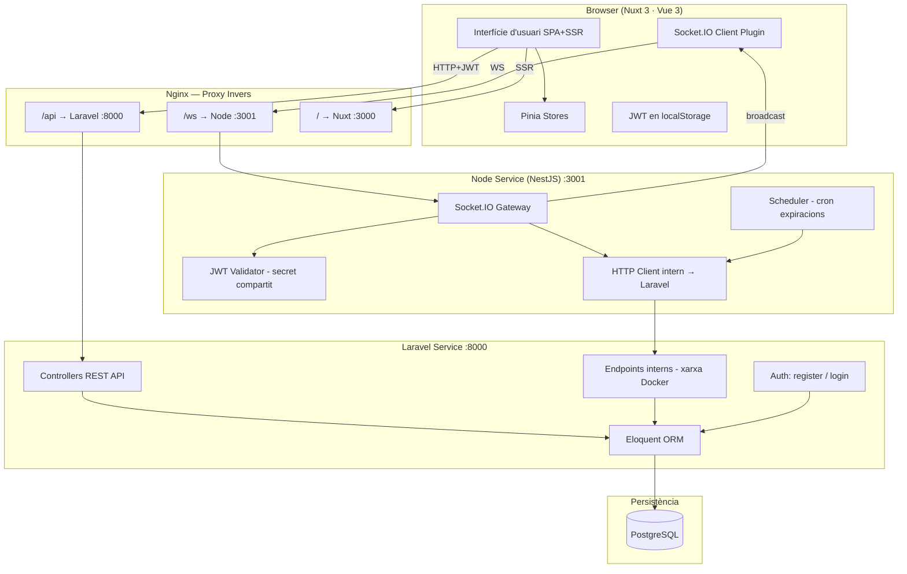

### Flux de dades principal (reserva de seient)

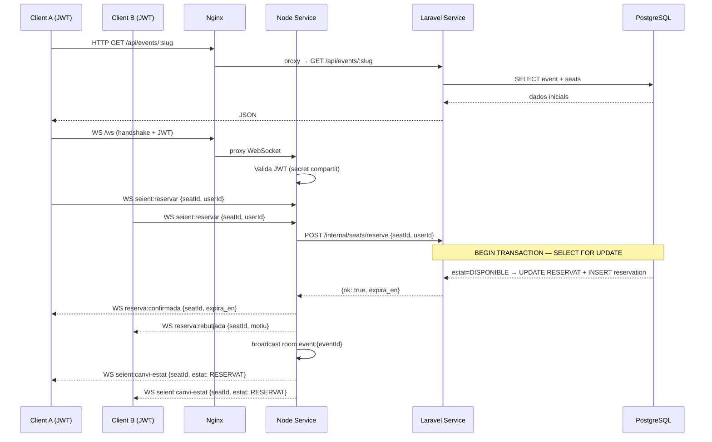

### Flux d'autenticació

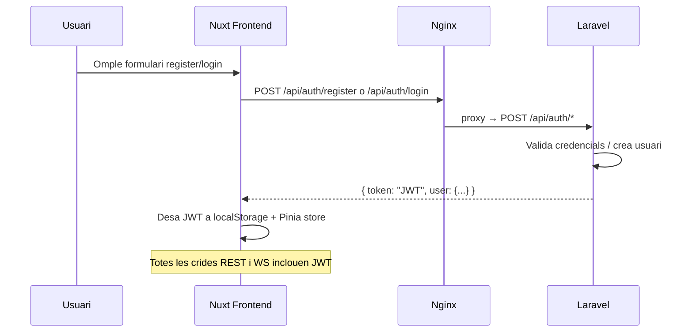

---

## 5. Estructura del monorepo

> **v2.0:** El directori `backend/` s'ha dividit en dos serveis independents. S'afegeix `nginx/` per al proxy invers.

```
prj-entrades-a20valzavvas/
├── frontend/                    # Nuxt 3 — SPA + SSR
│   ├── assets/
│   ├── components/
│   │   ├── MapaSeients.vue
│   │   ├── Seient.vue
│   │   ├── TemporitzadorReserva.vue
│   │   ├── LlegendaEstats.vue
│   │   └── NotificacioEstat.vue
│   ├── composables/
│   │   ├── useSocket.ts
│   │   ├── useTemporitzador.ts
│   │   └── useConflicte.ts
│   ├── middleware/
│   │   └── auth.ts              # Redirigeix a /auth/login si no hi ha JWT
│   ├── pages/
│   │   ├── index.vue              # SSR
│   │   ├── auth/
│   │   │   ├── login.vue          # CSR
│   │   │   └── register.vue       # CSR
│   │   ├── events/[slug].vue      # CSR + WS
│   │   ├── checkout.vue
│   │   ├── entrades.vue
│   │   └── admin/
│   │       ├── index.vue
│   │       └── events/
│   │           ├── index.vue
│   │           ├── new.vue
│   │           └── [id].vue
│   ├── plugins/
│   │   └── socket.client.ts
│   ├── stores/
│   │   ├── auth.ts              # JWT, user, login/logout actions
│   │   ├── seients.ts
│   │   ├── reserva.ts
│   │   ├── event.ts
│   │   └── connexio.ts
│   └── nuxt.config.ts
│
├── backend/
│   ├── node-service/            # NestJS — Temps real (WebSockets + Cron)
│   │   ├── src/
│   │   │   ├── gateway/
│   │   │   │   ├── seats.gateway.ts
│   │   │   │   └── gateway.module.ts
│   │   │   ├── scheduler/
│   │   │   │   ├── expiry.scheduler.ts
│   │   │   │   └── scheduler.module.ts
│   │   │   ├── auth/
│   │   │   │   └── jwt.guard.ts   # Valida JWT (secret compartit, sense BD)
│   │   │   ├── laravel-client/
│   │   │   │   ├── laravel.client.ts  # HttpService → Laravel intern
│   │   │   │   └── laravel-client.module.ts
│   │   │   └── app.module.ts
│   │   └── package.json
│   │
│   └── laravel-service/         # Laravel — Accés a BD + Auth + REST API
│       ├── app/
│       │   ├── Http/
│       │   │   ├── Controllers/
│       │   │   │   ├── Auth/
│       │   │   │   │   ├── RegisterController.php
│       │   │   │   │   └── LoginController.php
│       │   │   │   ├── Api/
│       │   │   │   │   ├── EventController.php
│       │   │   │   │   ├── SeatController.php
│       │   │   │   │   ├── OrderController.php
│       │   │   │   │   └── AdminController.php
│       │   │   │   └── Internal/
│       │   │   │       ├── SeatReservationController.php
│       │   │   │       └── StatsController.php
│       │   │   └── Middleware/
│       │   │       └── InternalNetworkOnly.php
│       │   └── Models/
│       │       ├── User.php
│       │       ├── Event.php
│       │       ├── Seat.php
│       │       ├── Reservation.php
│       │       ├── Order.php
│       │       └── OrderItem.php
│       ├── database/
│       │   ├── migrations/
│       │   └── seeders/
│       └── routes/
│           ├── api.php          # Rutes públiques + auth
│           └── internal.php     # Rutes privades (xarxa Docker interna)
│
├── nginx/
│   └── nginx.conf               # Proxy invers: /ws → Node, /api → Laravel, / → Nuxt
│
├── shared/                      # Types compartits TypeScript (Node + Nuxt)
│   └── types/
│       ├── seat.types.ts
│       ├── event.types.ts
│       ├── socket.types.ts
│       └── auth.types.ts        # nou: User, JwtPayload
│
├── docker-compose.yml           # 5 serveis: postgres, node-service, laravel-service, frontend, nginx
├── pnpm-workspace.yaml          # workspaces: frontend, node-service, shared
└── .github/
    └── workflows/
        ├── ci.yml
        ├── deploy-frontend.yml
        ├── deploy-node.yml
        └── deploy-laravel.yml
```

---

## 6. Esquema de base de dades

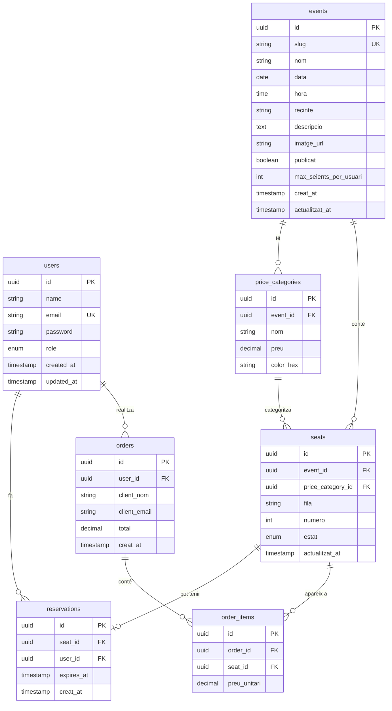

### Enum `estat` (seats)

| Valor        | Descripció                                 |
| ------------ | ------------------------------------------ |
| `DISPONIBLE` | Lliure per reservar                        |
| `RESERVAT`   | Bloquejat temporalment (té reserva activa) |
| `VENUT`      | Compra finalitzada, no alliberable         |

---

## 7. API REST — Endpoints

> **v2.0:** Tots els endpoints estan servits per **Laravel**. Els endpoints `/api/auth/*` no requereixen token. La resta d'endpoints que modifiquen estat requereixen `Authorization: Bearer <JWT>`. Els endpoints `/internal/*` només són accessibles des de la xarxa Docker interna (Node Service).

### Autenticació

| Mètode | Ruta                    | Descripció                          | Auth | Codi èxit |
| ------ | ----------------------- | ----------------------------------- | ---- | --------- |
| `POST` | `/api/auth/register`    | Registrar nou usuari                | No   | `201`     |
| `POST` | `/api/auth/login`       | Autenticar usuari, retorna JWT      | No   | `200`     |

#### `POST /api/auth/register` — Petició

```json
{
  "name": "Maria Garcia",
  "email": "maria@example.com",
  "password": "secret123",
  "password_confirmation": "secret123"
}
```

#### `POST /api/auth/register` — Resposta `201`

```json
{
  "token": "eyJ0eXAiOiJKV1QiLCJhbGciOiJIUzI1NiJ9...",
  "user": { "id": "uuid", "name": "Maria Garcia", "email": "maria@example.com", "role": "comprador" }
}
```

#### `POST /api/auth/login` — Petició

```json
{
  "email": "maria@example.com",
  "password": "secret123"
}
```

#### `POST /api/auth/login` — Resposta `200`

```json
{
  "token": "eyJ0eXAiOiJKV1QiLCJhbGciOiJIUzI1NiJ9...",
  "user": { "id": "uuid", "name": "Maria Garcia", "email": "maria@example.com", "role": "comprador" }
}
```

### Endpoints interns (Node → Laravel, xarxa Docker)

| Mètode   | Ruta                               | Descripció                                     |
| -------- | ---------------------------------- | ---------------------------------------------- |
| `POST`   | `/internal/seats/reserve`          | Reservar seient (transacció BD)                |
| `DELETE` | `/internal/seats/{id}/reserve`     | Alliberar reserva voluntàriament               |
| `POST`   | `/internal/seats/expire`           | Alliberar reserves expirades (cron)            |
| `GET`    | `/internal/stats/{eventId}`        | Estadístiques en temps real per a broadcast    |

### Esdeveniments públics

| Mètode | Ruta                      | Descripció                        | Codi èxit |
| ------ | ------------------------- | --------------------------------- | --------- |
| `GET`  | `/api/events`             | Llistat d'esdeveniments publicats | `200`     |
| `GET`  | `/api/events/:slug`       | Detall d'un esdeveniment          | `200`     |
| `GET`  | `/api/events/:slug/seats` | Estat actual de tots els seients  | `200`     |

#### `GET /api/events` — Resposta `200`

```json
[
  {
    "id": "uuid",
    "slug": "concert-final-2026",
    "nom": "Concert Final de Curs 2026",
    "data": "2026-06-15",
    "hora": "20:00",
    "recinte": "Palau Sant Jordi",
    "imatge_url": "/uploads/concert-final.jpg",
    "total_seients": 200,
    "seients_disponibles": 143
  }
]
```

#### `GET /api/events/:slug/seats` — Resposta `200`

```json
{
  "event_id": "uuid",
  "seients": [
    {
      "id": "uuid",
      "fila": "A",
      "numero": 1,
      "estat": "DISPONIBLE",
      "preu": 25.0,
      "categoria": "General",
      "color_hex": "#4CAF50"
    },
    {
      "id": "uuid",
      "fila": "A",
      "numero": 2,
      "estat": "RESERVAT",
      "preu": 50.0,
      "categoria": "VIP",
      "color_hex": "#9C27B0"
    }
  ]
}
```

### Comandes

| Mètode | Ruta                       | Descripció                   | Codi èxit |
| ------ | -------------------------- | ---------------------------- | --------- |
| `POST` | `/api/orders`              | Confirmar compra             | `201`     |
| `GET`  | `/api/orders?email=:email` | Consultar entrades per email | `200`     |

#### `POST /api/orders` — Petició

```json
{
  "session_token": "uuid-del-client",
  "client_nom": "Maria Garcia",
  "client_email": "maria@example.com"
}
```

#### `POST /api/orders` — Resposta `201`

```json
{
  "order_id": "uuid",
  "client_nom": "Maria Garcia",
  "client_email": "maria@example.com",
  "total": 75.0,
  "seients": [
    { "fila": "B", "numero": 5, "categoria": "General", "preu": 25.0 },
    { "fila": "B", "numero": 6, "categoria": "General", "preu": 25.0 },
    { "fila": "A", "numero": 3, "categoria": "VIP", "preu": 25.0 }
  ]
}
```

#### `POST /api/orders` — Errors

| Codi                | Causa                                       |
| ------------------- | ------------------------------------------- |
| `409 Conflict`      | Algun seient ja no pertany al session_token |
| `422 Unprocessable` | Dades del client incompletes o invàlides    |

#### `GET /api/orders?email=maria@example.com` — Resposta `200`

```json
[
  {
    "order_id": "uuid",
    "event": "Concert Final de Curs 2026",
    "data": "2026-06-15",
    "hora": "20:00",
    "recinte": "Palau Sant Jordi",
    "seients": ["B5", "B6", "A3"],
    "total": 75.0,
    "creat_at": "2026-03-24T18:30:00Z"
  }
]
```

### Admin

| Mètode   | Ruta                          | Descripció                                   | Codi èxit |
| -------- | ----------------------------- | -------------------------------------------- | --------- |
| `GET`    | `/api/admin/events`           | Tots els esdeveniments (inclou despublicats) | `200`     |
| `POST`   | `/api/admin/events`           | Crear esdeveniment                           | `201`     |
| `PUT`    | `/api/admin/events/:id`       | Editar esdeveniment                          | `200`     |
| `DELETE` | `/api/admin/events/:id`       | Eliminar esdeveniment                        | `204`     |
| `GET`    | `/api/admin/events/:id/stats` | Estadístiques en temps real                  | `200`     |
| `GET`    | `/api/admin/reports`          | Informes agregats                            | `200`     |

#### `POST /api/admin/events` — Petició

```json
{
  "nom": "Concert Final de Curs 2026",
  "slug": "concert-final-2026",
  "data": "2026-06-15",
  "hora": "20:00",
  "recinte": "Palau Sant Jordi",
  "descripcio": "El gran concert de fi de curs...",
  "max_seients_per_usuari": 4,
  "publicat": false,
  "categories": [
    {
      "nom": "General",
      "preu": 25.0,
      "color_hex": "#4CAF50",
      "files": ["C", "D", "E", "F", "G", "H", "I", "J"]
    },
    { "nom": "VIP", "preu": 50.0, "color_hex": "#9C27B0", "files": ["A", "B"] }
  ],
  "seients_per_fila": 20
}
```

#### `GET /api/admin/events/:id/stats` — Resposta `200`

```json
{
  "usuaris_connectats": 42,
  "seients_disponibles": 115,
  "seients_reservats": 23,
  "seients_venuts": 62,
  "reserves_actives": 23,
  "recaptacio_total": 1950.0
}
```

---

## 8. Protocol Socket.IO

### Rooms

Cada usuari que entra a la pàgina d'un esdeveniment s'uneix a la room `event:{eventId}`. Tots els broadcasts s'emeten a aquesta room.

### Esdeveniments Client → Servidor

| Esdeveniment       | Payload                     | Descripció                           |
| ------------------ | --------------------------- | ------------------------------------ |
| `event:unir`       | `{ eventId, sessionToken }` | Unir-se a la room de l'esdeveniment  |
| `seient:reservar`  | `{ seatId, sessionToken }`  | Sol·licitar reserva d'un seient      |
| `seient:alliberar` | `{ seatId, sessionToken }`  | Alliberar voluntàriament una reserva |
| `compra:confirmar` | `{ sessionToken }`          | Finalitzar compra (alternativa REST) |

### Esdeveniments Servidor → Client (broadcast a room)

| Esdeveniment          | Payload                                       | Descripció                          |
| --------------------- | --------------------------------------------- | ----------------------------------- |
| `seient:canvi-estat`  | `{ seatId, estat, fila, numero }`             | Estat d'un seient ha canviat        |
| `stats:actualitzacio` | `{ disponibles, reservats, venuts, usuaris }` | Actualització de comptadors (admin) |

### Esdeveniments Servidor → Client (resposta privada)

| Esdeveniment         | Payload                            | Descripció                                |
| -------------------- | ---------------------------------- | ----------------------------------------- |
| `reserva:confirmada` | `{ seatId, expira_en: timestamp }` | Reserva acceptada                         |
| `reserva:rebutjada`  | `{ seatId, motiu: string }`        | Reserva rebutjada (concurrent o expirada) |
| `compra:completada`  | `{ orderId, seients[] }`           | Compra finalitzada correctament           |
| `error:general`      | `{ codi, missatge }`               | Error genèric                             |

---

## 9. Gestió de concurrència

El mecanisme central és una **transacció PostgreSQL amb bloqueig pessimista** (`SELECT FOR UPDATE`). Això garanteix atomicitat fins i tot si múltiples instàncies del servidor accedissin a la mateixa BD.

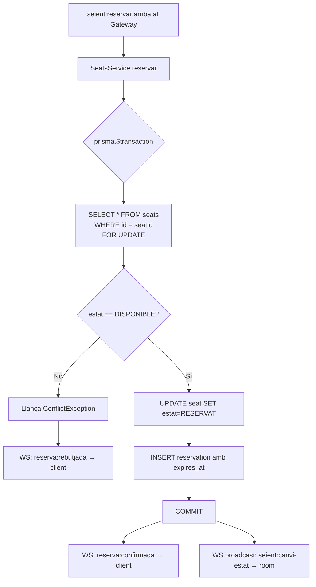

### Expiració automàtica de reserves

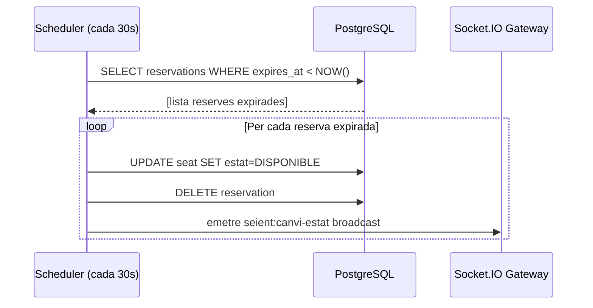

---

## 10. Gestió d'estat (Pinia)

### Stores i responsabilitats

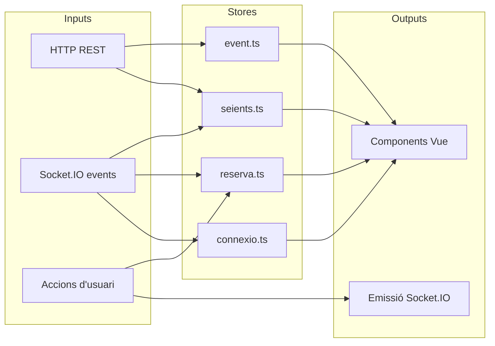

### `seients.ts` — Estat dels seients

```typescript
// Estat
{
  seients: Map<string, Seient>  // seatId → Seient
  seientsMeus: Set<string>      // seatIds reservats per mi
}

// Accions principals
inicialitzar(seients: Seient[])
actualitzarEstat(seatId: string, estat: EstatSeient)
marcarComMeu(seatId: string)
desmarcarMeu(seatId: string)
```

### `reserva.ts` — Reserva activa de l'usuari

```typescript
// Estat
{
  seients: string[]     // seatIds en reserva activa
  expira_en: Date|null  // timestamp d'expiració
  sessionToken: string  // UUID persistent en localStorage
}

// Accions principals
afegirReserva(seatId: string, expira_en: Date)
eliminarReserva(seatId: string)
netejarReserves()       // en sortir de l'esdeveniment
```

### `connexio.ts` — Estat de connexió Socket.IO

```typescript
// Estat
{
  connectat: boolean;
  usuarisConnectats: number;
  eventId: string | null;
  reconnectant: boolean;
}
```

---

## 11. Rutes i renderització frontend

| Ruta                 | Renderització | Auth requerida | Descripció                                    |
| -------------------- | ------------- | -------------- | --------------------------------------------- |
| `/`                  | **SSR**       | No             | Portada — llistat d'esdeveniments publicats   |
| `/auth/login`        | CSR           | No             | Formulari de login                            |
| `/auth/register`     | CSR           | No             | Formulari de registre                         |
| `/events/[slug]`     | CSR + WS      | No (veure) / Sí (reservar) | Pàgina d'esdeveniment amb mapa    |
| `/checkout`          | CSR           | Sí             | Formulari de compra (confirmar reserva)       |
| `/entrades`          | CSR           | Sí             | Consulta d'entrades de l'usuari autenticat    |
| `/admin`             | CSR           | Sí (rol admin) | Dashboard: estadístiques en temps real        |
| `/admin/events`      | CSR           | Sí (rol admin) | Llistat d'esdeveniments (admin)               |
| `/admin/events/new`  | CSR           | Sí (rol admin) | Crear nou esdeveniment                        |
| `/admin/events/[id]` | CSR           | Sí (rol admin) | Editar esdeveniment existent                  |

### Diagrama de navegació

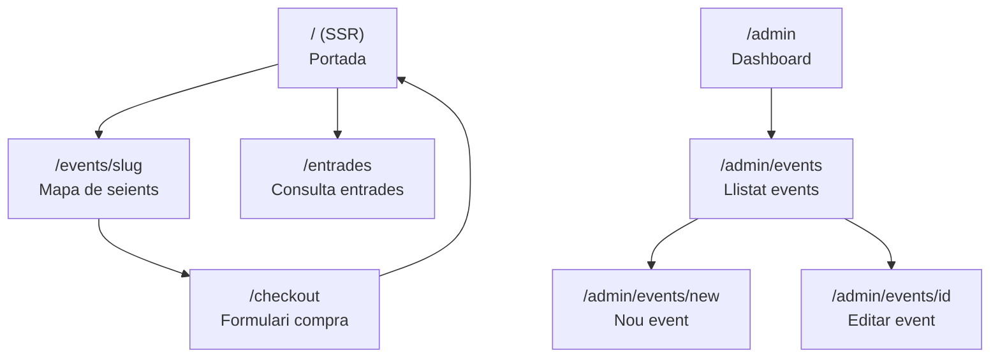

---

## 12. Funcionalitats per rol

### Comprador

- [x] Veure llistat d'esdeveniments publicats
- [x] Veure mapa de seients amb estats en temps real
- [x] Reservar fins a N seients (N configurable per event)
- [x] Veure temporitzador de reserva (compte enrere visible)
- [x] Veure conflictes resolts: missatge clar si el seient ja ha estat agafat
- [x] Completar checkout (nom + email)
- [x] Consultar entrades comprades per email

### Administrador

- [x] CRUD complet d'esdeveniments
- [x] Configurar categories de preu i aforament
- [x] Dashboard en temps real: seients disponibles / reservats / venuts, usuaris connectats
- [x] Informes: recaptació per categoria, percentatge d'ocupació, evolució temporal

---

## 13. Flux de reserva i compra

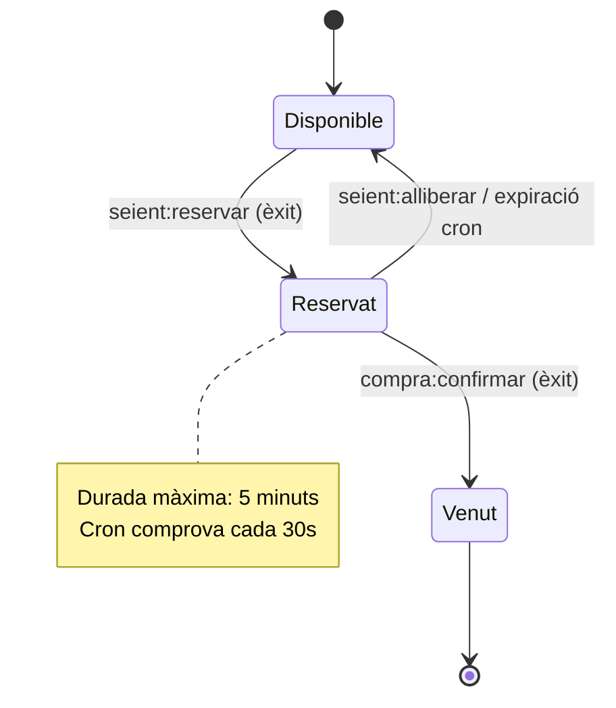

### Flux complet de compra

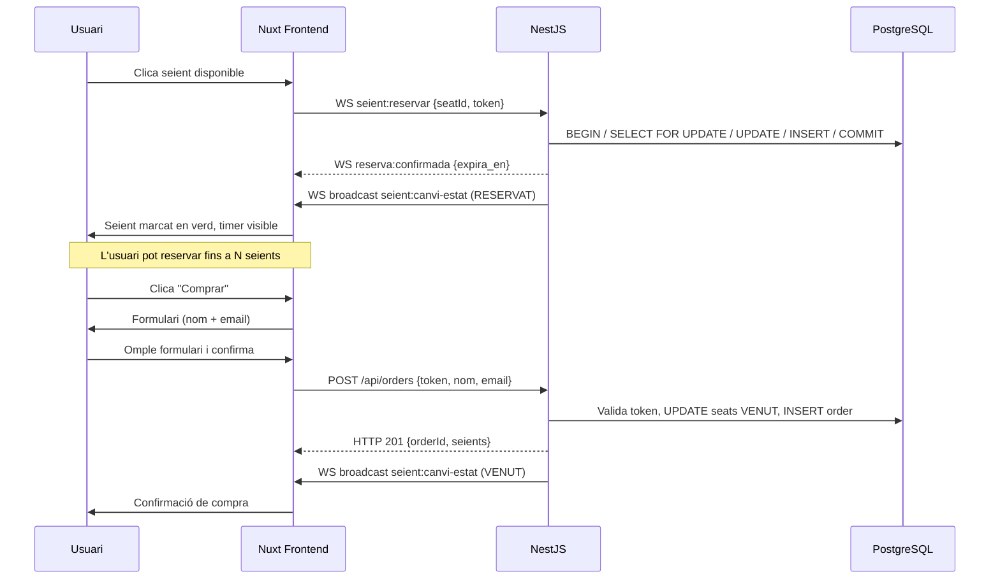

---

## 14. Testing

### 14.1 Tests unitaris (Vitest)

| Funció                                         | Fitxer                                 |
| ---------------------------------------------- | -------------------------------------- |
| Transformació de dades de seients del servidor | `stores/seients.spec.ts`               |
| Càlcul del temps restant de reserva            | `composables/useTemporitzador.spec.ts` |
| Gestió d'estat a la store `reserva`            | `stores/reserva.spec.ts`               |

### 14.2 Tests de rutes (Nuxt Testing Utils)

| Cas                                      | Descripció                                        |
| ---------------------------------------- | ------------------------------------------------- |
| Ruta dinàmica `/events/[slug]`           | Paràmetre `slug` arriba correctament al component |
| Redes a `/checkout` sense reserva activa | Redirigeix a `/`                                  |
| Ruta `/admin` sense token admin          | Redirigeix a `/`                                  |

### 14.3 Tests de Pinia

| Cas                        | Descripció                                          |
| -------------------------- | --------------------------------------------------- |
| Inicialització correcta    | `inicialitzar([])` deixa l'estat buit               |
| Actualització per event WS | `seient:canvi-estat` actualitza el Map correctament |
| Reset en sortir de l'event | `netejarReserves()` buida totes les stores          |

### 14.4 Test de concurrència (Cypress + Sockets Node.js)

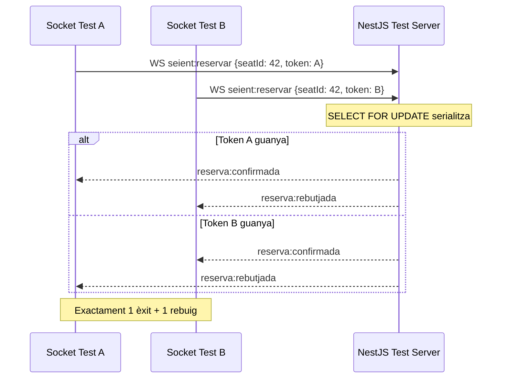

**Assertion clau:**

```
expect([resA.ok, resB.ok]).toContain(true)
expect([resA.ok, resB.ok]).toContain(false)
expect(resA.ok).not.toEqual(resB.ok)
```

### CI/CD Pipeline

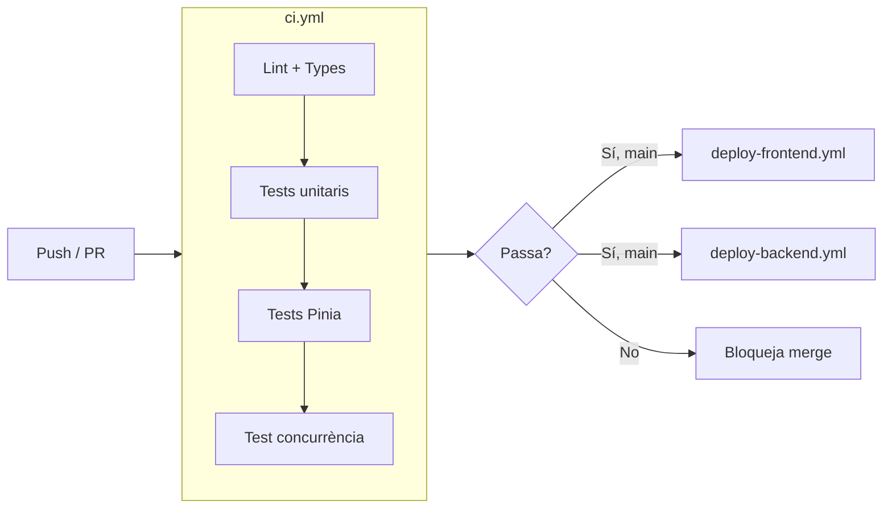

---

## 15. Infraestructura i desplegament

### Docker Compose (local)

> **v2.0:** 5 serveis. Nginx és el punt d'entrada únic (port 80). Frontend, Node i Laravel no exposen ports directament a l'exterior en producció.

```yaml
# docker-compose.yml (esquema)
services:
  postgres:
    image: postgres:16
    ports: ["5432:5432"]
    environment:
      POSTGRES_DB: entrades
      POSTGRES_USER: entrades
      POSTGRES_PASSWORD: secret
    healthcheck:
      test: ["CMD-SHELL", "pg_isready -U entrades"]

  laravel-service:
    build: ./backend/laravel-service
    ports: ["8000:8000"]
    depends_on:
      postgres:
        condition: service_healthy
    environment:
      DB_HOST: postgres
      DB_DATABASE: entrades
      DB_USERNAME: entrades
      DB_PASSWORD: secret
      JWT_SECRET: ${JWT_SECRET}
      APP_KEY: ${LARAVEL_APP_KEY}

  node-service:
    build: ./backend/node-service
    ports: ["3001:3001"]
    depends_on: [laravel-service]
    environment:
      JWT_SECRET: ${JWT_SECRET}
      LARAVEL_INTERNAL_URL: http://laravel-service:8000
      PORT: 3001

  frontend:
    build: ./frontend
    ports: ["3000:3000"]
    environment:
      NUXT_PUBLIC_API_URL: http://nginx/api
      NUXT_PUBLIC_WS_URL: ws://nginx/ws

  nginx:
    image: nginx:alpine
    ports: ["80:80"]
    volumes: ["./nginx/nginx.conf:/etc/nginx/conf.d/default.conf"]
    depends_on: [frontend, node-service, laravel-service]
```

### Desplegament a producció (VPS)

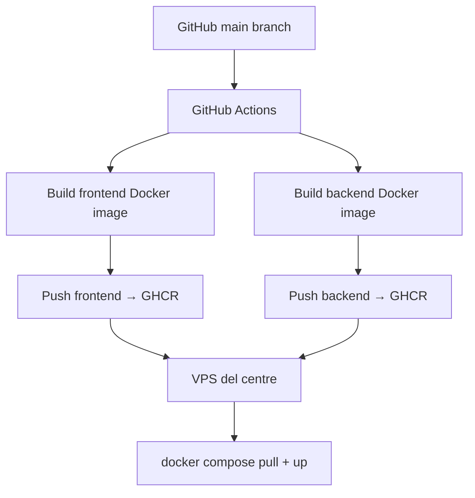

### Variables d'entorn requerides

| Variable                  | Servei          | Descripció                                       |
| ------------------------- | --------------- | ------------------------------------------------ |
| `DB_HOST`                 | Laravel         | Host PostgreSQL                                  |
| `DB_DATABASE`             | Laravel         | Nom de la BD                                     |
| `DB_USERNAME`             | Laravel         | Usuari PostgreSQL                                |
| `DB_PASSWORD`             | Laravel         | Contrasenya PostgreSQL                           |
| `JWT_SECRET`              | Laravel + Node  | Secret compartit per signar i validar JWT        |
| `LARAVEL_APP_KEY`         | Laravel         | Clau d'aplicació Laravel (`php artisan key:generate`) |
| `RESERVATION_TTL_MINUTES` | Laravel         | Durada reserva (defecte: 5)                      |
| `LARAVEL_INTERNAL_URL`    | Node Service    | URL interna de Laravel (xarxa Docker)            |
| `CRON_INTERVAL_SECONDS`   | Node Service    | Interval cron expiració (defecte: 30)            |
| `PORT`                    | Node Service    | Port del servidor NestJS                         |
| `NUXT_PUBLIC_API_URL`     | Frontend        | URL base de l'API REST (via Nginx)               |
| `NUXT_PUBLIC_WS_URL`      | Frontend        | URL WebSocket (via Nginx)                        |

---

## 16. Funcionalitats opcionals

### Gràfics (Vue ChartJS)

- **Gràfic d'ocupació** (donut): disponibles / reservats / venuts
- **Evolució de vendes** (línies): compres per franja horària
- Dades obtingudes des de la store `admin` (actualitzada per WS)

### Animacions de seients

- Transició CSS `scale + color` en canvi d'estat
- Indicador de connexió / reconnexió Socket.IO

### Reconnexió amb recuperació d'estat

El plugin `socket.client.ts` implementa el handler `connect` de Socket.IO que, en reconnectar, re-emet `event:unir` amb el `sessionToken` existent. El servidor restaura el context i el client re-sincronitza l'estat dels seients i el timer des de Pinia.

---

## 17. No-goals

Els següents elements estan **fora d'abast** per a la primera versió:

- Pagament real (Stripe, Redsys)
- WebRTC / assistència en directe
- Streaming massiu
- Múltiples instàncies del servidor (escala horitzontal)
- Aplicació mòbil
- Notificacions per email de confirmació

---

_Document generat durant la fase d'exploració. Actualitzar-lo a mesura que evolucioni la implementació._
