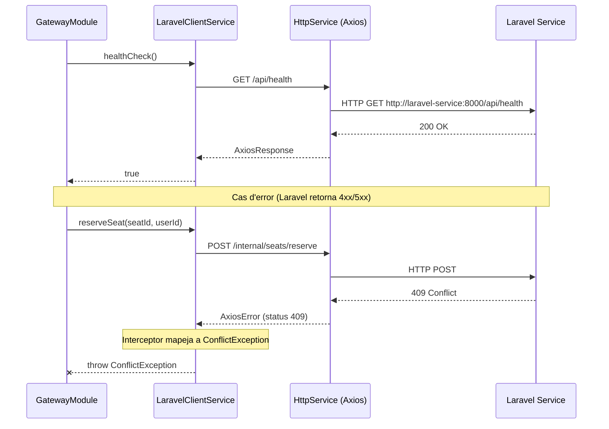

## Context

L'scaffold del Node Service (PE-55) ja inclou un `LaravelClientModule` buit registrat a l'`AppModule` i `@nestjs/axios` com a dependència. El Laravel Service corre al port 8000 dins de Docker i exposa un endpoint `/api/health`. Ambdós serveis comparteixen la mateixa xarxa Docker, de manera que les crides internes no passen per Nginx.

Aquest canvi omple el mòdul buit amb un `LaravelClientService` funcional que centralitza tota la comunicació HTTP Node → Laravel.

## Goals / Non-Goals

**Goals:**
- Proporcionar un servei injectable únic (`LaravelClientService`) que tots els mòduls de Node usin per cridar Laravel
- Configurar `HttpModule` amb base URL i timeout des de variables d'entorn
- Mapejar respostes d'error HTTP de Laravel a excepcions NestJS natives
- Definir mètodes stub per als endpoints futurs
- Verificar connectivitat amb una crida de health check intern

**Non-Goals:**
- Implementar els endpoints interns de Laravel (US-03-02, US-04-01)
- Omplir els mètodes stub més enllà de `NotImplementedException`
- Afegir retry logic o circuit breaker
- Autenticació entre serveis — la xarxa Docker interna és de confiança

## Diagrama de seqüència



## Decisions

### 1. Usar `@nestjs/axios` HttpModule (ja instal·lat)

El paquet `@nestjs/axios` ja és al `package.json` del node-service. Embolcalla Axios amb DI de NestJS, suporta configuració asíncrona via `registerAsync`, i s'integra naturalment amb `ConfigService`.

**Alternativa considerada**: `fetch` natiu — rebutjat perquè no té integració DI ni interceptors de request/response per a gestió d'errors centralitzada.

### 2. `HttpModule.registerAsync` per a configuració

Usar `registerAsync` amb `ConfigService` per llegir `LARAVEL_INTERNAL_URL` i `LARAVEL_HTTP_TIMEOUT` en temps d'inicialització del mòdul.

```typescript
HttpModule.registerAsync({
  imports: [ConfigModule],
  inject: [ConfigService],
  useFactory: (config: ConfigService) => ({
    baseURL: config.get<string>('LARAVEL_INTERNAL_URL'),
    timeout: config.get<number>('LARAVEL_HTTP_TIMEOUT', 5000),
  }),
})
```

### 3. Interceptor Axios per a mapatge d'errors

Afegir un interceptor de resposta a `LaravelClientService.onModuleInit()` que capturi errors Axios i els rellanço com a subclasses de `HttpException` de NestJS:

| HTTP Status | Excepció NestJS |
|-------------|-----------------|
| 400 | `BadRequestException` |
| 404 | `NotFoundException` |
| 409 | `ConflictException` |
| 422 | `UnprocessableEntityException` |
| 5xx | `InternalServerErrorException` |

**Alternativa considerada**: try/catch per mètode — rebutjat perquè genera codi repetitiu a cada mètode.

### 4. Mètodes stub amb `NotImplementedException`

Cada mètode d'endpoint futur es defineix amb signatures TypeScript correctes però llança `NotImplementedException`. Això proporciona seguretat de tipus i autocompletat als mòduls consumidors.

### Schemas JSON dels endpoints interns (stubs)

```json
// POST /internal/seats/reserve
// Request:
{ "seatId": "uuid", "userId": "uuid" }
// Response (futur):
{ "reservationId": "uuid", "expiresAt": "ISO8601" }

// DELETE /internal/seats/{id}/reserve
// Response (futur): 204 No Content

// POST /internal/seats/expire
// Response (futur):
{ "expiredCount": 3 }

// GET /internal/stats/{eventId}
// Response (futur):
{ "total": 100, "available": 50, "reserved": 30, "sold": 20 }
```

### Tipus compartits afectats

Cap fitxer de `shared/types/` es modifica en aquesta US. Els DTOs es defineixen localment al mòdul `laravel-client`. Quan s'implementin els mètodes (US-03-02, US-04-01), es poden moure tipus compartits si cal.

### Esdeveniments Socket.IO afectats

Cap. El `LaravelClientService` és purament HTTP; no emet ni escolta esdeveniments Socket.IO directament.

## Estratègia de testing

- **Framework**: Vitest (configurat al workspace node-service)
- **Fitxer**: `src/backend/node-service/src/laravel-client/laravel-client.service.spec.ts`
- **Mocks**: `HttpService` mockejat amb `vi.fn()` per simular respostes Axios
- **Casos de test**:
  - Instanciació del servei amb HttpService mockejat
  - `healthCheck()` retorna `true` quan `HttpService.get` resol amb status 200
  - `healthCheck()` llança excepció quan `HttpService.get` rebutja
  - Mapatge d'errors: cada status HTTP (400, 404, 409, 422, 500) es mapeja a l'excepció NestJS correcta
  - Els 4 mètodes stub llancen `NotImplementedException`

## Risks / Trade-offs

- **[Laravel no operatiu durant l'arrencada de Node]** → El servei no crida Laravel a l'arrencada. El health check és un mètode explícit, no una crida d'inicialització.
- **[Sense retry/circuit-breaker]** → Acceptable per al MVP. Si Laravel cau, les crides fallen immediatament amb 5xx. Es pot afegir posteriorment via interceptor Axios sense canviar la interfície del servei.
- **[Timeout massa curt/llarg]** → Per defecte 5s, configurable via `LARAVEL_HTTP_TIMEOUT`. Es pot ajustar per desplegament sense canvis de codi.
