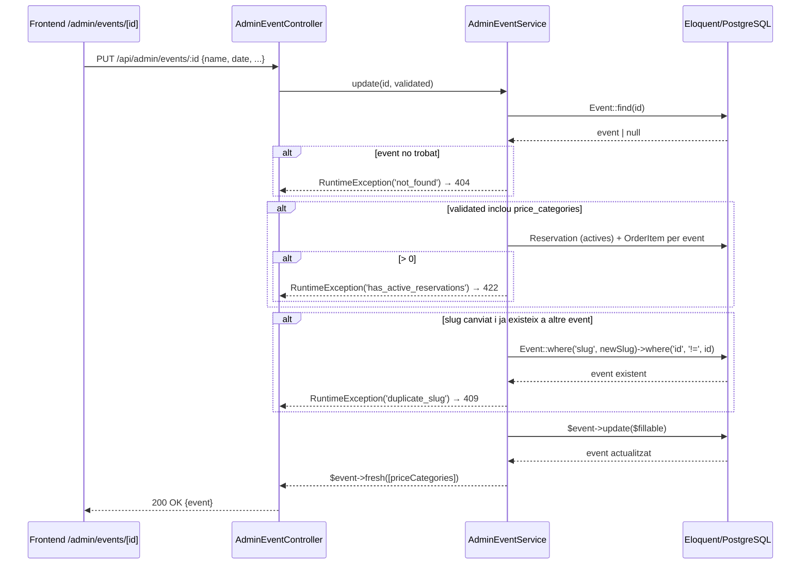

## Context

L'API admin ja disposa de `GET /api/admin/events` i `POST /api/admin/events` implementats (US-02-01 i US-02-02). Cal afegir `PUT /api/admin/events/:id` per permetre editar les dades generals d'un event existent.

La restricció clau és que si l'event té reserves actives (`Reservation` en estat no expirada) o `OrderItem` associats als seus seients, no es pot modificar l'estructura de categories ni seients, ja que trencar-la invalidaria les reserves/compres existents.

El backend usa **Laravel 11 + Eloquent** (PostgreSQL). El mòdul `Admin` ja té `AdminEventController` i `AdminEventService` protegits per middleware `auth:sanctum` + `admin` (rol basat en `role = 'admin'`).

## Goals / Non-Goals

**Goals:**

- Afegir `GET /api/admin/events/:id` i `PUT /api/admin/events/:id` a `AdminEventController` i `AdminEventService`.
- Permetre actualitzar: `name`, `slug`, `description`, `date`, `venue`.
- Rebutjar amb `422` si s'intenten modificar `price_categories` quan hi ha reserves actives o `order_items`.
- Retornar `404` si l'event no existeix.
- Pàgina frontend `/admin/events/[id]` que carregui l'event i enviï el formulari d'edició.
- Tests de feature Laravel i tests unitaris de component Nuxt.

**Non-Goals:**

- Modificació de `price_categories` o seients (fora d'abast mentre hi ha reserves).
- Publicació/despublicació d'events (US diferent).
- Eliminació d'events.

## Decisions

### Decisió 1: Quins camps es permeten actualitzar

**Opció A (escollida):** Permetre actualitzar `name`, `slug`, `description`, `date`, `venue`. Rebutjar modificació de `price_categories` si hi ha reserves actives.

**Opció B:** Permetre actualitzar tot i recalcular seients. — Rebuig: trencaria reserves existents, massa risc.

**Rationale:** Separar la mutació de metadades de l'event de la mutació de l'estructura de seients és la seguretat mínima necessària.

---

### Decisió 2: Com detectar reserves actives

**Opció A (escollida):** Consultar si existeix algun `Reservation` no expirat (`expires_at > now()`) o algun `OrderItem` associat als seients de l'event. Si la request inclou el camp `price_categories`, retornar `422` en cas positiu.

**Opció B:** Sempre rebutjar `price_categories` al `PUT`, independentment de l'estat. — Rebuig: massa restrictiu, podria ser útil en futures US permetre-ho quan no hi ha reserves.

**Rationale:** Comprovació lazy: només es valida si el client envia `price_categories`.

---

### Decisió 3: UpdateEventRequest (Laravel FormRequest)

Es crea `UpdateEventRequest` amb tots els camps opcionals mitjançant la regla `sometimes`. Si `price_categories` s'inclou i hi ha reserves actives, el service llança `RuntimeException('has_active_reservations')` que el controller transforma en `422`.

```php
// app/Http/Requests/Admin/UpdateEventRequest.php
public function rules(): array
{
    return [
        'name'             => ['sometimes', 'string', 'max:255'],
        'slug'             => ['sometimes', 'nullable', 'string', 'max:255', 'regex:/^[a-z0-9-]+$/'],
        'description'      => ['sometimes', 'nullable', 'string'],
        'date'             => ['sometimes', 'date', 'after:now'],
        'venue'            => ['sometimes', 'string', 'max:255'],
        'price_categories' => ['sometimes', 'array', 'min:1'],
    ];
}
```

---

### Decisió 4: Slug — unicitat

Si el request canvia el `slug`, cal verificar que el nou `slug` no existeixi a un altre event. Si és el mateix slug que ja té l'event, s'omet la comprovació (la condició `$newSlug !== $event->slug` evita falsos positius). Retorna `409 Conflict` en cas de duplicat.

---

### Flux de la petició



## Risks / Trade-offs

- **[Risc] Condició de carrera en la comprovació de reserves** → La comprovació no és atòmica; una reserva podria crear-se entre la comprovació i l'actualització. Mitigació: acceptable per ara (la US no demana transacció aquí; les reserves actives s'expiren per cron).
- **[Trade-off] `UpdateEventRequest` usa `sometimes` per tots els camps** → Acceptable; la validació i la guarda per reserves actives protegeix la integritat.
- **[Risc] Slug duplicat en rename** → Mitigat per comprovació explícita al service amb `$newSlug !== $event->slug`.

## Testing Strategy

| Unitat                        | Framework                   | Mocks / Setup                       |
| ----------------------------- | --------------------------- | ----------------------------------- |
| `AdminEventService`           | PHPUnit (Feature)           | Base de dades de test (PostgreSQL)  |
| `AdminEventController`        | PHPUnit (Feature)           | `actingAs($admin)` via Sanctum      |
| `pages/admin/events/[id].vue` | Vitest + `@nuxt/test-utils` | `$fetch` mockat, `$router` espiat   |

Casos a cobrir:

- 200 actualització correcta de camps de metadades
- 200 GET de dades de l'event existent
- 404 event no trobat (GET i PUT)
- 422 intent de modificar `price_categories` amb reserves actives
- 422 intent de modificar `price_categories` amb `order_items`
- 409 nou slug ja existent (i original no modificat)
- 200 permetre el mateix slug de l'event actual
- 200 actualitzar metadades sense `price_categories` quan hi ha reserves
- 401 sense Bearer token
- 403 rol `comprador`
