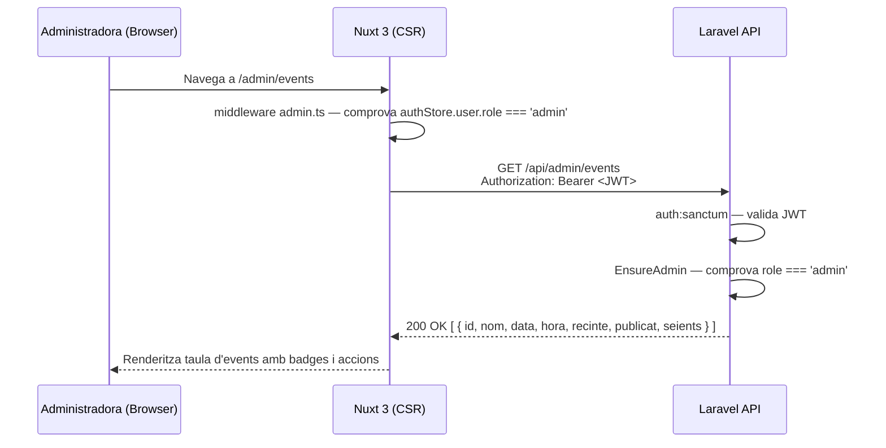

## Context

El projecte Sala Onirica utilitza un monorepo amb backend Laravel (API REST, autenticació Sanctum) i frontend Nuxt 3. L'entitat `Event` i el middleware `admin.ts` del frontend ja existeixen (depenències US-01-03 i US-00-04). El middleware `auth:sanctum` del backend ja protegeix rutes autenticades. Cal afegir un capa de validació de rol `admin` al backend i exposar l'endpoint de llistat complet d'events per a l'administradora.

## Goals / Non-Goals

**Goals:**
- Exposar `GET /api/admin/events` retornant tots els events (publicats i esborranys) amb JWT vàlid + rol admin.
- Renderitzar `/admin/events` al frontend amb taula d'events, badge d'estat i accions per fila.
- Garantir que la ruta frontend no exposa dades en el HTML inicial (`ssr: false`).

**Non-Goals:**
- Creació, edició o eliminació d'events (US-02-02 i posteriors).
- Paginació (volum acadèmic).
- Canvis a l'esquema de BD.

## Decisions

### D1: Middleware de rol admin al backend com a classe Laravel dedicada

**Decisió:** Crear `app/Http/Middleware/EnsureAdmin.php` que comprova `$request->user()->role === 'admin'` i retorna 403 si no. Registrar-lo com a middleware nomenat `admin` a `bootstrap/app.php` (Laravel 11+) i aplicar-lo a totes les rutes del grup `/api/admin`.

**Alternativa descartada:** Fer la comprovació directament dins del controlador. Descartada perquè cada controlador admin hauria de repetir la lògica.

**Alternativa descartada:** Usar polítics (Policies) de Laravel. Descartada per ser excessiva per a un control de rol binari.

### D2: Controlador dedicat `AdminEventController`

**Decisió:** Crear `app/Http/Controllers/Admin/AdminEventController.php` amb mètode `index()` que retorna tots els events ordenats per data. Separar el namespace d'admin dels controladors públics.

**Alternativa descartada:** Afegir el mètode `adminIndex` al `EventController` existent. Descartada per barrejar responsabilitats públiques i d'admin.

### D3: Pàgina Nuxt amb `ssr: false` i `useFetch` directe

**Decisió:** La pàgina `pages/admin/events.vue` usa `definePageMeta({ ssr: false, middleware: 'admin' })` i `useFetch('/api/admin/events', { headers: { Authorization: ... } })` per obtenir les dades al costat del client.

**Alternativa descartada:** Usar un store Pinia per als events d'admin. Descartada perquè el llistat d'admin no es comparteix entre pàgines en aquesta fase.

## Diagrama de flux

## Risks / Trade-offs

- **[Risc] Token JWT absent en `useFetch` SSR** → Mitigació: `ssr: false` garanteix que la crida es fa sempre al client, on el token és accessible des del store.
- **[Risc] Ordre de middleware: `auth` abans que `admin`** → Mitigació: aplicar primer `auth:sanctum` al grup de rutes i després `admin`, assegurant que `$request->user()` no és null quan `EnsureAdmin` l'usa.
- **[Trade-off] No paginació** → Acceptable per a volum acadèmic; si s'afegeix en el futur, l'endpoint pot estendre's sense trencar el contracte actual.

## Testing Strategy

- **Backend (Pest/PHPUnit):**
  - `AdminEventController@index` retorna 200 amb llista d'events (publicats i esborranys) per a usuari admin.
  - Retorna 401 si no hi ha token.
  - Retorna 403 si el token pertany a un usuari amb rol `comprador`.
- **Frontend (Vitest + `@nuxt/test-utils`):**
  - La pàgina renderitza la taula quan l'API retorna events.
  - L'event amb `publicat: false` mostra el badge "Esborrany".
  - El middleware `admin` (ja cobert per `frontend-admin-middleware`) redirigeix si no és admin.
