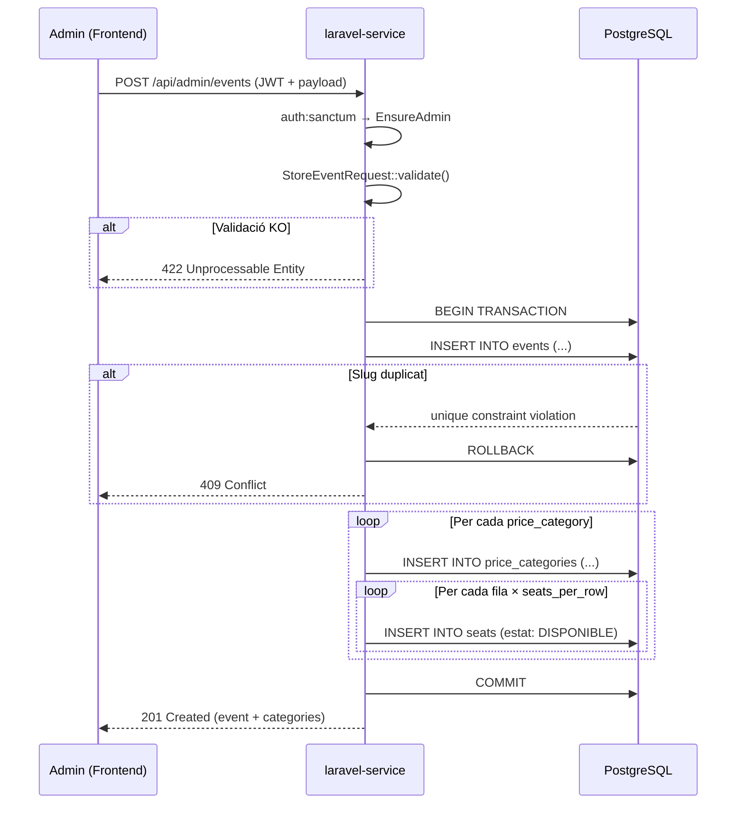

## Context

La funcionalitat actual de l'admin al backend Laravel permet llistar esdeveniments (`GET /api/admin/events`). No existeix cap endpoint per crear-los. L'administradora ha de poder crear un nou event amb les seves categories de preu i tots els seients en una sola operació atòmica. Si la transacció falla per qualsevol motiu (slug duplicat, validació, error de BD), cap registre ha de quedar a mig crear.

El backend és un monorepo amb dues capes: `laravel-service` (CRUD, auth, lògica de negoci) i `node-service` (NestJS + Socket.IO, temps real). La creació d'events és responsabilitat del `laravel-service`.

## Goals / Non-Goals

**Goals:**

- Endpoint `POST /api/admin/events` protegit per `auth:sanctum` + middleware `admin`
- Creació atòmica de `Event` + `PriceCategory[]` + `Seat[]` dins una transacció DB
- Validació: slug únic (`409`), data futura, camps requerits
- Generació automàtica de seients a partir de les files i quantitats definides per categoria
- Pàgina frontend `/admin/events/new` (CSR) amb formulari reactiu

**Non-Goals:**

- Publicació de l'event en el moment de la creació (el camp `published` serà `false` per defecte)
- Edició d'events existents (US-02-03)
- Eliminació d'events (US-02-04)
- Notificació en temps real als clients quan es crea un event nou

## Decisions

### 1. Transacció amb `DB::transaction()`

**Decisió**: usar `DB::transaction(fn() => ...)` al `AdminEventService` per envolicar la creació d'`Event`, `PriceCategory[]` i `Seat[]`.

**Alternativa**: Eloquent model events amb observers. Rebutjada perquè afegeix complexitat innecessària per a una operació d'inserció única.

**Raó**: Si la creació d'algun seient falla (ex. constraint violated), Laravel fa rollback automàtic i cap registre parcial queda a la BD.

### 2. Generació de seients per fila + quantitat per categoria

**Decisió**: cada categoria de preu al request inclou `rows` (array de lletres de fila) i `seats_per_row` (enter). El backend genera automàticament tots els seients.

**Alternativa**: enviar cada seient individualment al payload. Rebutjada — per sales de 200 seients, el payload seria enorme i la validació complexa.

**Raó**: La sala té una configuració de files uniforme. El formulari admin és més simple: l'admin defineix "Fila A–C, 10 seients/fila = 30 seients" per categoria, i el backend ho genera.

### 3. Slug: generat automàticament o enviat pel client

**Decisió**: el slug és enviat pel client (admin). Si no s'envia, el backend el genera a partir del `name` (lowercased, espais → guions, caràcters especials eliminats).

**Alternativa**: sempre generat pel backend. Rebutjada — l'admin pot voler controlar l'URL de l'event.

**Raó**: Flexibilitat per a l'admin sense afegir complexitat a la generació.

### 4. Schema del request

```json
POST /api/admin/events
{
  "name": "Dune: Part Two 4K Dolby",
  "slug": "dune-4k-dolby-2026",          // opcional, es genera si no s'envia
  "description": "Projecció especial...", // opcional
  "date": "2026-12-01T20:30:00",
  "venue": "Sala Gran",
  "price_categories": [
    {
      "name": "Platea",
      "price": 12.50,
      "rows": ["A", "B", "C"],
      "seats_per_row": 10
    },
    {
      "name": "General",
      "price": 9.00,
      "rows": ["D", "E", "F"],
      "seats_per_row": 10
    }
  ]
}
```

### 5. Schema de la resposta (201)

```json
{
  "id": "uuid",
  "name": "Dune: Part Two 4K Dolby",
  "slug": "dune-4k-dolby-2026",
  "date": "2026-12-01",
  "time": "20:30",
  "venue": "Sala Gran",
  "published": false,
  "total_capacity": 60,
  "price_categories": [
    { "id": "uuid", "name": "Platea", "price": "12.50", "seats_count": 30 },
    { "id": "uuid", "name": "General", "price": "9.00", "seats_count": 30 }
  ]
}
```

### 6. Diagrama de flux



## Risks / Trade-offs

- **[Risc] Events amb molts seients**: per a sales >500 seients, la inserció bulk pot ser lenta. → Mitigació: usar `Seat::insert([...])` (bulk insert) en lloc d'inserir seient per seient.
- **[Risc] Slug generat a partir del nom pot col·lidir**: si l'admin crea dos events amb el mateix nom. → Mitigació: el 409 informa l'admin, que pot corregir el slug manualment.
- **[Trade-off] `total_capacity` calculat vs. enviat**: es calcula automàticament sumant `rows.length × seats_per_row` per categoria. Consistència garantida, però l'admin no el pot sobreescriure.

## Migration Plan

No cal migració nova — les taules `events`, `price_categories` i `seats` ja existeixen.

Passos de deploy:

1. Merge PR amb el nou codi
2. Executar `php artisan test` (CI ho valida)
3. No cal `php artisan migrate` al servidor

## Open Questions

- Cal afegir un camp `image_url` a la creació d'events? → Pendent de US-02-xx o EP-09.
