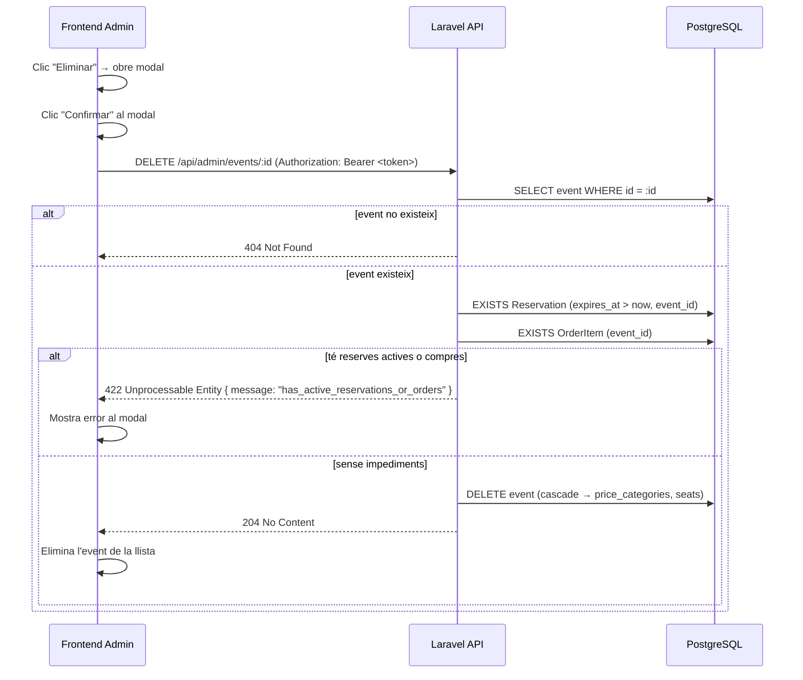

## Context

L'API admin ja disposa de `GET /api/admin/events`, `POST /api/admin/events`, `GET /api/admin/events/:id` i `PUT /api/admin/events/:id` implementats (US-02-01, US-02-02, US-02-03). Cal afegir `DELETE /api/admin/events/:id` per completar el CRUD d'events al panell d'administració.

La restricció clau és que eliminar un event amb reserves actives o compres associades comprometria la integritat de les dades dels compradors. El servei no ha d'eliminar mai un event que tingui `Reservation` no expirades o `OrderItem` vinculats als seus seients.

El backend usa **Laravel 11 + Eloquent** (PostgreSQL). El mòdul admin ja té `AdminEventController` i `AdminEventService` protegits per `auth:sanctum` + middleware `admin`.

## Goals / Non-Goals

**Goals:**

- Afegir `DELETE /api/admin/events/:id` a `AdminEventController` i `AdminEventService`.
- Rebutjar amb `422` si l'event té reserves actives (`Reservation.expires_at > now()`) o compres (`OrderItem` associats als seus seients).
- Eliminar en cascada `price_categories` i `seats` de l'event quan no hi ha impediments.
- Retornar `204 No Content` en eliminació exitosa.
- Retornar `404 Not Found` si l'event no existeix.
- Botó "Eliminar" amb modal de confirmació a la pàgina frontend `/admin/events`.

**Non-Goals:**

- Soft delete / restauració d'events esborrats.
- Publicació/despublicació d'events (US-02-05).
- Eliminar events amb reserves actives forçant l'alliberament previ (fora d'abast).

## Decisions

### Decisió 1: Hard delete vs soft delete

**Opció A (escollida):** Hard delete (`$event->delete()`). Si l'event no té reserves ni compres, s'elimina definitivament.

**Opció B:** Soft delete (`deleted_at`). — Rebuig: afegeix complexitat al model, a les queries i als seeds sense cap cas d'ús de restauració definit al backlog.

**Rationale:** El backlog no preveu restauració d'events. Hard delete és la solució mínima i correcta.

---

### Decisió 2: Com detectar impediments per eliminar

**Opció A (escollida):** Consultar si existeix algun `Reservation` amb `expires_at > now()` associat als seients de l'event, o algun `OrderItem` associat als mateixos seients. Si és el cas, retornar `422`.

```php
// La taula `seats` té una FK directa `event_id` → no cal passar per `priceCategory`.
$hasActiveReservations = Reservation::where('expires_at', '>', now())
    ->whereHas('seat', fn($q) => $q->where('event_id', $event->id))
    ->exists();

$hasOrders = OrderItem::whereHas('seat', fn($q) => $q->where('event_id', $event->id))
    ->exists();
```

**Opció B:** Sempre permetre eliminar i alliberar reserves prèviament. — Rebuig: implica cancel·lar compres i notificar compradors, fora d'abast d'aquest US.

**Rationale:** Consistent amb el disseny de PE-16 (edit), que aplica la mateixa guarda per a reserves actives. S'usa `seat.event_id` directament (FK existent a la migració de US-01-03) en lloc de la cadena `seat → priceCategory → event_id`, simplificant la query sense canviar la semàntica.

---

### Decisió 3: Cascada de BD

Les FK de `price_categories` → `events` i `seats` → `price_categories` ja disposen de `onDelete('cascade')` des de les migrations de US-01-03. L'eliminació de l'`Event` elimina automàticament les categories i seients associats sense cap migració addicional.

---

### Decisió 4: UX frontend — modal de confirmació

**Opció A (escollida):** Modal de confirmació inline a la pàgina `/admin/events` (component Nuxt usant `<dialog>` natiu o div condicionat). Quan el backend retorna `422`, es mostra un missatge d'error sense tancar el modal.

**Opció B:** Pàgina de confirmació independent `/admin/events/[id]/delete`. — Rebuig: afegeix una ruta extra sense guany de UX. La confirmació inline és suficient.

**Rationale:** El flux més ràpid per a l'administradora és confirmar i veure el resultat sense canviar de pàgina.

---

## Diagrama de flux



## Risks / Trade-offs

- **Risc:** Reserves que expirenmentres s'executa la comprovació podrien quedar en un estat intermig. → Mitigació: la comprovació `expires_at > now()` és atòmica a la BD; un cron de 30s s'encarrega d'alliberar-les independentment.
- **Risc:** L'eliminació en cascada elimina seients permanentment; si hi ha compres sense `OrderItem` vàlid (inconsistència de BD), seients comprats podrien perdre la referència. → Mitigació: la guarda sobre `OrderItem` prevé aquesta situació.
- **Trade-off:** No hi ha soft delete; no es poden restaurar events eliminats per error. → Acceptable perquè el backlog no preveu restauració.
