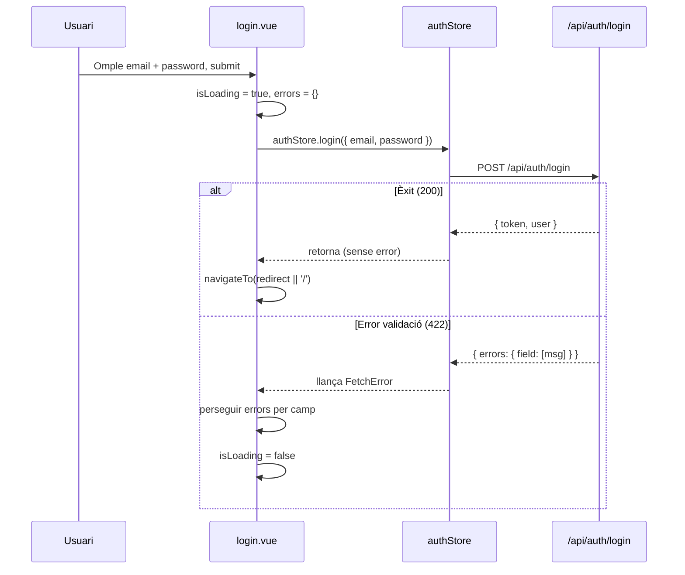
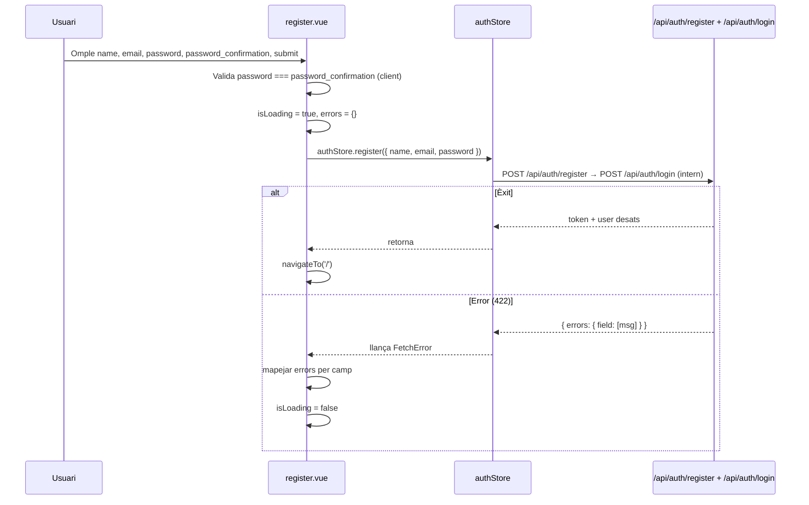

## Context

Els endpoints d'autenticació (`POST /api/auth/register`, `POST /api/auth/login`) i la store Pinia `stores/auth.ts` (amb les accions `register()` i `login()`) ja estan operatius. El middleware `middleware/auth.ts` redirigeix els usuaris no autenticats a `/auth/login`, però aquesta ruta no existia. Tampoc existia la ruta `/auth/register`. PE-51 crea les dues pàgines de formulari que completen el flux d'autenticació al frontend.

## Goals / Non-Goals

**Goals:**

- Crear `pages/auth/login.vue` i `pages/auth/register.vue` com a rutes públiques de Nuxt 3
- Formularis reactius que criden les accions de la store `useAuthStore`
- Mostrar errors de validació del servidor per camp (no genèrics)
- Mostrar estat de càrrega durant la petició (botó disabled + indicador visual)
- Redirecció a la ruta anterior (o `/`) en èxit al login; redirecció a `/` en èxit al registre
- Redirecció a `/` si l'usuari ja és autenticat en accedir a les pàgines

**Non-Goals:**

- OAuth / login social, recuperació de contrasenya, gestió de perfil
- Modificar `stores/auth.ts`, `middleware/auth.ts` ni cap altra store existent

## Decisions

### Decisió 1: Gestió d'errors per camp sense canvis a la store

**Elecció**: Capturar l'error de `$fetch` dins de la pàgina (try/catch) i mapejar els missatges d'error als camps del formulari localment, sense afegir estat d'error a la store.

**Alternativa considerada**: Afegir un camp `errors` a `stores/auth.ts`. Rebutjada perquè la store ja és correcta i estable; els errors de formulari són estat de presentació local (no cal persistir ni compartir-los).

**Rationale**: Principi de responsabilitat única — la store gestiona l'estat d'autenticació, la pàgina gestiona l'estat del formulari.

### Decisió 2: `useRoute().query.redirect` per redirecció post-login

**Elecció**: El middleware `auth.ts` ja redirigeix a `/auth/login`; la pàgina de login llegirà `route.query.redirect` (si existeix) per tornar a la pàgina original.

**Alternativa considerada**: Guardar la ruta anterior a Pinia. Rebutjada per afegir complexitat innecessària.

### Decisió 3: `definePageMeta({ middleware: [] })` per rutes públiques

**Elecció**: Les pàgines d'auth no declaren cap middleware per ser accessibles sense token. Un guard addicional (`onMounted`) redirigirà a `/` si `isAuthenticated` és `true`.

**Rationale**: Les rutes `/auth/*` han de ser públiques; afegir un guard explícit evita que usuaris ja autenticats tornin al formulari.

### Decisió 4: Formularis sense llibreria externa de validació

**Elecció**: Validació bàsica HTML5 (`required`, `type="email"`, `minlength`) i errors del servidor mostrats per camp.

**Alternativa considerada**: VeeValidate o Zod. Rebutjada per no ser necessaris per formularis simples de 2-4 camps.

## Flux UX — Login



## Flux UX — Register



## Estructura d'errors del backend

El backend Laravel retorna erreurs de validació com:

```json
{
  "message": "The email has already been taken.",
  "errors": {
    "email": ["The email has already been taken."]
  }
}
```

La pàgina extreu `error.data?.errors` (objecte `Record<string, string[]>`) i associa el primer missatge de cada camp al camp corresponent del formulari.

## Risks / Trade-offs

- **[Risc] Canvis a l'API d'errors del backend**: Si el format `errors` canvia, el mapeig de camp fallarà silenciosament → **Mitigació**: mostrar sempre un error genèric de fallback si `errors` és undefined.
- **[Trade-off] Validació `password_confirmation` al client**: Es fa a la pàgina, no a la store — coherent amb la decisió 1, però significa que si la store `register()` s'usa directament sense la pàgina, no hi ha validació d'aquest camp.

## Testing Strategy

- **Fitxers**: `pages/auth/login.spec.ts`, `pages/auth/register.spec.ts`
- **Framework**: Vitest + `@nuxt/test-utils`
- **Mocks**: `useAuthStore` (actions simulades), `navigateTo`
- **Cobertura**:
  - Submit amb dades vàlides → acció de store cridada + redirecció
  - Submit amb errors de validació → errors mostrats per camp
  - Usuari ja autenticat → redirecció a `/` sense cridar l'acció
  - Estat de càrrega durant la petició (botó disabled)
