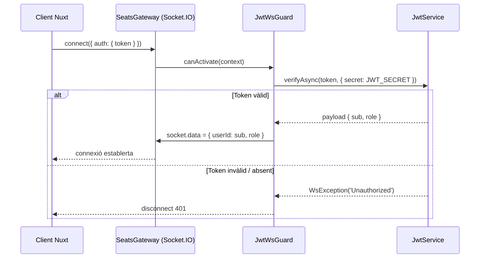

## Context

El Node Service (NestJS) gestiona totes les connexions WebSocket (Socket.IO) de la plataforma. Fins ara, el mòdul `auth` existeix però és buit: no hi ha cap mecanisme que verifiqui si el client que es connecta al gateway té un token JWT vàlid. Qualsevol client pot connectar-se i emetre events com `seient:reservar` sense autenticació.

El `JWT_SECRET` és el mateix per a Laravel i el Node Service (variable d'entorn compartida). Gràcies a això, el Node Service pot validar signatures JWT sense consultar la BD, mantenint el patró de "servidor com a única font de veritat" per a les reserves, però evitant dependències de BD en temps de handshake.

Estat actual:

- `src/auth/auth.module.ts` — mòdul buit, sense providers
- `src/gateway/gateway.module.ts` — mòdul buit (el gateway es scaffoldarà a US-03-02)
- `@nestjs/jwt` ja present a `package.json`

## Goals / Non-Goals

**Goals:**

- Implementar `JwtWsGuard` que valida JWT en el handshake Socket.IO
- Extreure `userId` i `role` del payload JWT i afegir-los a `socket.data`
- Rebutjar connexions sense JWT vàlid o expirat amb codi `401`
- Configurar `AuthModule` amb `JwtModule` per a ús del guard

**Non-Goals:**

- Implementar el gateway de seients (SeatsGateway) — és US-03-02
- Protegir endpoints HTTP REST amb JWT — ja cobert per Laravel Sanctum
- Gestionar la renovació o invalidació de tokens (logout blacklist)
- Validar el `role` dins del guard — tan sols es propaga al context

## Decisions

### D1: Guard com a `WsGuard` de NestJS vs. middleware Socket.IO

**Escollit**: `WsGuard` NestJS (`@UseGuards` / `canActivate` al gateway).

**Alternativa considerada**: Middleware Socket.IO natiu (`server.use((socket, next) => {...})`).

**Rationale**: El `WsGuard` s'integra amb el sistema de decoradors de NestJS, permet injectar `JwtService` via DI, i facilita el testing amb `@nestjs/testing`. El middleware Socket.IO natiu trencaria la coherència arquitectural del projecte.

### D2: Origen del token — `socket.handshake.auth.token` vs query param

**Escollit**: `socket.handshake.auth.token` com a primera opció, amb fallback a `socket.handshake.query.token`.

**Rationale**: El camp `auth` de Socket.IO és l'estàndard recomanat per passar credencials en el handshake; els query params queden a logs del servidor. El client Nuxt envia el token via `io(url, { auth: { token } })`.

### D3: Tipatge de `socket.data`

**Escollit**: Interfície `AuthenticatedSocket` que extén `Socket` amb `data: { userId: string; role: string }`.

**Rationale**: Permet que els gateways futurs (US-03-02) accedeixin a `socket.data.userId` amb tipatge fort, evitant `any`.

### D4: Biblioteca JWT — `JwtService` de `@nestjs/jwt` vs `jsonwebtoken` directe

**Escollit**: `JwtService` de `@nestjs/jwt` (ja instal·lat).

**Rationale**: Consistència amb l'ecosistema NestJS, injectable via DI, configurable al mòdul. `@nestjs/jwt` usa `jsonwebtoken` internament.

## Decisions — Diagrama de flux

## Risks / Trade-offs

- **[Risc] Token expirat entre handshake i ús** → El guard valida en connexió inicial. Si el token expira mentre la connexió és activa, l'usuari continuarà connectat fins a la propera reconexió. Mitigació: el client Nuxt gestiona reconexió automàtica amb el token refrescat (fora d'abast d'aquest US).

- **[Risc] `JWT_SECRET` absent al `.env`** → `JwtService.verifyAsync` llançarà excepció en cada connexió. Mitigació: el guard captura l'excepció i retorna `WsException`; el servidor no cau. Documentar `JWT_SECRET` a `.env.example`.

- **[Trade-off] Guard només en handshake** → Un token vàlid en connexió inicial garanteix autenticació, però no re-valida en cada event. Acceptable per TTL de token de 1h (configurable).

## Testing Strategy

- **`src/auth/jwt-ws.guard.spec.ts`** (Vitest):
  - `JwtWsGuard` s'instancia directament (`new JwtWsGuard(mockJwtService, mockConfigService)`) per evitar la sobrecàrrega del mòdul NestJS en tests unitaris. `JwtService` i `ConfigService` es passen com a mocks `vi.fn()`.
  - Test: token vàlid → `canActivate` retorna `true` i `socket.data.userId` / `socket.data.role` contenen `sub` / `role` del payload
  - Test: token absent (ni `auth.token` ni `query.token`) → llança `WsException('Unauthorized')`
  - Test: token expirat (`TokenExpiredError`) → llança `WsException('Unauthorized')`
  - Test: signatura invàlida (`JsonWebTokenError`) → llança `WsException('Unauthorized')`
  - Test: fallback a `query.token` quan `auth.token` és absent → connexió establerta
- No cal testar `AuthModule` per separat (és wire-up de DI)
- **Escenaris diferits a US-03-02**: "Unauthenticated event emission is blocked" i verificació del codi `401` al client requereixen un gateway real (SeatsGateway) i es cobriran quan s'implementi US-03-02.

## Migration Plan

1. Afegir `JWT_SECRET` a `.env.example` del node-service (si no existeix ja)
2. Implementar `JwtWsGuard` i actualitzar `AuthModule`
3. El guard s'aplicarà als gateways quan s'implementin (US-03-02)
4. Sense canvis de BD → rollback trivial (eliminar els fitxers nous)

## Open Questions

_(cap)_
