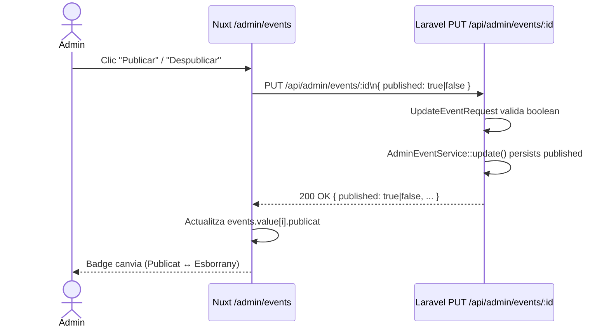

## Context

La funcionalitat de publicar/despublicar un event (US-02-05 / PE-18) és una extensió minimalista del flux de gestió d'events de l'administrador. El model `Event` ja compta amb el camp `published` (boolean, default `false`) gràcies a la migració `2026_04_07_000000_add_published_to_events_table.php`.

**Estat actual:**

- `AdminEventService::update()` accepta `['name', 'slug', 'description', 'date', 'venue']` com a fillable, però **no** inclou `published`.
- `UpdateEventRequest` no valida el camp `published`.
- No existeix cap endpoint públic `GET /api/events` a `routes/api.php` — pendent de crear.
- La pàgina `/admin/events` ja mostra un botó "Publicar/Despublicar" per fila, però sense handler (`@click` buit).

**Stakeholders:** administradora (toggle de publicació), usuaris públics (visibilitat de la cartellera).

## Goals / Non-Goals

**Goals:**

- Permetre a l'administradora activar/desactivar la visibilitat pública d'un event des de la llista `/admin/events`.
- Crear l'endpoint públic `GET /api/events` que únicament retorna events amb `published = true`.
- Feedback visual immediat al frontend (canvi reactiu de badge sense recàrrega).

**Non-Goals:**

- Publicació programada per data/hora.
- Gestió de l'estat `published` des del formulari d'edició `/admin/events/[id]` (fora d'abast d'aquest ticket).
- Endpoint públic `GET /api/events/:slug` (US-03-01).

## Decisions

### Decisió 1 — Reutilitzar `PUT /api/admin/events/:id` per al toggle

**Opció escollida:** afegir `published` al payload de `PUT /api/admin/events/:id` existent.

**Alternativa considerada:** nou endpoint `PATCH /api/admin/events/:id/publish`.

**Raó:** La US-02-05 especifica explícitament "reutilitzar `PUT /api/admin/events/:id` amb `{ published: true/false }`". Mantenir un únic endpoint d'actualització redueix la superfície de routing i evita duplicació de lògica d'autorització.

### Decisió 2 — Endpoint públic `GET /api/events` com a nou EventController

**Opció escollida:** crear `App\Http\Controllers\EventController` amb mètode `index()` que filtra per `published = true`.

**Alternativa considerada:** afegir mètode `index` públic a `AdminEventController`.

**Raó:** Separació de responsabilitats: `AdminEventController` és un controlador protegit per `auth:sanctum` + `admin`. Barrejar rutes públiques i privades al mateix controlador viola el principi de responsabilitat única.

### Decisió 3 — Actualització reactiva de la llista al frontend

**Opció escollida:** mutació directa de `events.value` a l'array (sense `refresh()`).

**Alternativa considerada:** cridar `refresh()` del `useFetch` per re-obtenir la llista del servidor.

**Raó:** La operació és determinista — el backend retorna el camp `publicat` actualitzat a la resposta del `PUT`. Actualitzar localment proporciona feedback immediat sense latència addicional i és la solució més lleugera per a un toggle simple.

## Diagrama de flux



## Canvis per capa

### Backend — `UpdateEventRequest`

Afegir la regla de validació per permetre `published` al payload:

```php
'published' => ['sometimes', 'boolean'],
```

### Backend — `AdminEventService::update()`

Ampliar el camp `$fillable` per incloure `published`:

```php
$fillable = array_intersect_key(
    $data,
    array_flip(['name', 'slug', 'description', 'date', 'venue', 'published'])
);
```

### Backend — Nou `EventController` (rutes públiques)

```php
// routes/api.php
Route::get('/events', [EventController::class, 'index']); // public

// App\Http\Controllers\EventController
public function index(): JsonResponse
{
    $events = Event::where('published', true)->orderBy('date')->get()->map(...);
    return response()->json($events);
}
```

Resposta de cada event: `id`, `name`, `slug`, `date`, `venue`.

### Frontend — `/admin/events/index.vue`

Afegir funció `togglePublish(event)` i `@click="togglePublish(event)"` al botó:

```ts
async function togglePublish(event: AdminEvent) {
  try {
    const updated = await $fetch<{ published: boolean }>(
      `/api/admin/events/${event.id}`,
      {
        method: "PUT",
        headers: { Authorization: `Bearer ${authStore.token}` },
        body: { published: !event.publicat },
      },
    );
    event.publicat = updated.published;
  } catch {
    // error handling
  }
}
```

## Risks / Trade-offs

- **[Risc] Mutació directa del camp `publicat` a l'array local** — si el servidor retorna un error, cal revertir l'estat local. Mitigació: gestionar el `catch` i no actualitzar fins a rebre resposta exitosa.
- **[Risc] No existeix `EventController` per a rutes públiques** — la primera versió no té pàgina pública de cartellera funcional; crear l'endpoint ara és un prerequisit de US-03-01. Cap risc operacional.

## Testing strategy

- **Backend (Laravel Feature tests)**:
  - `AdminEventUpdateTest` — nou test: `PUT /api/admin/events/:id` amb `{ published: true }` persisted successfully.
  - Nou `EventControllerTest` — `GET /api/events` retorna només events publicats.
- **Frontend (Vitest + @nuxt/test-utils)**:
  - `pages/admin/events/index.spec.ts` — nou test del toggle: mock `$fetch` PUT, verificar que `event.publicat` canvia reactiu.
