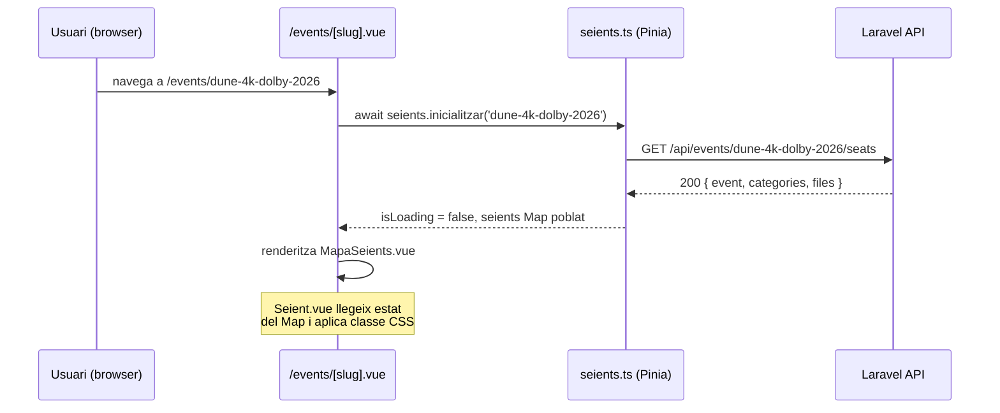

## Context

El projecte Sala Onirica té el backend separat en dos serveis: Laravel (API REST + BD) i Node (temps real via Socket.IO). Les capabilitats `US-02-02` i `US-02-05` ja existeixen i garanteixen que hi haurà events publicats amb seients a la BD. Ara cal la pàgina frontend que en mostri l'estat visual.

L'arquitectura actual és: **Nginx** (port 80) → `/api/*` → **Laravel** (port 8000), `/ws/*` → **Node** (port 3001), `/` → **Nuxt** (port 3000). El Token JWT de l'usuari autenticat viu a la store Pinia `auth.ts` i a `localStorage`. Les actualitzacions en temps real (US-03-02) vindran en la pròxima iteració; aquest US cobreix exclusivament la càrrega inicial de dades.

## Goals / Non-Goals

**Goals:**

- Nova pàgina Nuxt `/events/[slug]` (CSR) que crida `GET /api/events/{slug}/seats`
- Store Pinia `seients.ts` amb acció `inicialitzar(slug)` i mapa reactiu de seients
- Components `MapaSeients.vue`, `Seient.vue`, `LlegendaEstats.vue`, `NotificacioEstat.vue`
- Nou endpoint Laravel `GET /api/events/{slug}/seats` (públic, sense auth)
- Responsivitat: scroll horitzontal en mòbil per files llargues

**Non-Goals:**

- Actualitzacions en temps real via Socket.IO (US-03-02)
- Interacció de reserva o selecció de seient (US-04-01)
- SSR del mapa de seients (la reactivitat i el WS el fan inadequat per SSR)
- Autenticació requerida per veure el mapa (visitants sense compte han de poder veure'l)

## Decisions

### Decisió 1 — CSR per a la pàgina d'event (no SSR)

**Elecció:** `definePageMeta({ ssr: false })` a la pàgina `/events/[slug]`.

**Alternativa considerada:** SSR amb `useFetch` al setup i `<NuxtData>` per hidratar. Descartada perquè l'estat dels seients canvia contínuament (US-03-02 afegirà WebSocket) i SSR produiria snapshots obsolets que requeririen re-hidratació complexa.

**Raó:** CSR simplifica molt el codi de la store i elimina el risc de mismatch HTML en hidratació quan s'actualitzi en temps real.

### Decisió 2 — Store Pinia amb `Map<string, SeatState>` en lloc d'array

**Elecció:** La store `seients.ts` desa els seients com a `Map<seatId, { estat, fila, numero, categoria, preu }>`.

**Alternativa considerada:** Array `Seat[]`. Descartada perquè US-04-01 necessitarà actualitzar un seient concret per ID; amb Map, l'actualització és O(1) en comptes de O(n).

**Raó:** Prepara l'estructura per a `seients.actualitzarEstat(seatId, estat)` de US-03-02 sense canviar la interfície de la store.

### Decisió 3 — Endpoint públic (sense JWT requerit)

**Elecció:** `GET /api/events/{slug}/seats` no requereix autenticació a Laravel.

**Alternativa considerada:** Requerir JWT per veure el mapa. Descartada: el Backlog (US-03-01) especifica que visitants sense compte han de poder veure el mapa (rol Visitant).

**Raó:** Els seients disponibles no són dades sensibles; el JWT s'exigirà a les accions de reserva (US-04-01).

### Decisió 4 — Resposta de l'API agrupada per fila

**Elecció:** L'endpoint retorna `{ event, categories, files: { [fila]: Seat[] } }`.

**Alternativa considerada:** Llista plana de seients. Descartada perquè el component `MapaSeients.vue` renderitza fila per fila amb `v-for`; agrupar al servidor evita transformacions innecessàries al client.

**Raó:** Redueix complexitat al frontend i facilita l'ordenació garantida de files al servidor (ORM).

## Risks / Trade-offs

- **[Risc] La pàgina queda en blanc si l'event no existeix o no està publicat** → Mitigació: l'endpoint retorna `404`; la pàgina mostra un missatge d'error amb `NotificacioEstat.vue` i un botó "Tornar a la portada".
- **[Risc] Molts seients (>300) generen un grid lent** → Mitigació: renderització amb CSS Grid nativa (sense virtualització per ara); US-09-03 podrà afegir optimitzacions si cal.
- **[Trade-off] CSR implica FOUC breu (flash of unstyled content)** → Acceptable per a MVP; el loading state de la store mostra un skeleton mentre es carreguen les dades.

## Migration Plan

Additive — cap migració de BD ni canvi a endpoints existents. El nou endpoint s'afegeix al router de Laravel sense tocar cap ruta existent. La nova pàgina Nuxt és un fitxer nou a `pages/events/[slug].vue`.

## Open Questions

- _(Resolt)_ Necessita auth el visitant? → No; endpoint públic (veure Decisió 3).
- Com es gestiona la paginació si un event té > 500 seients? → Fora d'abast del MVP; resposta completa acceptable per a Sala Onirica (màx. ~200 seients per sessió).

---

## Diagrama de flux

---

## Testing Strategy

| What                                 | Framework                  | How                                                           |
| ------------------------------------ | -------------------------- | ------------------------------------------------------------- |
| `seients.ts` → `inicialitzar()`      | Vitest + `@pinia/testing`  | Mock `$fetch`; verificar que el Map queda poblat correctament |
| `seients.ts` → estat de càrrega      | Vitest                     | Verificar `isLoading` true/false durant i després de la crida |
| `Seient.vue` → classes de color      | Vitest + `@vue/test-utils` | Muntar amb prop `estat`; verificar classe CSS en cada estat   |
| `MapaSeients.vue` → renderitza files | Vitest + `@vue/test-utils` | Mock store; verificar que es renderitzen tots els seients     |
| `LlegendaEstats.vue` → 4 ítems       | Vitest + `@vue/test-utils` | Snapshot o count dels elements                                |
| Laravel `EventSeatsController` → 200 | PHPUnit/Pest               | `actingAs(null)` + event seeded + assert JSON structure       |
| Laravel `EventSeatsController` → 404 | PHPUnit/Pest               | Slug inexistent → assert 404                                  |
