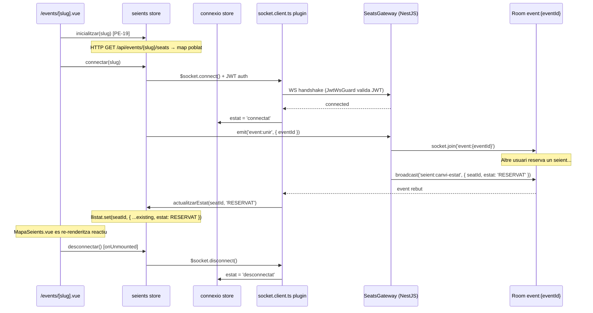

## Context

PE-19 va lliurar la pàgina `/events/[slug]` amb el mapa de seients i l'estat inicial carregat via `GET /api/events/{slug}/seats` (Laravel). La store `seients.ts` emmagatzema els seients en un `Map<seatId, SeatState>` preparat per a actualitzacions en O(1), però sense cap connexió WebSocket.

El `GatewayModule` del Node Service (NestJS) existeix però és buit — no hi ha cap `@WebSocketGateway` ni handlers de Socket.IO. El guard `JwtWsGuard` (PE-52) és funcional i injectable. No existeix cap plugin `socket.client.ts` al frontend.

PE-20 tanca el loop: el gateway gestiona el room de l'event, i el frontend s'hi subscriu per rebre i aplicar els canvis d'estat dels seients en temps real.

## Goals / Non-Goals

**Goals:**

- `SeatsGateway` (NestJS) amb handler `event:unir` que afegeix el client al room `event:{eventId}`
- Mètode `emitCanviEstat(eventId, payload)` al gateway per broadcasar `seient:canvi-estat` a tot el room (usat per futurs mòduls EP-04 i cron EP-04-05)
- Plugin Nuxt `plugins/socket.client.ts` que inicialitza la connexió Socket.IO amb el JWT de l'auth store
- Store Pinia `connexio.ts` que exposa `estat` (`connectat` | `desconnectat` | `reconnectant`)
- Extension de `seients.ts` amb `connectar(slug)`, `desconnectar()` i `actualitzarEstat(seatId, estat)`
- La pàgina `/events/[slug]` crida `connectar` en `onMounted` i `desconnectar` en `onUnmounted`

**Non-Goals:**

- Handlers `seient:reservar` i `seient:alliberar` (US-04-01, EP-04)
- Broadcast de `stats:actualitzacio` (EP-06)
- Indicador de connexió visible a la UI (US-03-03)
- Reconnexió automàtica amb recuperació d'estat complet (US-09-04)
- Visitor (no autenticat) amb WS — el mapa estàtic de PE-19 és suficient per a visitants

## Decisions

### Decisió 1 — Socket.IO inicialitzat al plugin, no a la store

**Elecció:** `plugins/socket.client.ts` crea la instància Socket.IO (`io(url, { auth: { token } })`) i la proporciona com a `$socket` via `provide`. Les stores consumen `$socket` a través de `useNuxtApp()`.

**Alternativa considerada:** Crear el socket directament a `connexio.ts` o `seients.ts`. Descartada perquè el socket és un recurs global compartit entre múltiples stores futures (`seients.ts`, `reserva.ts`); crear-lo a una store particular crea dependències creuades entre stores i impedeix centralitzar la gestió del cicle de vida (connect/disconnect/reconnect).

**Raó:** El plugin és el lloc natural per a recursos globals del client a Nuxt 3. Amb `provide`, la instància és injectable de manera testable.

### Decisió 2 — JWT llegit de l'auth store en el moment de la connexió

**Elecció:** El plugin llegeix `useAuthStore().token` just quan el component `/events/[slug]` crida `connectar()` (lazy connect), no en inicialitzar el plugin.

**Alternativa considerada:** Connexió automàtica al carregar el plugin. Descartada perquè visitants no autenticats no necessiten WebSocket (el mapa static de PE-19 és suficient) i la connexió anticipada malbarataria recursos al servidor per a pàgines que no necessiten temps real.

**Raó:** Connexió sota demanda és més eficient i evita errors de JWT no disponible en pages públiques.

### Decisió 3 — `event:unir` gestionat al gateway amb JwtWsGuard

**Elecció:** El handler `@SubscribeMessage('event:unir')` al `SeatsGateway` utilitza `@UseGuards(JwtWsGuard)` i crida `socket.join(\`event:${eventId}\`)`. El payload és `{ eventId: string }`.

**Alternativa considerada:** Unir-se al room al handshake (via `handleConnection`). Descartada perquè l'`eventId` no és conegut a la connexió; un client pot visitar múltiples events en la mateixa sessió de browser. Unir-se via event explícit permet abandonar el room anterior en navegar a un altre event.

**Raó:** Granularitat per event; el client pot emetre `event:unir` amb el nou `eventId` en cada navegació.

### Decisió 4 — `SeatsGateway` exportat per a ús des d'altres mòduls

**Elecció:** `GatewayModule` exporta `SeatsGateway`. `ReservationsModule` i futurs mòduls d'EP-04 importaran `GatewayModule` i injectaran `SeatsGateway` per cridar `emitCanviEstat`.

**Alternativa considerada:** Event emitter intern de NestJS (`EventEmitter2`). Descartada per afegir complexitat innecessària; la dependència directa és trivial amb el sistema de mòduls de NestJS i suficientment petita per al MVP.

**Raó:** Simplicitat; el bus d'events seria apropit si diversos emissors estiguessin en mòduls profundament desacoblats.

### Decisió 5 — `actualitzarEstat` a `seients.ts` és síncrona, no async

**Elecció:** `actualitzarEstat(seatId: string, estat: EstatSeient): void` actualitza directament `this.llistat.set(seatId, { ...existing, estat })`. No fa cap crida HTTP.

**Alternativa considerada:** Refetch de l'endpoint `GET /api/events/{slug}/seats` en rebre el WS event. Descartada; el servidor ja ha fet el broadcast amb el nou estat; re-fetchar duplicaria la latència i sobrecarregaria Laravel.

**Raó:** El servidor és la font de veritat; el broadcast `seient:canvi-estat` porta el nou estat directament.

## Risks / Trade-offs

- **[Risc] El JWT expira mentre la connexió WS és activa** → El servidor desconnectarà el client quan el token expiri (guard al handshake). Mitigació: la store `connexio.ts` detecta el `disconnect` i el frontend pot mostrar un missatge (US-03-03 / PE-21). Reconnexió amb token refrescat és US-09-04.
- **[Risc] El client envia `event:unir` per a un event que no existeix** → El gateway fa join al room igualment (no hi haurà mai broadcasts per rooms sense event real). Mitigació: opcional, el gateway pot verificar l'existència de l'event via `LaravelClientService`; per ara s'omet per simplicitat.
- **[Trade-off] Visitants sense compte no veuen canvis en temps real** → Acceptable; el PRD estableix que el JWT és requerit per a operacions de reserva. Visitants veuen el snapshot de PE-19.
- **[Risc] `socket.client.ts` no és executat en SSR** → Correcte per disseny; el fitxer `.client.ts` el Nuxt modular el carrega exclusivament al costat del browser. La pàgina `/events/[slug]` ja és `ssr: false`.

## Migration Plan

Additive — cap canvi de BD, cap canvi a endpoints existents de Laravel. S'afegeix:

1. `SeatsGateway` al `GatewayModule` del Node Service
2. Plugin `socket.client.ts` i stores `connexio.ts` al frontend
3. Noves accions a `seients.ts` (sense trencar cap acció existent)
4. Lifecycle hooks a `pages/events/[slug].vue` (sense SSR, risc zero)

Cap rollback especial requerit — els components poden funcionar sense WS si el Node Service no arrenca (el mapa estàtic de PE-19 continua funcionant).

## Open Questions

- _(A resoldre a US-03-03)_ Disseny visual de l'indicador de connexió al DOM.
- _(A resoldre a US-09-04)_ Estratègia de reconnexió automàtica i recarrega d'estat complet.

---

## Diagrama de flux — Subscripció i actualització en temps real

