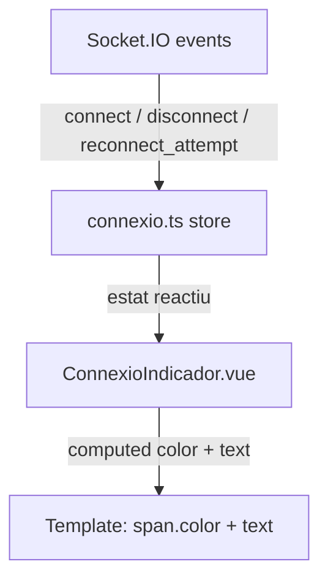

## Context

PE-20 va lliurar la store Pinia `connexio.ts` amb tres estats reactius (`connectat`, `desconnectat`, `reconnectant`) alimentats pels events Socket.IO `connect`, `disconnect` i `reconnect_attempt`. Tanmateix, no existeix cap element visual que exposi aquest estat a l'usuari.

A la pàgina `/events/[slug]`, un usuari podria estar veient un mapa de seients obsolet (connexió interrompuda per canvi de xarxa o expiració del JWT) sense cap indicació. PE-21 cobreix exclusivament la capa de presentació: un component `ConnexioIndicador.vue` que llegeix `connexio.estat` i renderitza un senyal visual.

## Goals / Non-Goals

**Goals:**

- Nou component `components/ConnexioIndicador.vue` que mostra:
  - Punt verd + text "Connectat" quan `estat === 'connectat'`
  - Punt vermell + text "Reconnectant…" quan `estat === 'reconnectant'`
  - Punt vermell + text "Desconnectat" quan `estat === 'desconnectat'`
- Integrar `ConnexioIndicador` a la pàgina `pages/events/[slug].vue`
- Test unitari `components/ConnexioIndicador.spec.ts` amb `@nuxt/test-utils`

**Non-Goals:**

- Lògica de reconnexió automàtica (US-09-04)
- Notificació toast o modal (component purament inline)
- Indicador a altres pàgines (admin, checkout)

## Decisions

### Decisió 1 — Component sense lògica pròpia (presentacional pur)

**Elecció:** `ConnexioIndicador.vue` únicament importa `useConnexioStore()` i deriva classes CSS / textos amb una `computed` o directament al template mitjançant expressions condicionals.

**Alternativa considerada:** Duplicar la subscripció als events Socket.IO dins del component. Descartada perquè la store `connexio.ts` ja encapsula tota la lògica d'estat; un segon listener crearia duplicació i possibles inconsistències.

**Raó:** Principi d'única responsabilitat — la store gestiona l'estat, el component només el representa. Afavoreix testabilitat: el test només necessita mockbar la store.

### Decisió 2 — Integració directa a `events/[slug].vue`, no via slot

**Elecció:** `<ConnexioIndicador />` s'afegeix com a element fix a l'encapçalament de la pàgina (damunt del `<MapaSeients />`).

**Alternativa considerada:** Exposar-lo com a slot al layout o en un portal teleportat. Descartada per ser innecessàriament complexa per a un component d'una sola pàgina.

**Raó:** La connexió WebSocket és específica de la pàgina d'event (CSR, `ssr: false`); no té sentit un slot global.

### Decisió 3 — Estils amb classes Tailwind (sense CSS scoped nou)

**Elecció:** Tot l'estilat del component usa classes Tailwind sense cap bloc `<style scoped>`:
- Punt d'estat: `bg-green-500` / `bg-red-500`, `rounded-full`, `w-2 h-2 inline-block`
- Text d'estat: `text-green-400` / `text-red-400`, `text-xs font-medium` — colors adaptats al fons fosc OLED de la pàgina d'event

**Alternativa considerada:** CSS scoped amb variables CSS. Descartada — el projecte usa Tailwind (visible en els components existents de PE-19); afegir CSS scoped per a dos estats de color seria inconsistent.

**Raó:** Consistència amb l'estil inline del projecte i zero overhead de CSS scoped. Les classes de color del text (`text-green-400` / `text-red-400`) garanteixen contrast suficient sobre el fons `#0f0f23` de la pàgina d'event sense necessitar CSS addicional.

## Testing Strategy

- **Framework:** Vitest + `@nuxt/test-utils` (consistent amb la resta del frontend)
- **Fitxer:** `components/ConnexioIndicador.spec.ts`
- **Unitats testades:** Renderitzat del component per als tres estats de la store
- **Mock:** `useConnexioStore` retornat com a `{ estat: ref('connectat') }` (o `desconnectat`, `reconnectant`)
- **Assertions:** presència del text esperat i de la classe de color correcta per a cada estat

## Risks / Trade-offs

- **[Risc] `useNuxtApp()` no disponible en test unitari** → Mitigació: `connexio.ts` s'accedeix via `useConnexioStore()` i la store es mocka directament amb `vi.mock`; no cal `useNuxtApp` al component.
- **[Trade-off] Indicador sempre visible, fins i tot quan el socket no s'ha iniciat** → Quan `seients.ts` no ha cridat `connectar()` (p.ex. usuari no autenticat), `connexio.estat` val `'desconnectat'` per defecte. Acceptable: el visitant no autenticat veu "Desconnectat" que és tècnicament correcte (no té WS actiu).

## Migration Plan

Additive — cap canvi al backend, cap canvi a la BD, cap canvi a endpoints existents. S'afegeix:

1. `components/ConnexioIndicador.vue` (fitxer nou)
2. `components/ConnexioIndicador.spec.ts` (fitxer nou)
3. Import i ús a `pages/events/[slug].vue` (modificació mínima)
