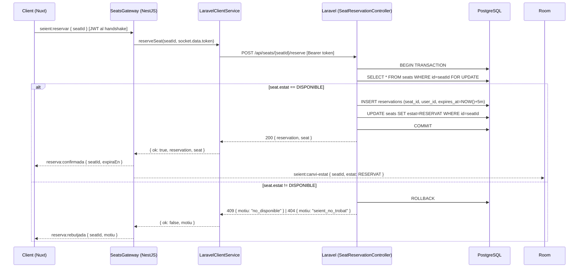

## Context

El mapa de seients (EP-03) ja és funcional: els clients es connecten per WebSocket, reben l'estat inicial dels seients i escolten canvis en temps real. El pas següent (EP-04) és permetre als usuaris reservar un seient temporalment abans de completar la compra.

El repte principal és la concurrència: múltiples usuaris poden clicar el mateix seient alhora. La plataforma usa PostgreSQL amb `DB::transaction + lockForUpdate()` (Laravel) com a mecanisme de bloqueig pessimista. El NestJS actua com a WS gateway i delega la lògica de reserva a Laravel via HTTP intern.

Entitats DB existents rellevants:

- `seats { id, event_id, row, number, estat: DISPONIBLE|RESERVAT|VENUT, ... }`
- `reservations { id, seat_id, user_id, expires_at, created_at }`
- `SeatStatus enum: DISPONIBLE | RESERVAT | VENUT`

## Goals / Non-Goals

**Goals:**

- Permetre a un Comprador reservar temporalment un seient `DISPONIBLE` via WebSocket
- Garantir exclusió mútua sota alta concurrència amb `SELECT FOR UPDATE`
- Notificar el client privadament (`reserva:confirmada` / `reserva:rebutjada`) i fer broadcast a la sala (`seient:canvi-estat`)
- Mantenir el TTL de 5 minuts (expiració ja gestionada pel `ReservationsScheduler`)

**Non-Goals:**

- Reserva múltiple en una operació
- Alliberament manual de reserva per l'usuari (ticket separat)
- Flux de checkout / compra (PE-23)
- Canvis d'esquema de BD (les entitats ja existeixen)

## Decisions

### D1 — Pessimistic lock (SELECT FOR UPDATE) vs Optimistic lock

**Decisió**: Pessimistic lock amb `DB::transaction + lockForUpdate()` a Laravel (`SeatReservationController::store()`).

**Alternativa descartada**: Optimistic lock (versió/timestamp). Requereix gestionar reintentos al client, cosa que complica el flux WebSocket i pot causar starvation sota alta concurrència.

**Raó**: El `SELECT FOR UPDATE` serialitza les reserves del mateix seient a nivell de BD, garantint que exactament una transacció prospera. El cost de bloqueig és acceptable perquè la finestra crítica és molt curta (INSERT reservation + UPDATE seat.estat).

### D2 — Arquitectura de la reserva: WS gateway → Laravel REST intern

**Decisió**: El client emet `seient:reservar` per WebSocket al `SeatsGateway` (NestJS). El gateway delega la lògica de negoci a Laravel via `POST /api/seats/{seatId}/reserve` (HTTP intern, `LaravelClientService`). Laravel executa el lock i la transacció i retorna el resultat. El gateway emet la resposta privada al client i el broadcast a la sala.

**Alternativa descartada**: Lògica de reserva directament al NestJS amb Prisma. Incompatible amb l'arquitectura del projecte on Laravel és l'única capa que toca la BD.

**Raó**: Separació de responsabilitats — NestJS gestiona WebSockets i temps real; Laravel gestiona la lògica de negoci i la BD. El broadcast és natiu de WS i no requereix overhead addicional.

### D3 — Identificació del Comprador via JWT

**Decisió**: Autenticació via JWT Sanctum gestionat pel `JwtWsGuard` al handshake WS. No s'envia `sessionToken` per missatge — el guard valida el token i l'injecta a `socket.data.token`.

**Canvi respecte al disseny inicial**: El disseny original preveia un `sessionToken` UUID anònim per missatge. La implementació final usa autenticació JWT perquè la plataforma sí té sistema d'autenticació (Sanctum). Això simplifica els payloads (sense `sessionToken`) i millora la seguretat.

### D4 — TTL management

**Decisió**: No cal canviar el `ReservationsScheduler`. El scheduler existent comprova cada 30s les reserves expirades (`expiresAt < NOW()`), les elimina i fa broadcast. La reserva nova simplement insereix `expiresAt = NOW() + 5 minutes` i el scheduler s'encarrega de la neteja.

---

## Flux tècnic



## Socket.IO Events

### Client → Server

| Event             | Payload              | Descripció                                                      |
| ----------------- | -------------------- | --------------------------------------------------------------- |
| `seient:reservar` | `{ seatId: string }` | Comprador demana reservar un seient (auth via JWT al handshake) |

### Server → Client (privat)

| Event                | Payload                                      | Descripció        |
| -------------------- | -------------------------------------------- | ----------------- |
| `reserva:confirmada` | `{ seatId: string, expiraEn: string (ISO) }` | Reserva acceptada |
| `reserva:rebutjada`  | `{ seatId: string, motiu: string }`          | Reserva rebutjada |

### Server → Room broadcast

| Event                | Payload                                                               | Descripció                              |
| -------------------- | --------------------------------------------------------------------- | --------------------------------------- |
| `seient:canvi-estat` | `{ seatId: string, estat: "RESERVAT", fila: string, numero: number }` | Nou estat a tots els clients de la sala |

## Shared Types (socket.types.ts)

```typescript
// Tipus a shared/types/socket.types.ts (implementació real)
export interface SeientReservarPayload {
  seatId: string;
  // Auth via JWT al handshake WS — sense sessionToken per missatge
}

export interface ReservaConfirmadaPayload {
  seatId: string;
  expiraEn: string; // ISO 8601
}

export interface ReservaRebutjadaPayload {
  seatId: string;
  motiu: string; // 'no_disponible' | 'seient_no_trobat' | 'error_intern'
}
```

## NestJS — SeatsService.reservar()

```typescript
async reservar(seatId: string, sessionToken: string): Promise<ReservaResult> {
  return this.prisma.$transaction(async (tx) => {
    const seat = await tx.seat.findUnique({
      where: { id: seatId },
      // SELECT FOR UPDATE via Prisma raw or isolation level
    });
    // Prisma no exposa directament FOR UPDATE; usar tx.$queryRaw o
    // isolation: Prisma.TransactionIsolationLevel.Serializable
    if (!seat || seat.status !== 'DISPONIBLE') {
      return { ok: false, reason: 'no_disponible' };
    }
    const expiresAt = new Date(Date.now() + 5 * 60 * 1000);
    await tx.reservation.create({
      data: { seatId, sessionToken, expiresAt },
    });
    await tx.seat.update({
      where: { id: seatId },
      data: { status: 'RESERVAT' },
    });
    return { ok: true, expiresAt };
  }, { isolationLevel: Prisma.TransactionIsolationLevel.Serializable });
}
```

> **Nota sobre SELECT FOR UPDATE**: Prisma no suporta `FOR UPDATE` directament. S'usa `isolationLevel: Serializable` a la transacció, que PostgreSQL implementa amb SERIALIZABLE SNAPSHOT ISOLATION. Alternativa: `tx.$queryRaw\`SELECT ... FOR UPDATE\`` per al SELECT explícit.

## Pinia Store — reserva.ts

```typescript
interface ReservaState {
  seatId: string | null;
  sessionToken: string;
  expiresAt: string | null; // ISO
}
// Accions: confirmarReserva(payload), netejarReserva()
```

## Testing Strategy

| Unitat                                           | Framework                 | Mock                                                                         |
| ------------------------------------------------ | ------------------------- | ---------------------------------------------------------------------------- |
| `SeatsService.reservar()` (happy path)           | Vitest                    | `prisma.$transaction` mockat, retorna seient DISPONIBLE → reserva creada     |
| `SeatsService.reservar()` (seient no disponible) | Vitest                    | `prisma.$transaction` mockat, retorna seient RESERVAT → retorna `ok:false`   |
| `SeatsService.reservar()` (concurrència)         | Vitest                    | Dues crides simultànies mockades; verificar que la transacció serialitza     |
| `SeatsGateway` — handler `seient:reservar`       | Vitest                    | Mock `SeatsService.reservar`, verificar `emit` i `to(room).emit`             |
| Store `reserva.ts` — `confirmarReserva`          | Vitest (@nuxt/test-utils) | Cap mock extern; test del canvi d'estat intern                               |
| `Seient.vue` — emit en clic                      | Vitest                    | Mock socket; verificar que s'emet `seient:reservar` amb el `seatId` correcte |

## Risks / Trade-offs

| Risc                                                                                                        | Mitigació                                                                                                   |
| ----------------------------------------------------------------------------------------------------------- | ----------------------------------------------------------------------------------------------------------- |
| Prisma no suporta `FOR UPDATE` natiu → race condition potencial amb `Serializable`                          | Usar `tx.$queryRaw` per al `SELECT FOR UPDATE` explícit si els tests de concurrència falla amb Serializable |
| El client pot perdre la connexió WS just després d'emetre `seient:reservar` i no rebre `reserva:confirmada` | El seient queda RESERVAT; el scheduler el allibera als 5 min. Acceptable per ara.                           |
| `sessionToken` generat al client pot col·lidir (UUID4 collision)                                            | Probabilitat negligible. No cal gestió addicional.                                                          |

## Migration Plan

1. Afegir els nous tipus a `shared/types/socket.types.ts`
2. Implementar `SeatsService.reservar()` al backend
3. Afegir el handler `seient:reservar` al `SeatsGateway`
4. Crear store `reserva.ts` al frontend
5. Actualitzar `Seient.vue` i `MapaSeients.vue` per emetre i escoltar els events
6. Executar `pnpm test`, `pnpm type-check`, `pnpm lint`

No hi ha migracions de BD (les entitats ja existeixen). Rollback: revertir el PR.

## Open Questions

- Cal confirmar si `isolationLevel: Serializable` és suficient per garantir exclusió mútua a PostgreSQL 16, o si s'ha d'usar `FOR UPDATE` explícit via `$queryRaw`.
