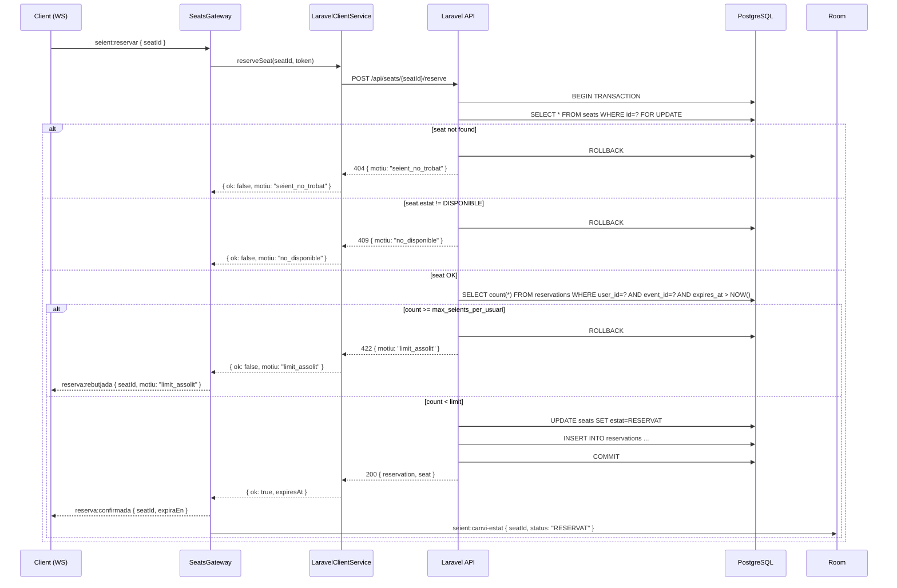

## Context

Actualment, `SeatsService.reservar()` comprova únicament que el seient estigui en estat `DISPONIBLE` abans de crear la `Reservation`. No hi ha cap mecanisme que limiti el nombre de reserves actives per `sessionToken` per a un event concret. L'administrador configura el camp `max_seients_per_usuari` a l'event per garantir un accés equitatiu.

La feature depèn de US-04-01 (autenticació per `sessionToken` al handshake WS); s'assumeix que `client.data.sessionToken` ja és accessible al gateway.

## Goals / Non-Goals

**Goals:**
- Afegir `max_seients_per_usuari Int @default(4)` al model `Event` de Prisma.
- Fer que `SeatsService.reservar()` compti les reserves actives del `sessionToken` dins la transacció i retorni `reserva:rebutjada { motiu: "limit_assolit" }` si el límit s'ha assolit.
- Exposar el getter `limitAssolit` al store Pinia `reserva.ts`.
- Actualitzar els DTOs d'admin (creació/edició d'event) per incloure el nou camp.
- Tests unitaris cobreixen els nous paths al service i al store.

**Non-Goals:**
- Limitar reserves per IP, per email o per compte d'usuari registrat.
- Canviar el TTL de les reserves ni la lògica del cron de caducitat.
- Limitar el nombre de seients comprats (entrades emeses), tan sols les reserves actives.
- UI per mostrar "X de N seients reservats" al mapa (es pot fer en una US posterior).

## Decisions

### D1: La comprovació del límit es fa dins `DB::transaction` de Laravel (no abans)

**Decisió**: Comptar les reserves actives de l'usuari per a l'event dins la mateixa transacció pessimista on es fa el `SELECT FOR UPDATE` del seient.

**Alternativa descartada**: Fer un `count` previ fora de la transacció i avortar si supera el límit.

**Raonament**: Fora de la transacció, entre el `count` i la inserció, un altre request concurrent podria incrementar el comptador. Fer-ho dins la transacció garanteix consistència sense condicions de carrera.

**Ordre d'operacions real** (implementació a `SeatReservationController`): el `SELECT FOR UPDATE` del seient es fa primer (per obtenir `event_id` i verificar l'estat), seguit del `COUNT` de reserves actives i la comprovació del límit. El lock del seient s'allibera automàticament si es fa ROLLBACK (límit assolit o seient no disponible). L'impacte en latència és negligible per al volum esperat.

### D2: `max_seients_per_usuari` amb valor per defecte 4 al model Prisma

**Decisió**: `max_seients_per_usuari Int @default(4)` a l'entitat `Event`.

**Raonament**: Garanteix backward compatibility amb events existents sense haver de fer una migració de dades manual. El valor 4 és el mencionat al criteri d'acceptació de PE-23.

### D3: Getter `limitAssolit` al store `reserva.ts` (frontend)

**Decisió**: El store `reserva.ts` exposa un getter computat `limitAssolit: boolean` que compara `seients.length` (reserves actives del token) contra `event.maxSeientPerUsuari`.

**Alternativa descartada**: Guardar el booleà com a estat separat i actualitzar-lo en cada `reserva:rebutjada`.

**Raonament**: Un getter computat és reactiu per defecte i no requereix lògica addicional d'actualització; si el nombre de reserves canvia (per caducitat), el getter s'actualitza automàticament.

### D4: Nou valor `motiu: "limit_assolit"` al missatge `reserva:rebutjada`

**Decisió**: Afegir `"limit_assolit"` com a valor vàlid al tipus `ReservaRebutjadaPayload` al fitxer `shared/types/socket.types.ts`.

**Raonament**: Permet al frontend distingir entre "seient ocupat" i "límit assolit" per mostrar un missatge d'error adequat, sense trencar clients existents (el camp `motiu` ja existia).

## Risks / Trade-offs

- **[Risc] Migració en producció amb events existents** → El `@default(4)` de Prisma aplica el valor als events nous i omple els existents amb `NULL` fins que s'executi la migració. Cal assegurar que la migració inclou `ALTER TABLE "Event" ALTER COLUMN "max_seients_per_usuari" SET DEFAULT 4` i que es fa `UPDATE "Event" SET "max_seients_per_usuari" = 4 WHERE "max_seients_per_usuari" IS NULL` abans de posar la columna com `NOT NULL`. → Mitigació: la migració Prisma es genera i revisa localment, i s'inclou al CI.

- **[Trade-off] Comptador dins transacció augmenta el temps de lock** → El `SELECT count(*)` addicional alarga lleugerament la finestra de la transacció. Per al volum esperat (sala de cinema, centenars d'usuaris) és negligible.

## Migration Plan

1. Afegir `max_seients_per_usuari Int @default(4)` al model `Event` de `schema.prisma`.
2. Executar `pnpm prisma migrate dev --name add-max-seients-per-usuari` en local.
3. Revisar el fitxer de migració generat i confirmar que el `DEFAULT 4` s'aplica correctament.
4. Desplegar: el CI executa `prisma migrate deploy` automàticament.
5. Rollback: si cal, la migració es pot revertir eliminant la columna (cap constraint crítica en depèn).

## Open Questions

- Cal mostrar a la UI quants seients té reservats l'usuari vs. el límit? (Fora d'abast d'aquesta US, però possible millora posterior.)
- El límit ha de ser per event o per projecció (si un event té múltiples sessions)? (Assumim per event en base al criteri d'acceptació de PE-23.)
