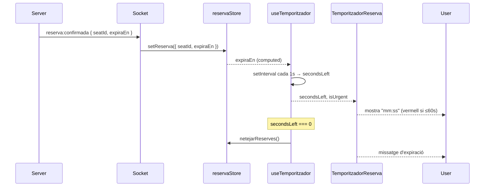

## Context

La plataforma Sala Onirica reserva seients amb un TTL de 5 minuts. Quan el servidor accepta una reserva, emet l'event WebSocket privat `reserva:confirmada` amb el camp `expiraEn` (ISO 8601). Sense un component visible de compte enrere, l'usuari no sap quant temps té per completar la compra i pot perdre la reserva per sorpresa.

La store `reserva` (Pinia) ja recull `expiraEn` i exposa `netejarReserves()`. El component `TemporitzadorReserva.vue` i el composable `useTemporitzador.ts` ja existeixen com a fitxers buits al projecte (context del ticket PE-24); cal implementar-los.

Estat actual: el camp `expiraEn` arriba al client però no s'utilitza a la UI.

## Goals / Non-Goals

**Goals:**
- Implementar `useTemporitzador.ts` que llegeixi `expiraEn` de la store i calculi els segons restants cada segon.
- Implementar `TemporitzadorReserva.vue` que mostri el compte enrere en format `mm:ss` i apliqui l'estil d'urgència (vermell) quan ≤ 60 s.
- Quan el temporitzador arriba a `00:00`, cridar `reserva.netejarReserves()` i mostrar un missatge d'expiració.
- Cobrir el composable i el component amb tests unitaris (Vitest + fake timers).

**Non-Goals:**
- Cap canvi al backend (NestJS, Prisma, Socket.IO Gateway).
- No s'amplia el TTL ni s'implementa renovació de reserva.
- No es gestiona la reconexió o sincronització de rellotge entre client i servidor (es confia en `expiraEn` del servidor i el rellotge local).

## Decisions

### 1. Basar el temporitzador en `expiraEn` del servidor (no en un comptador local)

**Decisió**: `useTemporitzador` calcula `secondsLeft = Math.max(0, Math.floor((new Date(expiraEn).getTime() - Date.now()) / 1000))` cada tick.

**Alternativa considerada**: decrementar un comptador local inicialitzat amb 300. Descartada perquè si l'usuari torna a la pàgina o el navegador suspèn l'execució, el comptador es desfasa del servidor.

**Rationale**: El servidor és la font de veritat. Calcular el delta respecte a `expiraEn` permet que el temporitzador sigui autosuficient independentment de quan es munti el component.

---

### 2. `setInterval` gestionat dins el composable (no al component)

**Decisió**: `useTemporitzador` registra i neteja l'interval via `onMounted`/`onUnmounted` (o `watchEffect` + cleanup). El component consumeix la ref `secondsLeft` reactiva.

**Alternativa considerada**: lògica d'interval directament al component. Descartada: dificulta el test i acobla la lògica de temps a la capa de presentació.

**Rationale**: Separació de responsabilitats; el composable és testable de forma aïllada amb `vi.useFakeTimers()`.

---

### 3. Llindar d'urgència a 60 s (computed)

**Decisió**: el composable exposa `isUrgent = computed(() => secondsLeft.value <= 60)`. El component aplica la classe CSS `urgencia` quan `isUrgent` és `true`.

**Alternativa considerada**: lògica de classe dins la plantilla. Descartada per llegibilitat i testabilitat.

---

### 4. Acció d'expiració al composable

**Decisió**: quan `secondsLeft.value === 0` dins el `watch`, el composable crida `reservaStore.netejarReserves()` i para l'interval. El component no necessita conèixer cap lògica d'expiració.

**Alternativa considerada**: emetre un event `@expired` i deixar que el pare gestioni. Descartada: afegeix acoblament superflu; la store és globalment accessible.

---

## Risks / Trade-offs

- **Desviació de rellotge client/servidor** → Mitigació: el càlcul es fa sempre restant `Date.now()` de `expiraEn`; la desviació acumulada és despreciable per a un TTL de 5 min.
- **Suspensió del navegador** → Si el navegador suspèn la pestanya, `setInterval` pot disparar-se tard. Mitigació: el primer tick post-suspensió recalcularà els segons restants des de `expiraEn`, que pot ser ja 0 → expiració immediata correcta.
- **Test de components Vue + fake timers** → Vitest + `@nuxt/test-utils` pot requerir `mountSuspended` i `vi.useFakeTimers()`. Mitigació: documentat a la secció de tests de les tasques.

## Testing Strategy

| Unitat | Fitxer | Framework | Mocks |
|--------|--------|-----------|-------|
| `useTemporitzador` | `composables/useTemporitzador.spec.ts` | Vitest | `vi.useFakeTimers()`, Pinia stub |
| `TemporitzadorReserva.vue` | `components/TemporitzadorReserva.spec.ts` | Vitest + `@nuxt/test-utils` | `useTemporitzador` stubbat |

Escenaris mínims per al composable:
- Calcula correctament `secondsLeft` a partir de `expiraEn`.
- Decrementa cada segon.
- `isUrgent` és `true` quan `secondsLeft <= 60`.
- Crida `netejarReserves()` quan `secondsLeft === 0`.
- Neteja l'interval en desmontar.

## Flux de dades

