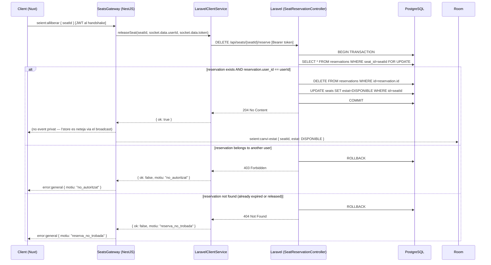

## Context

PE-22 va lliurar la reserva temporal (`seient:reservar`) amb bloqueig pessimista PostgreSQL via `DB::transaction + lockForUpdate()` a Laravel. El `SeatsGateway` (NestJS) delega tota la lògica de BD a Laravel via `LaravelClientService`, i el `JwtWsGuard` injecta `socket.data.userId` i `socket.data.token` al handshake.

La store Pinia `reserva.ts` manté un map de `seatId → { expiraEn }` per als seients que el Comprador té reservats. `Seient.vue` ara ha de distingir dos estats clickables: `DISPONIBLE` (emet `seient:reservar`) i `SELECCIONAT_PER_MI` (emet `seient:alliberar`).

L'endpoint `DELETE /api/seats/{seatId}/reserve` ja estava contemplat a l'especificació del backlog (US-04-04) però no havia estat implementat. No cal cap canvi d'esquema de BD ni de protocol WebSocket (el broadcast `seient:canvi-estat` ja existeix).

## Goals / Non-Goals

**Goals:**

- Permetre a un Comprador autenticat alliberar voluntàriament un seient que ell mateix té reservat
- Garantir que un Comprador no pot alliberar reserves d'un altre usuari (`403`)
- Emetre broadcast `seient:canvi-estat { DISPONIBLE }` a la room per mantenir la consistència en temps real
- Actualitzar la store `reserva.ts` i retornar el seient a l'estat visual `DISPONIBLE`

**Non-Goals:**

- Cancel·lació de comandes ja confirmades (`VENUT`) — fora d'abast
- Alliberament per part de l'administrador
- Alliberament en lot (múltiples seients en una sola crida)
- Canvis d'esquema de BD

## Decisions

### D1 — Endpoint REST intern: `DELETE /api/seats/{seatId}/reserve`

**Decisió**: Laravel exposa `DELETE /api/seats/{seatId}/reserve` com a route interna. El `SeatReservationController` implementa `destroy(seatId, userId)`: obre una transacció amb `lockForUpdate()` sobre la `Reservation`, valida propietat (`403` si `reservation.user_id !== userId`), esborra la reserva i posa `seat.estat = DISPONIBLE`, i retorna `204 No Content`.

**Alternativa descartada**: Un endpoint `POST /api/seats/{seatId}/release`. El verb `DELETE` és semànticament correcte (s'esborra el recurs `Reservation`) i segueix les convencions REST del projecte.

**Raó**: Reutilitza la infraestructura existent de `SeatReservationController::store()`. El `lockForUpdate()` prevé que el mateix seient sigui alliberat per múltiples processos simultàniament (edge case: expirador concurrent + manual release).

### D2 — Validació de propietat al servidor (mai al client)

**Decisió**: El `userId` s'extreu exclusivament de `socket.data.userId` (injectat pel `JwtWsGuard`) i es passa al `LaravelClientService`. El payload del client `{ seatId }` no inclou cap camp d'usuari.

**Raó**: Prevenir manipulació del client. Si el client pogués enviar `userId`, un actor maliciós podria suplantar un altre usuari i alliberar les seves reserves. El JWT és la font d'autoritat.

### D3 — Gestió de la concurrència: alliberament manual vs. expirador

**Decisió**: `lockForUpdate()` sobre `Reservation` dins de `DB::transaction`. Si el cron d'expiració i un alliberament manual s'executen simultàniament sobre el mateix seient, `lockForUpdate()` serialitza l'accés i el segon en arribar trobarà que la `Reservation` ja no existeix → retornarà `404` (que el gateway tradueix a `error:general` sense broadcast).

**Raó**: Consistent amb l'estratègia de PE-22. Evita estats intermedis conflictius sense overhead de reintentos.

### D4 — UI: click sobre un seient `SELECCIONAT_PER_MI`

**Decisió**: `Seient.vue` comprova `esSeleccionatPerMi(seatId)` (getter de `reserva.ts`). Si és `true`, emet `seient:alliberar`; si és `false` i l'estat és `DISPONIBLE`, emet `seient:reservar`. No hi ha pas de confirmació — el Comprador pot re-reservar immediatament si ho desitja.

**Alternativa descartada**: Diàleg de confirmació before alliberar. Afegeix fricció innecessària (el timer visualitza bé la reserva activa i el Comprador ja entén que la perd).

---

## Flux tècnic



## Socket.IO Events

### Client → Server

| Event              | Payload              | Descripció                                                  |
| ------------------ | -------------------- | ----------------------------------------------------------- |
| `seient:alliberar` | `{ seatId: string }` | Comprador allibera voluntàriament un seient que té reservat |

### Server → Room (broadcast)

| Event                | Payload                           | Descripció                                  |
| -------------------- | --------------------------------- | ------------------------------------------- |
| `seient:canvi-estat` | `{ seatId, estat: "DISPONIBLE" }` | Notifica tots els clients del canvi d'estat |

### Server → Client (privat, error paths)

| Event           | Payload             | Descripció                              |
| --------------- | ------------------- | --------------------------------------- |
| `error:general` | `{ motiu: string }` | Emès en cas de `403` o `404` de Laravel |

## API Intern

**DELETE `/api/seats/{seatId}/reserve`**

Headers: `Authorization: Bearer <token>`

Respostes:

```
204 No Content          — alliberament correcte
403 { "message": "Forbidden" }   — la reserva pertany a un altre usuari
404 { "message": "Not Found" }   — la reserva no existeix
```

## Shared Types

`shared/types/socket.types.ts`:

```ts
// Nou payload client→server
export interface SeientAlliberarPayload {
  seatId: string;
}
```

No es necessiten nous tipus server→client (reutilitza `SeientCanviEstatPayload` existent).

## Risks / Trade-offs

- **Race condition manual + expirador**: `lockForUpdate()` cobreix el cas; el segon procés rebrà `404` que es tracta com a no-op (el seient ja és `DISPONIBLE`). Risc baix.
- **Client desactualitzat**: Si `seient:canvi-estat` arriba tard o es perd, el component `Seient.vue` pot mostrar `SELECCIONAT_PER_MI` quan el seient ja és `DISPONIBLE`. Mitigació: el reconnect WS ja recupera l'estat complet (PE-20).
- **No hi ha confirmació visual immediata**: El Comprador veu el canvi quan rep el broadcast `seient:canvi-estat`. Si la latència és alta (> 200ms), pot semblar que el click no ha funcionat. Mitigació acceptable — igual que `seient:reservar`.

## Testing Strategy

| Unitat                                        | Framework                 | Mocks                                               |
| --------------------------------------------- | ------------------------- | --------------------------------------------------- |
| `SeatsGateway` handler `seient:alliberar`     | Vitest                    | `LaravelClientService.releaseSeat` mockat           |
| `LaravelClientService.releaseSeat()`          | Vitest                    | `HttpService` mockat (resposta 204 / 403 / 404)     |
| `SeatReservationController::destroy()`        | PHPUnit                   | DB factory, transacció real contra SQLite in-memory |
| Store `reserva.ts` acció `alliberarSeient`    | Vitest                    | socket emit mockat; getter `esSeleccionatPerMi`     |
| `Seient.vue` click sobre `SELECCIONAT_PER_MI` | Vitest + @nuxt/test-utils | socket emit verificat                               |

## Open Questions

- Cap — l'abast és totalment definit pels criteris d'acceptació de US-04-04.
