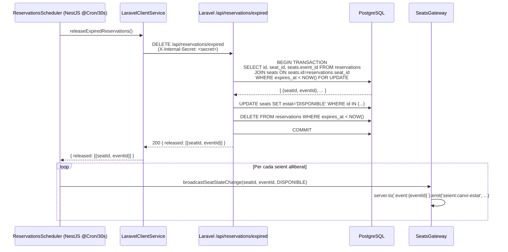

## Context

La reserva temporal (PE-22) crea registres `Reservation` amb `expires_at = NOW() + 5min`. Si un Comprador tanca el navegador o perd la connexió, el seient queda en estat `RESERVAT` indefinidament fins que qualcú el vegi expirat. Actualment el mòdul `scheduler/` existeix al Node Service però és un placeholder buit (`SchedulerModule {}` sense cap `@Cron`). Laravel `SeatReservationController` gestiona les operacions de reserva individuals però no té cap endpoint de neteja massiva.

## Goals / Non-Goals

**Goals:**

- Implementar `ReservationsScheduler` al Node Service que s'executa cada 30 segons via `@Cron`.
- Crear l'endpoint intern `DELETE /api/reservations/expired` al Laravel Service per alliberar en bloc les reserves caducades (transacció atòmica).
- Propagar `seient:canvi-estat { DISPONIBLE }` a la room correcta per a cada seient alliberat.
- Cobertura de tests unitaris: `ReservationsScheduler` (Vitest) i `ReservationService::releaseExpired()` (PHPUnit).

**Non-Goals:**

- Notificació push a l'usuari que va fer la reserva (no hi ha connexió WS persistent a consultar).
- Alliberament manual d'una reserva per l'administrador (cap US en scope).
- Lògica de reintentos si Laravel és inassolible (el cron fallarà silenciosament i s'intentarà al pròxim tick).
- Canvis al frontend (el client ja gestiona `seient:canvi-estat` des de PE-22/PE-19).

## Decisions

### Decisió 1: La lògica de neteja viu a Laravel, no a Node

**Decisió:** `releaseExpiredReservations()` és un endpoint de Laravel (`DELETE /api/reservations/expired`). El Node Service és l'orquestrador que inicia i difon; Laravel és la font de veritat.

**Alternativa descartada:** Implementar un cron directament a NestJS accedint a PostgreSQL via Prisma des del Node Service. Rebutjat perquè viola la separació arquitectural: Node no ha de tenir accés directe a la BD; Laravel és l'únic responsable de la persistència.

**Rationale:** Consistent amb el patró establert a PE-22 (reserva) i PE-23 (alliberament voluntari): Node ↔ Laravel via `LaravelClientService`; Laravel ↔ PostgreSQL exclusivament.

---

### Decisió 2: L'endpoint intern s'autentica amb el secret compartit intern, no amb JWT d'usuari

**Decisió:** `DELETE /api/reservations/expired` s'autentica via capçalera `X-Internal-Secret` (variable d'entorn `INTERNAL_SECRET` compartida entre Node i Laravel) en lloc d'un JWT d'usuari.

**Alternativa descartada:** Cridar amb `Authorization: Bearer <admin_token>`. Rebutjat perquè no hi ha cap token d'usuari disponible en el context del scheduler; usar un token d'admin estàtic seria un anti-patró de seguretat.

**Rationale:** El secret intern és la forma canònica per a comunicació servei-a-servei en l'arquitectura d'aquest monorepo (seguint la ruta del `X-Admin-Token` establert a EP-02).

---

### Decisió 3: Laravel retorna la llista de seients alliberats amb el seu `eventId`

**Decisió:** La resposta de `DELETE /api/reservations/expired` inclou `{ released: [{ seatId, eventId }] }`.

**Alternativa descartada:** Laravel emet directament Socket.IO. Rebutjat perquè Laravel no té socket server; el broker de WS és exclusivament el Node Service.

**Rationale:** Node necessita el `eventId` per construir el nom de la room (`event:{eventId}`) on fer el broadcast de `seient:canvi-estat`.

---

### Decisió 4: Transacció atòmica per totes les reserves expirades (batch)

**Decisió:** Laravel executa un `DB::transaction()` que fa `UPDATE seats SET estat='DISPONIBLE' WHERE id IN (...)` i `DELETE FROM reservations WHERE expires_at < NOW()` en una sola transacció.

**Alternativa descartada:** Una transacció per reserva. Rebutjat per ineficiència quan hi ha múltiples reserves expirades simultàniament i risc de deadlock si múltiples requests concurrents troben el mateix seient.

**Rationale:** Batch atomic actualitza totes les files en una sola transacció, minimitzant el window de inconsistència i el nombre de round-trips a la BD.

## Sequence Diagram



## API Schema

### `DELETE /internal/reservations/expired`

**Request:**

```http
DELETE /internal/reservations/expired HTTP/1.1
X-Internal-Secret: <INTERNAL_SECRET>
Content-Type: application/json
```

**Response 200:**

```json
{
  "released": [
    { "seatId": "uuid-seat-1", "eventId": "uuid-event-42" },
    { "seatId": "uuid-seat-2", "eventId": "uuid-event-42" }
  ]
}
```

**Response 200 (cap reserva expirada):**

```json
{ "released": [] }
```

**Response 401 (secret incorrecte o absent):**

```json
{ "message": "Unauthorized" }
```

## Socket.IO Events

| Direcció      | Event                | Payload                                   | Descripció                                   |
| ------------- | -------------------- | ----------------------------------------- | -------------------------------------------- |
| Server → Room | `seient:canvi-estat` | `{ seatId: string, estat: "DISPONIBLE" }` | Broadcast per cada seient alliberat pel cron |

Room target: `event:{eventId}` (un broadcast per event únic entre els seients alliberats).

## Shared Types

Cap nou tipus a `shared/types/`. El payload de `seient:canvi-estat` ja existeix a `socket.types.ts` (`SeientCanviEstatPayload`).

## Testing Strategy

| Unitat                                              | Framework             | Mocks                                                                |
| --------------------------------------------------- | --------------------- | -------------------------------------------------------------------- |
| `ReservationsScheduler.releaseExpired()`            | Vitest (Node Service) | `LaravelClientService` mockat, `SeatsGateway.server` mockat          |
| `LaravelClientService.releaseExpiredReservations()` | Vitest (Node Service) | `HttpService` mockat retornant `{ released: [{ seatId, eventId }] }` |
| `ReservationService::releaseExpired()`              | PHPUnit (Laravel)     | Base de dades SQLite in-memory (mateixa configuració que CI)         |

**Escenaris clau a cobrir:**

- No hi ha reserves expirades → `released: []`, cap broadcast
- 1 reserva expirada → BD actualitzada, 1 broadcast `seient:canvi-estat`
- N reserves expirades de M events → BD actualitzada, N broadcasts a M rooms
- Laravel inassolible → `LaravelClientService` llança excepció, scheduler captura i fa log (no re-throw)

## Risks / Trade-offs

| Risc                                                                                                                 | Mitigació                                                                                                                                                   |
| -------------------------------------------------------------------------------------------------------------------- | ----------------------------------------------------------------------------------------------------------------------------------------------------------- |
| **Doble alliberament**: el cron s'executa mentre un alliberament voluntari (PE-23) ja ha esborrat la mateixa reserva | La transacció Laravel usa `FOR UPDATE` + `WHERE expires_at < NOW()` — si la reserva ja no existeix, no fa res. Idempotent per disseny.                      |
| **Laravel temporalment inassolible**                                                                                 | El scheduler atrapa totes les excepcions i registra l'error en el log. Al pròxim tick (30s) ho reintentarà. Acceptable: el window màxim de bloqueig és 60s. |
| **Performance amb moltes reserves expirades**                                                                        | El batch UPDATE és O(n) però en condicions normals n serà < 50. No requereix índex addicional; `expires_at` ja és filtrat per la query.                     |
| **Execució concurrent de dues instàncies del Node Service**                                                          | `FOR UPDATE` a PostgreSQL garanteix que la primera transacció bloqueja les files; la segona obté 0 files. Correcte per disseny.                             |

## Migration Plan

1. Afegir `INTERNAL_SECRET` a `.env` i `.env.example` de Node Service i Laravel Service.
2. Desplegar Laravel Service primer (el nou endpoint és retrocompatible).
3. Desplegar Node Service (el scheduler comença a cridar el nou endpoint).
4. No hi ha migracions de BD noves necessàries.
5. Rollback: eliminar `ReservationsScheduler` del `SchedulerModule`; les reserves expirades quedaran bloquejades fins que es faci neteja manual (acceptable per rollback d'emergència).

## Open Questions

- Cap. Totes les decisions tècniques estan resoltes.
