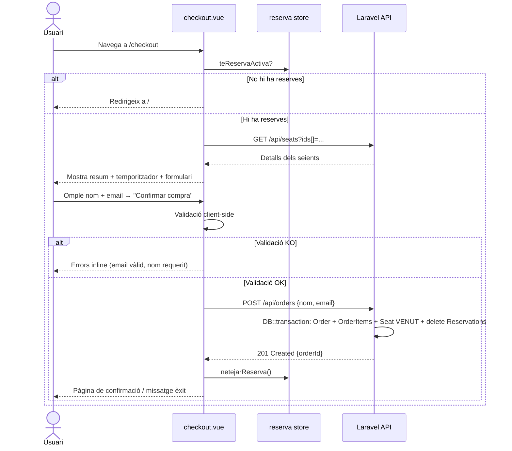

## Context

La pàgina `/checkout` ja existeix com a placeholder (`checkout.vue`) amb middleware `auth` però sense implementació. El backend (Laravel + Sanctum) té els models `Order` i `OrderItem` i les migracions corresponents, però no existeix cap controlador ni ruta per a `POST /api/orders`. Els seients reservats es guarden al store `reserva.ts` (`seients: Record<string, { expiraEn: string }>`), que conté els IDs i les seves dates d'expiració, però no els detalls visuals (fila, número, categoria, preu) — aquells estan al store `seients.ts`, que pot estar buit si l'usuari ha navegat directament a `/checkout`.

## Goals / Non-Goals

**Goals:**
- Implementar la pàgina `/checkout` al frontend amb resum de seients reservats, temporitzador actiu, formulari validat i crida a `POST /api/orders`.
- Implementar `POST /api/orders` al backend Laravel que crea l'ordre, marca seients com a `VENUT` i elimina les reserves.
- Redirigir automàticament a `/` si no hi ha reserves actives.
- Validació client-side del formulari (nom màx 100 chars, email RFC).

**Non-Goals:**
- Pasarela de pagament real.
- Generació de PDF de les entrades.
- Email de confirmació (EP-05 abasta la consulta d'entrades per email).
- Modificar la lògica de Socket.IO per a l'event de compra completada.

## Decisions

### D1: Obtenir detalls dels seients al checkout

**Problema**: El store `seients.ts` pot estar buit si l'usuari ha recarregat la pàgina.

**Decisió**: Afegir un nou endpoint `GET /api/seats?ids[]=...` (o equivalent) per obtenir detalls de seients per ID. La pàgina `/checkout` crida aquest endpoint amb els `seatIds` del store `reserva.ts` quan es munta.

**Alternativa descartada**: Persistir els detalls al store `reserva.ts` des del moment de la reserva. Descartada perquè el payload `reserva:confirmada` del socket només conté `seatId` + `expiraEn`, i extendre el protocol de socket queda fora d'abast.

**Alternativa descartada**: Reutilitzar el store `seients.ts` directament. Descartada perquè requereix que l'usuari hagi passat per la pàgina de l'event en la mateixa sessió.

### D2: Nom i email al formulari vs. dades de l'usuari autenticat

**Decisió**: El formulari demana explícitament nom complet i email tal com especifica PE-27. L'email es pot pre-emplenar amb el de l'usuari autenticat (via `/api/user`) per millorar la UX, però l'usuari el pot editar.

### D3: Flux de confirmació de compra — REST vs. Socket

**Decisió**: `POST /api/orders` via HTTP REST (no Socket.IO). El socket event `compra:confirmar` queda per una iteració futura (EP-09). La resposta HTTP és suficient per a la confirmació.

**Alternativa descartada**: Usar el socket event `compra:confirmar`. Descartada per complexitat addicional fora d'abast d'aquest US.

### D4: Transacció al backend

**Decisió**: `POST /api/orders` utilitza una transacció de base de dades (`DB::transaction`) per garantir atomicitat: crear `Order` + `OrderItem`s + actualitzar `Seat.status` a `VENUT` + eliminar `Reservation`s en una sola operació. Qualsevol error fa rollback.

## API Design

### Nou endpoint: GET /api/seats (per detalls de checkout)

```
GET /api/seats?ids[]=uuid1&ids[]=uuid2
Authorization: Bearer {sanctum_token}

Response 200:
[
  {
    "id": "uuid",
    "fila": "A",
    "numero": 5,
    "categoria": "Platea",
    "preu": 25.00
  }
]
```

### Nou endpoint: POST /api/orders

```
POST /api/orders
Authorization: Bearer {sanctum_token}
Content-Type: application/json

{
  "nom": "Joan García",
  "email": "joan@example.com"
}

Response 201:
{
  "id": "uuid",
  "total_amount": "75.00",
  "items": [
    { "seat_id": "uuid", "preu": 25.00 }
  ]
}

Response 422 (validació):
{
  "errors": {
    "email": ["El camp email no és un email vàlid."],
    "nom": ["El camp nom és obligatori."]
  }
}

Response 409 (sense reserves actives):
{
  "error": "No tens reserves actives."
}
```

## Diagrama de flux



## Canvis al backend (Laravel)

**Nous fitxers:**
- `app/Http/Controllers/OrderController.php` — mètodes `store` i index (opcional)
- `app/Http/Controllers/SeatController.php` — mètode `indexByIds`
- `app/Http/Requests/StoreOrderRequest.php` — validació `nom` + `email`

**Rutes noves (`routes/api.php`):**
```php
Route::middleware('auth:sanctum')->group(function () {
    Route::get('/seats', [SeatController::class, 'indexByIds']);
    Route::post('/orders', [OrderController::class, 'store']);
});
```

**Canvis al model `Seat`:** afegir `fillable` per a `status` si cal, i la constant `VENUT`.

## Canvis al frontend (Nuxt 3)

**Fitxers modificats:**
- `frontend/pages/checkout.vue` — implementació completa

**Lògica de la pàgina:**
1. `onMounted`: comprovar `teReservaActiva`; si fals → `navigateTo('/')`.
2. Cridar `GET /api/seats?ids[]=...` per obtenir detalls.
3. Mostrar resum (taula: fila, número, categoria, preu), preu total i `TemporitzadorReserva`.
4. Formulari reactiu amb `ref` per a `nom` i `email`; errors inline.
5. `submit`: validació client-side primer; si passa → `$fetch('/api/orders', {method:'POST', ...})`.
6. Èxit → `reservaStore.netejarReserva()` + mostrar confirmació.

## Testing

| Unitat | Eina | Mocks |
|---|---|---|
| `checkout.vue` — redirecció sense reserves | Vitest + `@nuxt/test-utils` | store `reserva` (teReservaActiva=false) |
| `checkout.vue` — validació email invàlid | Vitest | store `reserva` (amb reserves), `$fetch` mock |
| `checkout.vue` — submit correcte | Vitest | `$fetch` mock retorna 201 |
| `OrderController::store` | PHPUnit (Feature) | DB en memòria / SQLite |
| `SeatController::indexByIds` | PHPUnit (Feature) | DB |

## Risks / Trade-offs

- **[Risc] Reserves expiren durant el checkout**: El temporitzador mostra el temps restant. Si expira durant el formulari, `POST /api/orders` retornarà error (no hi haurà reserves). → *Mitigació*: Mostrar missatge d'error clar i redirigir a l'event.
- **[Trade-off] Detalls dels seients via API call extra**: Afegeix una petició HTTP al muntatge. → *Acceptable* perquè el volum de dades és petit i evita complexitat en el protocol de socket.
- **[Risc] Store `seients.ts` buit i store `reserva.ts` buit si l'usuari refresca**: Si l'usuari refresca `/checkout`, la redirecció a `/` és el comportament esperat i acceptable.
