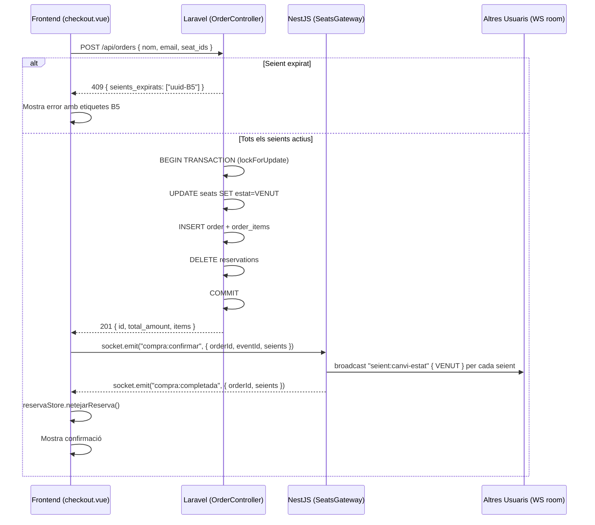

## Context

El flux de compra (EP-04) ja té implementat:
- `POST /api/orders` a Laravel (`OrderController.store()`): crea l'ordre en transacció, marca seients com VENUT, elimina reserves, retorna 201.
- Frontend `checkout.vue`: formulari de compra, crida l'API, gestiona el 201 amb pantalla de confirmació i errors genèrics.
- Tipus `CompraConfirmarPayload` i `CompraCompletadaPayload` definits a `shared/types/socket.types.ts`.

El que falta per PE-28:
1. **Detecció de seients expirats durant checkout**: el backend actual retorna 409 genèric quan no hi ha cap reserva activa, però no detecta quins seients específics han expirat si el cron els va eliminar mentre l'usuari omplia el formulari.
2. **Broadcast `seient:canvi-estat { VENUT }`**: un cop creada l'ordre, cal notificar en temps real la resta d'usuaris que els seients han passat a VENUT.
3. **Event privat `compra:completada`**: confirmar la compra al client via Socket.IO.

## Goals / Non-Goals

**Goals:**
- Detectar quins seients han expirat entre reserva i submit del checkout i retornar `409 { seients_expirats: string[] }`.
- Emetre `seient:canvi-estat { VENUT }` a la sala `event:{eventId}` per a cada seient venut.
- Emetre `compra:completada` privadament al client comprador.
- Gestionar el cas d'error 409 al frontend mostrant quins seients han expirat.

**Non-Goals:**
- Reimplementar la transacció d'ordre (ja implementada i funcional).
- Canvis al flux de reserva (PE-26) ni alliberació de seients (PE-27).
- Gestió del panell d'administració ni informes.

## Decisions

### D1 — Detecció de seients expirats: el frontend envia els `seat_ids` esperats

**Problema**: quan el cron elimina una reserva expirada, el registre `Reservation` ja no existeix a la BD. El backend no pot saber quins seients esperava comprar l'usuari sense que el client ho informi.

**Decisió**: `POST /api/orders` accepta un camp opcional `seat_ids: string[]` (UUIDs) al body. El backend:
1. Obté les reserves actives de l'usuari.
2. Compara contra `seat_ids` proporcionats.
3. Si algun UUID de `seat_ids` no té reserva activa → `409 { seients_expirats: string[] }` amb els UUIDs que manquen.
4. Si `seat_ids` no s'envia → comportament actual (processa totes les reserves actives).

**Alternativa descartada**: enviar les etiquetes "B5" directament. Descartada perquè les etiquetes (fila+numero) es poden construir al frontend des del store `seients`, mentre que els UUIDs són el format natiu de la BD.

**Frontend**: `checkout.vue` afegeix `seat_ids: reservaStore.seatIds` al body del POST. En rebre `409 { seients_expirats: UUID[] }`, mapeja els UUIDs a etiquetes (fila+numero) via el array `seats` local i mostra el missatge corresponent.

```json
// Request body
{ "nom": "Joan", "email": "joan@ex.com", "seat_ids": ["uuid-B5", "uuid-B6"] }

// Resposta 201
{ "id": "order-uuid", "total_amount": "48.00", "items": [{ "seat_id": "uuid-B6", "preu": 24.0 }] }

// Resposta 409 (seients expirats)
{ "seients_expirats": ["uuid-B5"] }
```

---

### D2 — Broadcast via Socket.IO post-confirmació: frontend-driven

**Problema**: Laravel no pot cridar directament el NestJS gateway. La comunicació servei-a-servei actual és unidireccional (NestJS → Laravel).

**Decisió**: Després que `POST /api/orders` retorna 201, el frontend emet `compra:confirmar` via Socket.IO al NestJS gateway amb els detalls de cada seient. El gateway:
1. Itera els seients de `compra:confirmar`.
2. Fa broadcast `seient:canvi-estat { seatId, estat: VENUT, fila, numero }` a `event:{eventId}`.
3. Emet `compra:completada { orderId, seients }` privadament al socket del comprador.

**Raó**: segueix el patró existent (`seient:reservar`, `seient:alliberar`) i no requereix afegir comunicació inversa Laravel → NestJS ni nova infraestructura.

**Risc**: si el frontend perd la connexió WS entre el 201 i l'emissió de `compra:confirmar`, el broadcast no arriba. **Mitigació**: la manca de broadcast és un problema de UX (altres usuaris no veuen el canvi immediatament), però el seient ja és VENUT a la BD. El cron de 30s o la recàrrega de la pàgina resoldrà l'estat visual. Acceptable per MVP.

**Alternativa descartada**: nou endpoint intern NestJS (`POST /internal/broadcasts/order`). Descartada perquè requereix afegir autenticació interna bidireccional i més boilerplate, però `compra:confirmar` ja és al protocol.

---

### D3 — Extensió de `CompraConfirmarPayload`

El tipus actual (`shared/types/socket.types.ts`) és `{ seients: string[] }` (només IDs). Cal afegir `eventId` i detalls de cada seient per al broadcast sense fer una crida addicional a Laravel des del NestJS.

```typescript
// shared/types/socket.types.ts — MODIFICAT
export interface CompraConfirmarPayload {
  orderId: string;
  eventId: string;
  seients: Array<{ seatId: string; fila: string; numero: number }>;
}
```

El frontend pot omplir `fila` i `numero` des de l'array `seats` local (carregat via `GET /api/seats`), i `eventId` des de `seientStore.event.id`.

---

### D4 — Transacció i concurrència (sense canvis)

`lockForUpdate()` + `prisma.$transaction` ja garanteix que dos usuaris no poden comprar el mateix seient. No cal cap canvi en la lògica de concurrència.

---

### D5 — Tests

- **Laravel**: nou test de feature `OrderControllerTest` — cas 409 amb `seat_ids` que inclou un UUID expirat.
- **NestJS**: nou test unitari per al handler `compra:confirmar` de `SeatsGateway` — comprova que `server.to().emit('seient:canvi-estat')` es crida per a cada seient i `socket.emit('compra:completada')` s'emet al client.
- **Frontend**: test unitari de `checkout.vue` — mock de `$fetch` que retorna 409 amb `seients_expirats`, comprova que es mostra el missatge d'error amb les etiquetes correctes.

## Sequence Diagram



## Risks / Trade-offs

- **[Risc] Broadcast perdut per desconnexió WS** → Mitigació: la BD és consistent; altres usuaris veuran l'estat correcte en la propera recàrrega o quan el gateway rebi l'event d'un altre usuari que reservi el mateix seient (que tornarà 409).
- **[Trade-off] seat_ids opcional al body** → Permet backward compatibility però si el frontend no els envia, la detecció de seients expirats no funciona. En aquest projecte és controlat (només `checkout.vue` fa la crida), però caldria fer-ho obligatori en un entorn amb múltiples clients.
- **[Risc] Dades de fila/numero al payload WS** → El frontend pot enviar dades incorrectes. Acceptable per MVP; en producció es podria verificar al NestJS fent una crida a Laravel, però afegeix latència.
