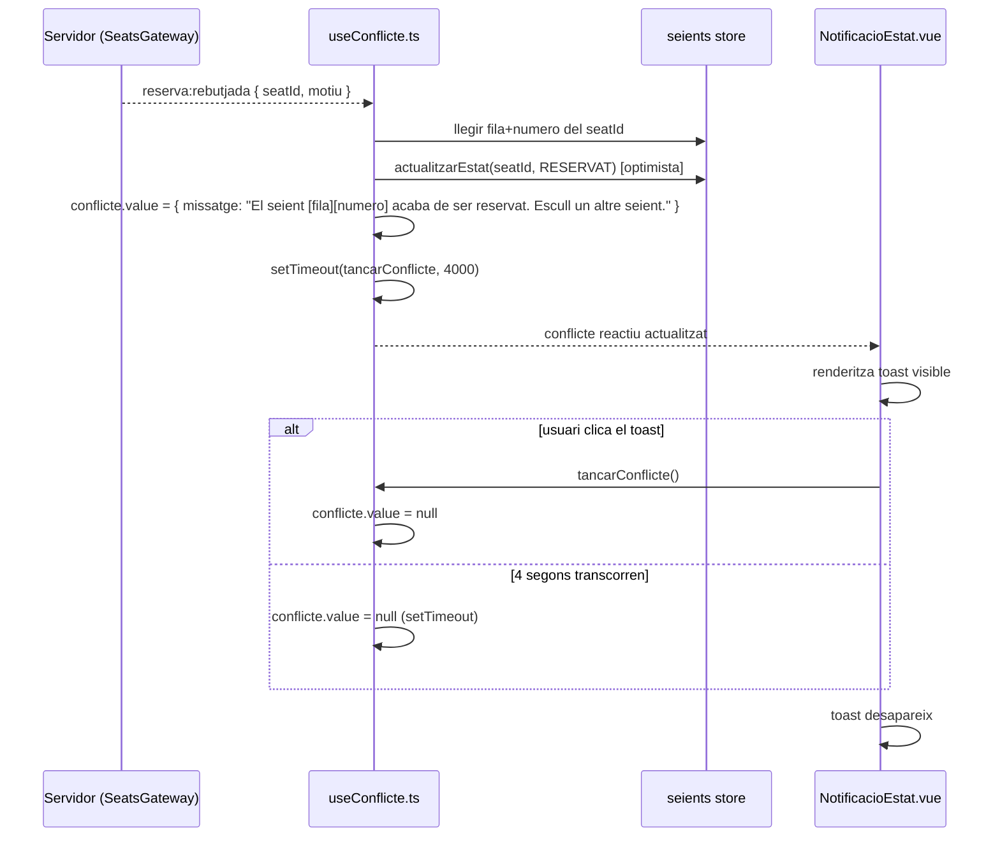

## Context

El backend ja emet l'event privat `reserva:rebutjada { seatId, motiu }` quan un seient no es pot reservar (conflict concurrent, seient venut, o límit assolit). El frontend, però, no té cap handler per a aquest event que mostri un feedback visual diferent del comportament per defecte (cap feedback o un missatge genèric).

El composable `useConflicte.ts` ja existeix referenciat al context del projecte però pot estar buit. El component `NotificacioEstat.vue` ja existeix però pot no implementar el toast de conflicte. Aquesta US el completa.

## Goals / Non-Goals

**Goals:**

- Escoltar `reserva:rebutjada` al composable `useConflicte.ts` i construir el missatge de conflicte llegint les dades del seient (fila + número) des de la store `seients`.
- Mostrar un toast no bloquejant a `NotificacioEstat.vue` que desaparegui als 4 segons o al clicar-lo.
- El seient es mostra com a `RESERVAT` immediatament al mapa (el broadcast `seient:canvi-estat` ja n'és responsable; `useConflicte` pot forçar una actualització optimista local si el broadcast arriba tard).

**Non-Goals:**

- Cap canvi al backend — `reserva:rebutjada` ja existeix i s'emet correctament.
- Gestió de múltiples toasts simultànies (cua de notificacions) — queda fora d'abast.
- Persistència de l'historial de conflictes.
- Diferenciar visualment entre `motiu: "no_disponible"` i `motiu: "limit_assolit"` — ambdós disparen el toast de conflicte amb el text de seient ocupat (la gestió de `limit_assolit` és responsabilitat de PE-28 / `limitAssolit` getter).

## Decisions

### D1: El composable `useConflicte.ts` com a propietari de la lògica de conflicte

**Decisió**: La lògica de negoci de `reserva:rebutjada` (missatge, update optimista, timer) resideix exclusivament a `useConflicte.ts`, exportada com `handleReservaRebutjada()`. El listener de socket el registra la store `seients.connectar()` (que ja gestiona tot el cicle de vida WS) i delega immediatament al composable via `handleReservaRebutjada(payload)`.

**Alternativa considerada**: Registrar el listener directament dins `useConflicte.ts` via `onMounted` del composable.

**Per què no**: La store `seients` centralitza tots els listeners WS i el seu cleanup (`connectar/desconnectar`). Afegir un segon registre al composable hauria duplicat la gestió del cicle de vida i creat una dependència d'ordre de muntatge. Amb la delegació via funció exportada, el composable és igualment testable cridant `handleReservaRebutjada()` directament sense cap mock de socket.

**Implicació de testing**: Els tests de `useConflicte.spec.ts` criden `handleReservaRebutjada()` directament (sense mock de socket). Els tests de `seients.spec.ts` verifiquen que el listener delega correctament a `handleReservaRebutjada`.

### D2: Estat reactiu del toast gestionat per `useConflicte.ts`

**Decisió**: El composable exposa `conflicte: Ref<{ missatge: string } | null>` i `tancarConflicte()`. `NotificacioEstat.vue` el consumeix via `useConflicte()`.

**Alternativa considerada**: Usar una store Pinia per al toast.

**Raó**: El toast és efímer i no necessita persistència entre navegacions; un composable és suficient i menys acoblat.

### D3: Auto-dismiss via `setTimeout` dins del composable

**Decisió**: `useConflicte.ts` programa un `setTimeout(tancarConflicte, 4000)` cada cop que s'estableix un nou conflicte. El timeout es neteja amb `clearTimeout` si arriba un nou conflicte abans que expiri l'anterior.

**Raó**: Centralitzar el timer al composable simplifica el component i permet testar el comportament temporal amb Vitest fake timers sense dependre de `@testing-library/vue`.

### D4: Actualització optimista local del seient conflictiu

**Decisió**: Quan `reserva:rebutjada` arriba, `useConflicte.ts` crida `seients.actualitzarEstat(seatId, EstatSeient.RESERVAT)` per assegurar la visualització immediata, sense esperar el broadcast `seient:canvi-estat`.

**Alternativa considerada**: No fer res i confiar en el broadcast.

**Raó**: El broadcast pot arribar amb un petit retard. L'usuari ha de veure immediatament que el seient és taronja (RESERVAT) per entendre per què el seu intent ha fallat. Doble actualització idempotent: si el broadcast arriba primer, la crida és un no-op.

---

### Flux de dades

## Risks / Trade-offs

| Risc | Mitigació |
|------|-----------|
| El seient no es troba a la store `seients` quan arriba `reserva:rebutjada` (race condition entre join event i rebuda) | Guardar protecció: si `seients.getSeat(seatId)` retorna `null`, mostrar text genèric "Un seient acaba de ser reservat." |
| Dos conflictes en ràpida successió sobreescriuen el timer | `clearTimeout` de l'anterior timer abans d'establir el nou |
| `NotificacioEstat.vue` podria ja tenir lògica existent que entri en conflicte | Llegir el component actual abans d'implementar i integrar-s'hi en comptes de reescriure'l |

## Testing Strategy

| Unitat | Framework | Mocks |
|--------|-----------|-------|
| `useConflicte.ts` | Vitest | `useNuxtApp().$socket` (EventEmitter mock), `useSeients()` (store mock via `setActivePinia`) |
| `NotificacioEstat.vue` | Vitest + `@nuxt/test-utils` | `useConflicte` retornat via mock de composable |
| Timer (4s auto-dismiss) | Vitest fake timers (`vi.useFakeTimers`) | — |
