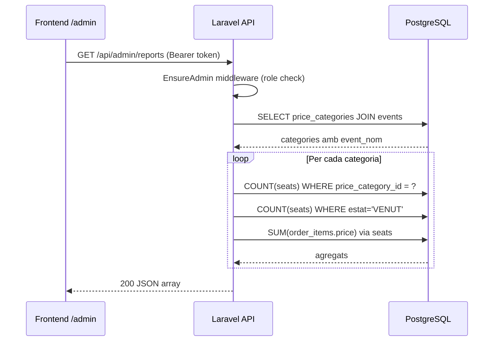

## Context

El panell d'administració (`/admin`) ja mostra estadístiques en temps real per event gràcies a `GET /api/admin/events/:id/stats` (PE-31). El mòdul `admin` a Laravel disposa de `AdminEventController` i `AdminEventService`. Ara cal afegir una vista agregada de recaptació i ocupació per categoria de preu, sense requeriments de temps real.

El model de dades rellevant:

```
PriceCategory: { id, event_id, name, price }
Seat:          { id, event_id, price_category_id, estat: DISPONIBLE|RESERVAT|VENUT }
OrderItem:     { id, order_id, seat_id, price }
```

## Goals / Non-Goals

**Goals:**

- Exposar `GET /api/admin/reports` que retorni per cada `PriceCategory`: nom, preu unitari, total de seients, seients venuts, % d'ocupació i recaptació total.
- Afegir una secció de taula d'informes a `pages/admin/index.vue`.
- Cobertura de test unitari a `AdminEventService.getSalesReport()` amb `PrismaService` mockejat.

**Non-Goals:**

- Filtre per event (l'endpoint és global; els gràfics d'evolució pertanyen a US-09-02).
- Exportació CSV.
- Actualització en temps real de la taula.

## Decisions

### Decisió 1: Endpoint global vs. per-event

**Opció A — Global** (`GET /api/admin/reports`): agrega totes les `PriceCategory` de tots els events.
**Opció B — Per-event** (`GET /api/admin/events/:id/reports`): agrega per event seleccionat, consistent amb el selector existent.

**Decisió: Opció A** per respectar literalment la spec de US-06-02. El selector d'event del dashboard és independent de la taula d'informes. Si en el futur cal filtrar per event, l'endpoint admet un query param opcional `?event_id=`.

### Decisió 2: Agrupació per id vs. per nom de categoria

Categories de preus amb el mateix nom (ex: "VIP") però pertanyents a events diferents generen files separades si s'agrupa per `id`. Agrupant per `name` s'obté una vista consolidada però perd granularitat.

**Decisió: agrupació per `PriceCategory.id`** per mantenir la granularitat i evitar col·lisions semàntiques. Cada fila inclou el nom de l'event associat per identificació.

### Decisió 3: On col·locar la lògica de negoci

S'afegeix el mètode `getSalesReport(): CategoryReportRow[]` directament a `AdminEventService` existent, evitant crear un servei addicional per una funció simple.

**Alternativa**: `AdminReportsService` separat. Rebutjada per over-engineering: un mètode nou no justifica un servei nou.

### Schema de l'endpoint

```
GET /api/admin/reports
Authorization: Bearer <token>  (role: admin)

Response 200:
[
  {
    "category_id": "uuid",
    "event_nom": "Dune 4K",
    "nom": "VIP",
    "preu": "50.00",
    "total_seients": 50,
    "seients_venuts": 10,
    "percentatge_ocupacio": 20.0,
    "recaptacio": "500.00"
  },
  ...
]
```

### Query strategy (Laravel Eloquent)

```php
PriceCategory::with('event')
  ->withCount(['seats as total_seients', 'seats as seients_venuts' => fn($q) => $q->where('estat', 'VENUT')])
  ->withSum(['seats as recaptacio' => fn($q) => $q->join('order_items', 'seats.id', '=', 'order_items.seat_id')], 'order_items.price')
  ->get()
```

Alternativa equivalent amb `DB::raw` si `withSum` amb join resulta complex:

```php
$recaptacio = OrderItem::whereHas('seat', fn($q) => $q->where('price_category_id', $category->id))->sum('price');
```

S'usa la segona variant per claredat i per evitar joins complexos en `withSum`.



## Risks / Trade-offs

- **N+1 queries** → Mitigation: carregar tots els agregats en una sola query Eloquent o usar `withCount` + loop optimitzat. Per l'escala d'aquest projecte (< 1000 seients) no és crític, però s'usa `withCount` per eficiència.
- **Categories sense seients** → Retornen `total_seients: 0`, `percentatge_ocupacio: 0.0`. Acceptable.
- **Report global pot créixer** → Si el nombre d'events és molt alt, paginar. Fora d'abast per ara.

## Testing Strategy

- `AdminEventService` ja té tests a `tests/Unit/Services/AdminEventServiceTest.php` (o equivalent).
- S'afegeix `getSalesReport()` amb:
  - Cas feliç: 1 categoria amb 10 VENUT de 50 totals → 20% ocupació, recaptació = seients_venuts \* preu
  - Cas sense vendes: 0 VENUT → 0% ocupació, recaptació = 0.00
  - Cas sense seients: total_seients = 0 → percentatge = 0.0, sense divisió per zero
- Framework: PHPUnit (Laravel native), test class a `tests/Unit/Services/`.
- `PriceCategory`, `Seat`, `OrderItem` es mockejen via factories o DB en memòria amb SQLite.
