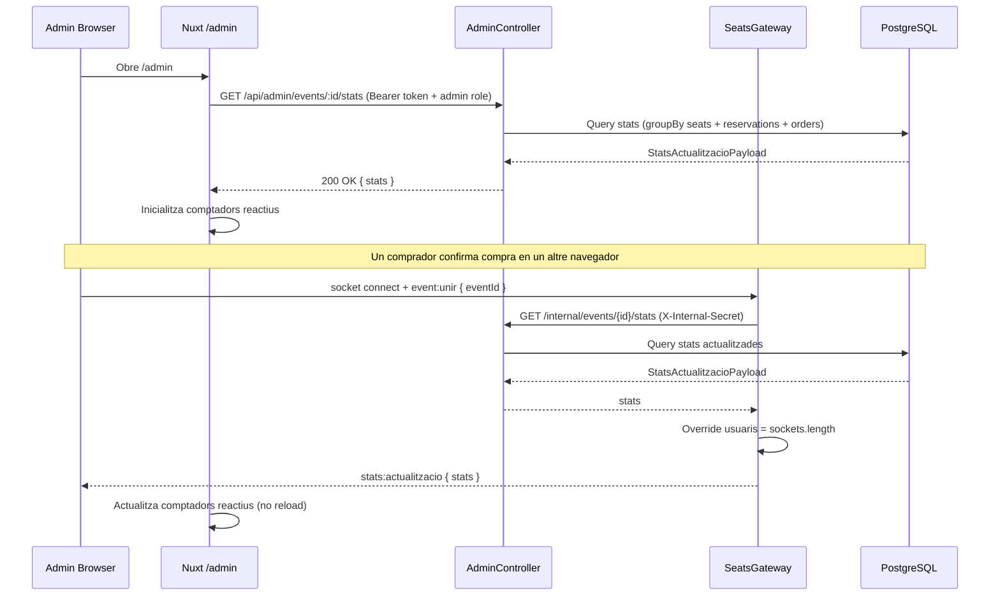

## Context

La plataforma ja té un `SeatsGateway` que emet `seient:canvi-estat` a cada canvi d'estat de seient. El protocol Socket.IO ja defineix `stats:actualitzacio` com a event de broadcast però no s'emet. L'`AdminModule` ja existeix amb middleware `X-Admin-Token`, però no té endpoint de stats. La pàgina `/admin` ja existeix com a ruta (CSR, `ssr:false`) però no té contingut de dashboard reactiu.

## Goals / Non-Goals

**Goals:**
- Endpoint REST `GET /api/admin/events/:id/stats` per obtenir l'estat inicial
- Emissió de `stats:actualitzacio` al room `event:{eventId}` cada vegada que canvia l'estat d'un seient
- Pàgina `/admin` amb comptadors reactius que s'actualitzen sense recarregar
- Camps: seients disponibles / reservats / venuts (xifres i %), usuaris connectats, reserves actives, recaptació total

**Non-Goals:**
- Gràfics o visualitzacions avançades (EP-09)
- Filtrat per rang de dates o per preu
- Exportació de dades (reports)
- Autenticació avançada per admin (ja cobert per `X-Admin-Token` middleware)

## Decisions

### Decisió 1: Emetre `stats:actualitzacio` des de `SeatsGateway`

**Opció A (escollida):** `SeatsGateway` calcula i emet les stats agregades just després d'emetre `seient:canvi-estat`.

**Opció B:** Nou `AdminGateway` separat subscrit a events de domini.

**Rationale:** Menys acoblament nou; el gateway ja té accés a `PrismaService` per injecció. Evita introduir un bus d'events o event emitter extra. El cost és que `SeatsGateway` agrega stats — acceptable perquè és una query lleugera.

### Decisió 2: Query de stats via Laravel intern (HTTP service-to-service)

El servei NestJS no té accés directe a la base de dades. Les stats es calculen a **Laravel** (`AdminEventService::getEventStats()`) amb queries Eloquent: `Seat::groupBy('estat')` + `Reservation::count()` + `OrderItem::sum('price')`. El `SeatsGateway` crida `laravelClient.getStats(eventId)` que fa `GET /internal/events/{id}/stats` amb capçalera `X-Internal-Secret`. El nombre d'usuaris connectats (`usuaris`) s'obté al NestJS via `server.in(...).fetchSockets()` i s'afegeix al payload abans d'emetre.

### Decisió 3: Tipus `StatsActualitzacioPayload` al paquet shared

S'afegeix a `shared/types/socket.types.ts` per garantir que backend i frontend usin el mateix contracte sense duplicar la definició.

### Diagrama de seqüència

## Risks / Trade-offs

- **[Risc] N+1 de stats en alta concurrència** → Mitigació: la query de stats és lleugera (3 queries agregades). Si fos un problema, es pot afegir un debounce de 500ms al backend per no calcular-les a cada canvi de seient individual.
- **[Trade-off] SeatsGateway amb responsabilitat extra** → Acceptable ara; si creix, extreure a `StatsService` injectable.
- **[Risc] Admin desconnectat no rep stats** → Mitigació: en reconnectar, el frontend fa GET inicial de nou.

## Testing Strategy

- **Backend `AdminEventService.getEventStats()`** (Laravel): Feature test amb `DB::table()->insert()` directe. Verifica que els comptadors retornats coincideixen amb les dades inserides.
- **Backend `SeatsGateway`** (NestJS): Test existent s'amplia per verificar que `emitStatsActualitzacio` és cridat i emet el payload correcte. `laravelClient.getStats` es mocka per evitar HTTP real.
- **Frontend store/composable `useAdminStats`**: Vitest amb socket mockejat. Verifica que en rebre `stats:actualitzacio` els refs reactius s'actualitzen.
