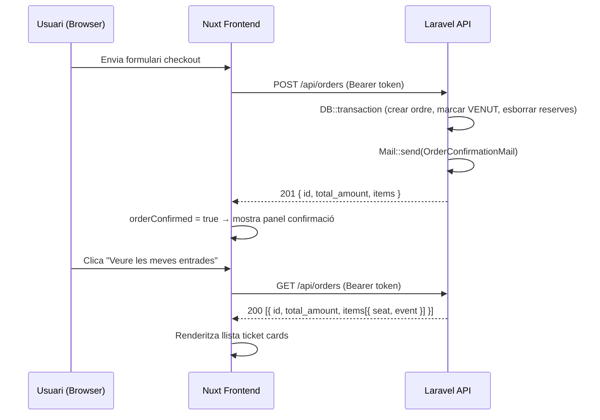

## Context

El sistema disposa d'autenticació completa via Laravel Sanctum. La taula `orders` ja té `user_id` FK i el `OrderController::store()` ja usa `$request->user()`. La pàgina `/entrades` existeix amb `middleware: "auth"` i un TODO buit. El `checkout.vue` ja té els estats `orderConfirmed` i `orderId` però no mostra cap panel de confirmació.

Relació de models existent:
```
User → hasMany Order → hasMany OrderItem → belongsTo Seat → belongsTo Event
                                                          ↘ belongsTo PriceCategory
```

No cal cap canvi de schema de BD ni de tipus compartits.

## Goals / Non-Goals

**Goals:**
- `GET /api/orders` (auth:sanctum) retorna les ordres de l'usuari autenticat amb tots els detalls
- Vista `/entrades` mostra les entrades comprades en format ticket card cinematogràfic
- Panel de confirmació post-compra a `checkout.vue`
- Email HTML automàtic en completar la compra

**Non-Goals:**
- PDF ni QR d'entrada
- Paginació (totes les ordres en una sola crida; es pot afegir en el futur)
- Endpoint públic per email
- Multi-event en una sola ordre

---

## Decisions

### D1 — Endpoint `GET /api/orders` sense paginació inicial

**Decisió:** Retornar totes les ordres de l'usuari en una sola crida, ordenades per `created_at DESC`.

**Alternativa considerada:** Cursor-based pagination des del primer dia.

**Raó:** Un usuari típic farà poques compres. La complexitat de paginació no aporta valor ara. Si el volum creix, s'afegeix paginació com a millora sense breaking change (afegir `meta.next_cursor` és additiu).

---

### D2 — Eager loading complet al `OrderController::index()`

**Decisió:** `Order::with(['orderItems.seat.event', 'orderItems.seat.priceCategory'])` en una sola consulta.

**Alternativa:** Lazy load o N+1 intencional.

**Raó:** Evita N+1. Un usuari amb 10 ordres de 2 seients cadascuna generaria 41 queries sense eager loading. Amb eager loading: 4 queries fixes.

**Resposta JSON:**
```json
[
  {
    "id": "uuid",
    "total_amount": "28.00",
    "status": "completed",
    "created_at": "2026-04-17T20:30:00Z",
    "items": [
      {
        "id": "uuid",
        "price": "14.00",
        "seat": {
          "id": "uuid",
          "row": "B",
          "number": 5,
          "price_category": { "name": "Preferent" },
          "event": {
            "id": "uuid",
            "name": "Hamlet",
            "slug": "hamlet-2026",
            "date": "2026-04-19T20:30:00Z",
            "venue": "Sala Principal",
            "image_url": "https://..."
          }
        }
      }
    ]
  }
]
```

---

### D3 — Email enviat síncronament des de `OrderController::store()`

**Decisió:** `Mail::to($user->email)->send(new OrderConfirmationMail($order))` dins del controlador, fora de la transacció.

**Alternativa:** Laravel Queue (job asíncron).

**Raó:** Simplifica el setup (no cal configurar Redis/database queue per a aquesta feature). Si l'enviament falla, l'ordre ja s'ha creat correctament (l'email és post-transacció). El risc de latència és acceptable per a un sistema de baix volum. Si en el futur es vol asincronisme, el canvi és trivial (`Mail::to()->queue()` → `Mail::to()->send()`).

**Flux:**
```
POST /api/orders
  └─ DB::transaction { crear ordre, actualitzar seients, esborrar reserves }  ✓
  └─ Mail::to($user)->send(OrderConfirmationMail)   ← fora transacció
  └─ return 201
```

---

### D4 — Frontend: composable `useOrders` en lloc d'un nou store Pinia

**Decisió:** Composable `composables/useOrders.ts` que encapsula la crida autenticada i l'estat local (`orders`, `isLoading`, `error`).

**Alternativa:** Nou store Pinia `orders.ts`.

**Raó:** Les entrades no necessiten estat global compartit entre pàgines. Un composable és suficient i no contamina el store global. Si en el futur cal accés cross-component, la migració a store és directa.

---

### D5 — Disseny ticket card amb efecte perforació CSS

**Decisió:** Ticket card amb `border-radius` diferencial i `background radial-gradient` per simular la perforació, sense SVG extern.

**Paleta:** `#0F0F23` bg / `#1E1B4B` card / `#CA8A04` accent gold / `#F8FAFC` text.

---

## Risks / Trade-offs

**[Email síncron bloqueja la resposta]** → Si el servidor SMTP no respon, el `POST /api/orders` es retarda. Mitigació: configurar `MAIL_TIMEOUT` baix al `.env`. Solució futura: Queue.

**[Eager loading sense paginació]** → Un usuari amb moltes ordres podria rebre una resposta gran. Mitigació: acceptable a curt termini; la query té `ORDER BY created_at DESC` i es pot limitar fàcilment.

**[Email HTML sense test d'integració real]** → S'usa `Mail::fake()` als tests. El rendering real depèn del client de correu. Mitigació: plantilla blade mínima i semàntica.

---

## Flux complet (Sequence Diagram)



---

## Testing Strategy

| Unitat | Framework | Mocks |
|--------|-----------|-------|
| `OrderController::index()` | Laravel Feature Test (PHPUnit) | — (BD real en test) |
| Email enviat en `store()` | Laravel Feature Test | `Mail::fake()` |
| `useOrders` composable | Vitest + `@nuxt/test-utils` | `$fetch` mock |
| `pages/entrades.vue` rendering | Vitest | `useOrders` mock |

---

## Migration Plan

1. Afegir `index()` a `OrderController` + ruta `GET /api/orders`
2. Crear `OrderConfirmationMail` + blade template
3. Afegir `Mail::send()` a `OrderController::store()`
4. Implementar composable `useOrders` al frontend
5. Implementar `pages/entrades.vue`
6. Estendre panel de confirmació a `checkout.vue`
7. Tests + CI

Cap migració de BD necessària. Rollback: revertir ruta i crides de mail; l'ordre existent no es veu afectada.

## Open Questions

- Cal configurar un driver de mail real (SMTP/Mailtrap) a `.env.example`? → Sí, documentar `MAIL_*` variables.
- El nom de l'usuari al email ve de `$user->name`? → Sí, ja existeix al model `User`.
