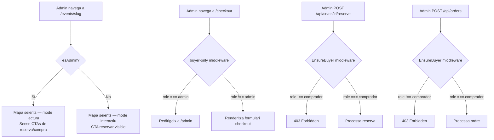

## Context

Les rutes de compra (`POST /api/orders`) i de reserva (`POST /api/seats/{id}/reserve`) estan protegides per `auth:sanctum` però no comproven el rol de l'usuari autenticat. Un admin autenticat pot, per tant, arribar al mapa de seients (`/events/[slug]`), fer clic en un seient i reservar-lo o fins i tot completar una compra, cosa que contradiu el disseny del sistema on l'admin gestiona i el comprador compra.

Al frontend, `checkout.vue` aplica el middleware `auth` (usuari autenticat) però no comprova el rol. La pàgina `/events/[slug]` no distingeix entre un admin i un comprador: mostra el botó "Confirmar compra" i el temporitzador si `reserva.teReservaActiva` (condició que pot ser certa si l'admin ha reservat un seient sense restricció).

El `authStore` ja exposa `user.role` i el middleware `admin.ts` ja bloqueja compradors de les rutes `/admin`. El middleware `EnsureAdmin` de Laravel ja bloqueja compradors de `/api/admin/*`. PE-63 aplica la separació simètrica en la direcció inversa.

## Goals / Non-Goals

**Goals:**

- `POST /api/orders` retorna `403` per a qualsevol usuari amb `role !== 'comprador'`.
- `POST /api/seats/{id}/reserve` retorna `403` per a admins.
- La pàgina `/checkout` redirigeix admins a `/admin` sense renderitzar el formulari.
- La pàgina `/events/[slug]` entra en mode lectura per a admins: mapa visible, cap CTA de reserva o compra.
- UI/UX: revisió de consistència visual al dashboard admin i al mapa d'events en mode admin.

**Non-Goals:**

- No es canvia el rol `comprador` en cap dels endpoints públics ni de lectura (GET).
- No s'afegeix cap nou rol ni es modifica l'esquema de la BD.
- No es restringeix l'accés de l'admin als endpoints `/api/events` ni al mapa de seients GET.
- No s'afegeix autenticació a `GET /api/events/{slug}/seats` (el mapa és públic per a Visitants).

## Decisions

### Decisió 1 — Middleware `EnsureBuyer` al backend (Laravel)

**Elecció:** Crear un nou middleware Laravel `EnsureBuyer` (`app/Http/Middleware/EnsureBuyer.php`) que comprovi `$request->user()->role === 'comprador'`. Si no, retorna `403 { "message": "El rol admin no pot realitzar compres" }`. S'aplica a les rutes `POST /api/orders` i `POST /api/seats/{seatId}/reserve`.

**Alternativa considerada:** Inline check dins de cada controlador (`if ($user->role !== 'comprador') return response()->json(..., 403)`). Descartat: duplicació de lògica i menys consistent amb el patró existent (`EnsureAdmin`).

**Raó:** El middleware és la capa correcta per a guards de rol a Laravel. Manté els controladors nets i la lògica de seguretat centralitzada. El patró és idèntic a `EnsureAdmin` ja existent.

```
// api.php — rutes afectades
Route::middleware(['auth:sanctum', 'buyer'])->group(function () {
    Route::post('/seats/{seatId}/reserve', ...);
    Route::post('/orders', ...);
});
```

### Decisió 2 — Middleware Nuxt `buyer-only.ts` al frontend

**Elecció:** Crear `middleware/buyer-only.ts` que comprovi `authStore.user?.role === 'admin'` i redirigeixi a `/admin`. Aplicar-lo a `/checkout` via `definePageMeta({ middleware: ['auth', 'buyer-only'] })`.

**Alternativa considerada:** Guard inline a `onMounted` de `checkout.vue`. Descartat: el middleware de Nuxt s'executa abans de la hidratació de la pàgina, evitant un flash del formulari per a l'admin.

**Raó:** Coherència amb el patró existent (`admin.ts`, `auth.ts`). El middleware s'executa en la capa de navegació, no dins del component.

### Decisió 3 — Mode lectura admin a `/events/[slug]`

**Elecció:** Afegir un computed `esAdmin` a `[slug].vue` basat en `authStore.user?.role`. Condicionar:

1. El bloc `topbar-reserva` (temporitzador + botó "Confirmar compra") amb `v-if="reserva.teReservaActiva && !esAdmin"`.
2. Passar `:read-only="esAdmin"` a `<MapaSeients>`.
3. A `MapaSeients.vue`, acceptar la prop `readOnly: boolean` i deshabilitar el handler de clic en cada `Seient` quan és `true`.

**Alternativa considerada:** Comprovar el rol directament dins de `MapaSeients.vue` via `useAuthStore()`. Descartat: acobla el component al store d'autenticació, la prop és més testable i reutilitzable.

**Raó:** La prop `readOnly` és el patró estàndard per a components UI read-only. La pàgina `[slug].vue` és la que coneix el context de rol i decideix quin mode mostra.

### Decisió 4 — No redirigir admin fora de `/events/[slug]`

L'admin ha de poder accedir a `/events/[slug]` per monitoritzar la disponibilitat de seients en temps real (requisit PE-63). Per tant no s'aplica cap middleware de redirecció: l'admin arriba normalment però amb la UI en mode lectura.

## Diagrama de flux — Accés de l'admin al flux de compra



## Risks / Trade-offs

- [Risc] Admin amb reserva activa pre-existent (creada abans de PE-63) → Mitigació: el backend bloqueja `POST /api/orders` i `POST /api/seats/reserve` per a admins; qualsevol reserva existent expirarà per cron (5 min TTL) sense conseqüències.
- [Risc] El `buyer-only` middleware falla si `authStore.user` és `null` (usuari no autenticat que passa el middleware `auth`) → Mitigació: `buyer-only` s'encadena sempre DESPRÉS de `auth`, que ja garanteix que `user` existeix.
- [Risc] `MapaSeients.vue` o `Seient.vue` s'instancien en altres contextos on la prop `readOnly` no s'ha passat → Mitigació: la prop té `default: false`, comportament actual preservat per a totes les crides existents.

## Open Questions

- Cap: tots els requisits de PE-63 estan especificats i el disseny cobreix cada criteri d'acceptació.
