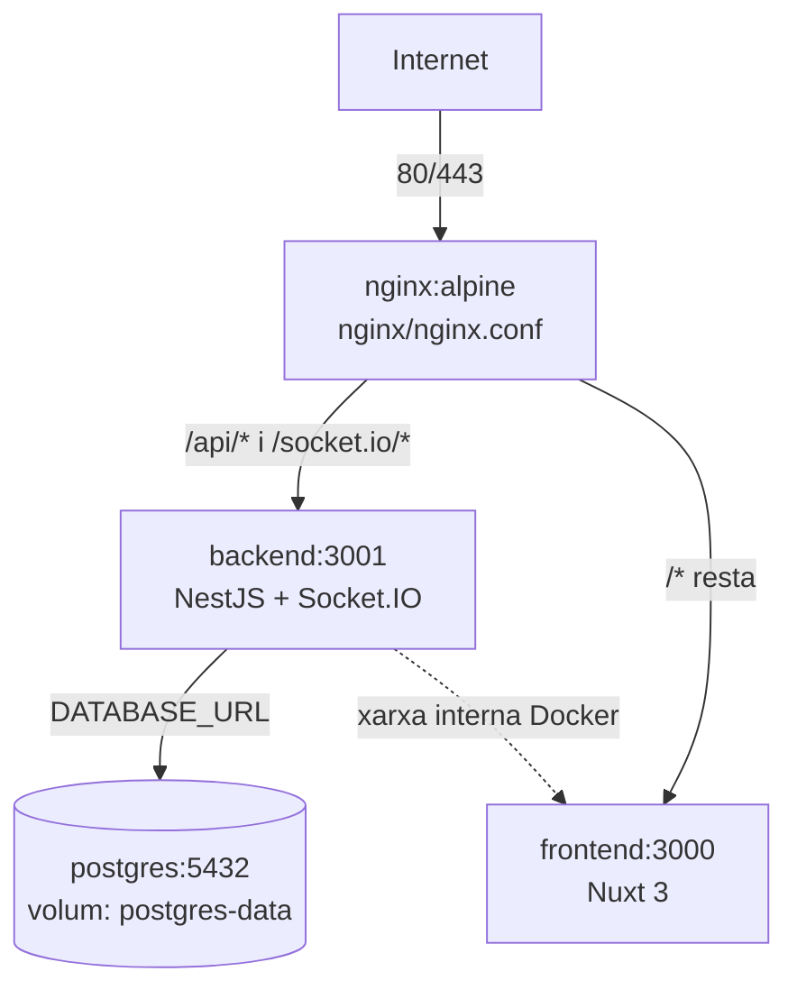
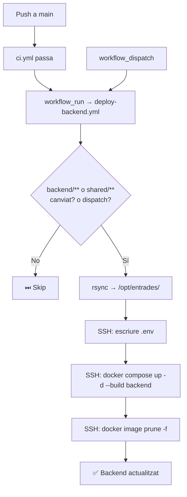

## Context

No existeix cap infraestructura de producció al VPS. PE-39 és el ticket fundacional de l'EP-08: estableix `docker-compose.prod.yml`, nginx, postgres persistent i el primer workflow de deploy automatitzat (backend). PE-40 (frontend) i PE-57 (Laravel) reutilitzaran aquesta base.

**Ruta de desplegament al VPS**: `/opt/entrades/`

L'aplicació té tres capes públiques:
- Frontend Nuxt (port 3000 intern)
- Backend NestJS API (port 3001 intern) — inclou Socket.IO
- Admin panel (servit pel frontend)

Cap port intern s'exposa directament: nginx fa de reverse proxy i és l'únic servei amb ports 80/443 públics.

## Goals / Non-Goals

**Goals:**
- `docker-compose.prod.yml` complet: nginx, backend, frontend (placeholder), postgres amb volum persistent.
- `nginx/nginx.conf`: proxy invers per a frontend i backend (API + WebSocket Socket.IO).
- `backend/Dockerfile` de producció amb `prisma migrate deploy` a l'arrencada.
- Workflow `deploy-backend.yml`: rsync + injecció `.env` + `docker compose up -d --build backend`, condicional per paths i amb `workflow_dispatch`.
- Preparació del VPS: directori `/opt/entrades/`, permisos `deploy`, estructura SSL ready (Certbot).

**Non-Goals:**
- Workflow de deploy del frontend (PE-40) i Laravel (PE-57).
- Obtenció automàtica del certificat SSL (pas manual post-desplegament).
- Rollback automàtic o blue/green deployment.

## Decisions

### 1. Nginx en Docker com a reverse proxy

**Decisió**: Nginx corre com un servei Docker dins de `docker-compose.prod.yml`, no com a servei del host.

**Alternativas considerades**:
- Nginx instal·lat directament al host: dificulta la reproducibilitat i el versionat de la configuració.
- Traefik: potent però complex per a un entorn acadèmic.

**Rationale**: La configuració de nginx queda versionada al repositori (`nginx/nginx.conf`). Tot l'stack s'aixeca i s'atura amb un únic `docker compose up/down`. Fàcil de replicar en altres entorns.

### 2. Socket.IO: proxy WebSocket a nginx

**Decisió**: El `location /socket.io/` de nginx inclou els headers `Upgrade` i `Connection` necessaris per a WebSocket. Sense aquesta configuració, Socket.IO fa fallback a long-polling i les actualitzacions en temps real fallen silenciosament.

```nginx
location /socket.io/ {
    proxy_pass http://backend:3001;
    proxy_http_version 1.1;
    proxy_set_header Upgrade $http_upgrade;
    proxy_set_header Connection "upgrade";
    proxy_set_header Host $host;
}
```

### 3. PostgreSQL amb volum persistent

**Decisió**: El servei `postgres` al `docker-compose.prod.yml` declara un volum named (`postgres-data`) mapejat a `/var/lib/postgresql/data`.

**Rationale**: Sense volum persistent, cada `docker compose up --build` destroeix la base de dades. El volum named és gestionat per Docker i sobreviu a `docker compose down` (però no a `docker compose down -v`, que s'ha d'evitar en producció).

### 4. `prisma migrate deploy` a l'arrencada del backend

**Decisió**: El `backend/Dockerfile` inclou un entrypoint que executa `npx prisma migrate deploy && node dist/main.js`. Alternativament, es pot fer com a step SSH al workflow.

**Alternativas considerades**:
- Entrypoint al Dockerfile: simple, garanteix que les migracions s'apliquen abans que l'API accepti connexions.
- Step separat al workflow: més control, però requereix esperar que postgres estigui ready.

**Rationale**: L'entrypoint és la solució més senzilla per a un entorn acadèmic. `migrate deploy` (no `migrate dev`) és segur en producció: aplica migracions pendents sense generar-ne de noves.

### 5. rsync + build al VPS en lloc de GHCR

**Decisió**: Usar `burnett01/rsync-deployments` per sincronitzar el repositori a `/opt/entrades/` i `docker compose up -d --build` per construir al VPS.

**Rationale**: Més simple que GHCR (sense registre extern). El build al VPS aprofita la cache de Docker layers. Consistent amb el patró establert en altres projectes de l'equip.

### 6. Trigger dual: `workflow_run` + `workflow_dispatch`

**Decisió**: `workflow_run` encadena el deploy al CI de `main`. `workflow_dispatch` permet deploys manuals sobre qualsevol branca.

```yaml
if: ${{ github.event_name == 'workflow_dispatch' || github.event.workflow_run.conclusion == 'success' }}
```

### 7. Deploy condicional per paths

**Decisió**: `dorny/paths-filter@v3` detecta si han canviat `backend/**` o `shared/**`. Si no i el trigger és `workflow_run`, els passos de rsync/SSH se salten.

**Rationale**: Cada workflow (backend, frontend, Laravel) és independent. Evita rebuilds innecessaris quan el merge no toca el backend.

## Arquitectura del stack de producció





## Estructura de fitxers nous

```
├── docker-compose.prod.yml
├── nginx/
│   └── nginx.conf
├── backend/
│   └── Dockerfile
└── .github/
    └── workflows/
        └── deploy-backend.yml
```

## Secrets requerits

| Secret GitHub | Descripció |
|---|---|
| `SSH_HOST` | IP o hostname del VPS |
| `SSH_USER` | `deploy` |
| `SSH_KEY` | Clau privada SSH |
| `BACKEND_ENV_FILE` | Contingut complet del `.env` del backend (DATABASE_URL, ADMIN_TOKEN, PORT, etc.) |

## Estratègia de testing

- **Verificació manual**: Push a `main` amb canvi a `backend/` → workflow s'executa → VPS aixeca nova versió.
- **Verificació de skip**: Push canviant només `frontend/` → workflow de backend finalitza com `success` sense SSH.
- **Verificació nginx + WebSocket**: Accedir a `/events/[slug]` des del navegador i comprovar que Socket.IO connecta per WebSocket (no long-polling) a les DevTools.
- **Verificació postgres persistent**: `docker compose -f docker-compose.prod.yml down && docker compose -f docker-compose.prod.yml up -d` → les dades persisteixen.

## Risks / Trade-offs

| Risc | Mitigació |
|---|---|
| `docker compose up --build` consumeix CPU/RAM del VPS durant el build | Acceptable per a entorn acadèmic; build incremental gràcies a cache de Docker |
| `prisma migrate deploy` pot fallar si postgres no ha arrencat | Afegir `depends_on: postgres` amb `condition: service_healthy` al `docker-compose.prod.yml` |
| rsync copia tot el repo (frontend, Laravel, etc.) tot i que només canvia backend | Acceptable: el directori és llegit però no reconstruït per altres serveis |
| `BACKEND_ENV_FILE` quedat desactualitzat | Documentar les variables requerides; actualitzar el secret quan canviï el `.env.example` |
| `docker compose down -v` destroeix el volum de postgres | Documentar explícitament que NO s'ha d'usar `-v` en producció |

## Pla de desplegament

1. Crear `backend/Dockerfile`, `docker-compose.prod.yml` i `nginx/nginx.conf` al repositori.
2. Crear `.github/workflows/deploy-backend.yml`.
3. Preparar el VPS: crear `/opt/entrades/`, permisos per a `deploy`.
4. Configurar GitHub Secrets.
5. Primer deploy manual via `workflow_dispatch` per verificar l'stack complet.
6. Obtenir certificat SSL: `docker compose run --rm certbot certonly --webroot ...` (post-desplegament).
