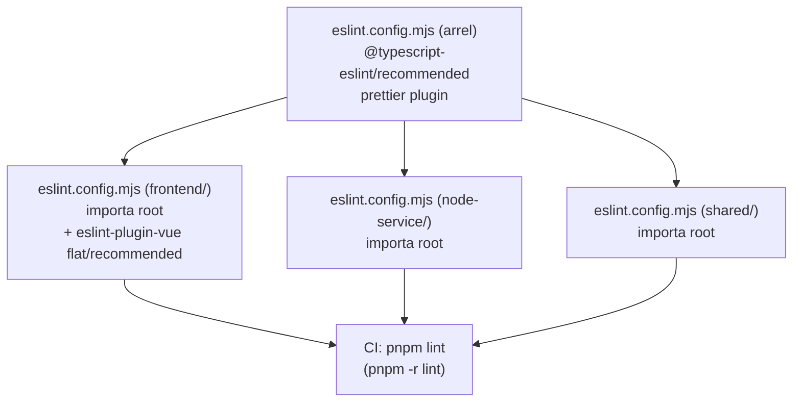

## Context

El monorepo conté tres workspaces amb runtimes i frameworks diferents: `frontend/` (Nuxt 3 + Vue 3), `backend/node-service/` (NestJS + TypeScript pur), i `shared/` (TypeScript pur). Cada workspace té el seu script `lint` stubbed amb `echo 'eslint not configured yet (US-07-05)'`. El root `package.json` ja té `"lint": "pnpm -r lint"` que delega als workspaces.

No existeix cap fitxer `.eslintrc.cjs`, `.prettierrc` ni cap paquet d'ESLint instal·lat. El CI no pot executar lint fins que no estigui configurat.

## Goals / Non-Goals

**Goals:**

- Configurar ESLint a l'arrel del monorepo, extensible per cada workspace
- Integrar Prettier com a regla d'ESLint (no pas com a eina separada per al lint)
- Proveir script `pnpm lint` funcional per als tres workspaces
- Proveir script `pnpm format` a l'arrel per a tots els fitxers `.ts`, `.vue`, `.json`
- El pipeline de CI executa `pnpm lint` com a primer step

**Non-Goals:**

- Auto-fix d'errors ESLint al codi existent (es deixa a l'equip)
- Configuració de Stylelint o lint de CSS/SCSS
- Regles personalitzades específiques de negoci
- Husky o git hooks (fora d'abast d'aquest US)

## Decisions

### D1 — Una configuració plana a l'arrel, cada workspace l'estén

**Opció A (escollida):** Un `.eslintrc.cjs` a l'arrel amb regles comunes TypeScript. Cada workspace té el seu propi `.eslintrc.cjs` (o inline config) que estén l'arrel i afegeix regles específiques (Vue per al frontend, nada per als altres).

**Opció B descartada:** Configuració completament centralitzada a l'arrel amb `overrides` per path. Descartada perquè dificulta afegir plugins específics per workspace (p.ex. `eslint-plugin-vue` no ha d'estar al scope de `backend/`).

**Rationale:** L'opció A és el patró recomanat per a pnpm workspaces — cada package té autonomia però hereta les regles compartides.

### D2 — Prettier integrat com a regla ESLint (`eslint-plugin-prettier`)

**Opció A (escollida):** `eslint-plugin-prettier` + `eslint-config-prettier`. Un únic cop d'ull amb `pnpm lint` valida tant estil com format.

**Opció B descartada:** Prettier com a script separat amb `--check`. Requereix dos passos al CI i configuració duplicada.

**Rationale:** L'enunciat de PE-37 especifica "Prettier integrat com a regla d'ESLint".

### D3 — Format de configuració: ESLint v10 flat config (`eslint.config.mjs`)

**Opció A (escollida):** ESLint v10 amb flat config (`eslint.config.mjs`). La configuració arrel és un array d'objectes importable directament. El workspace `frontend/` importa i estén la config arrel. Els workspaces `shared/` i `node-service/` hereten la config arrel automàticament per traversal de directoris.

**Opció B descartada:** ESLint v8 amb format legacy `.eslintrc.cjs`. Requeriria un fitxer `.eslintrc.cjs` a cada workspace. Menys compatible amb els plugins actuals en les seves versions més recents.

**Rationale:** ESLint v10 és la versió instal·lada (`^10.2.1`) i flat config és el format oficial i recomanat. La migració a flat config permet eliminar `.eslintignore` (les ignores s'inclouen directament al config) i simplifica la cadena d'herència.

### D4 — Scope de `pnpm lint`: cada workspace fa el seu propi `eslint`

Cada workspace executa `eslint .` (sense `--ext`, ja que flat config determina els fitxers per `files` glob). Això aprofita el context de `tsconfig.json` local de cada workspace.

## Arquitectura de fitxers

```
prj-entrades/
├── eslint.config.mjs           ← regles base TypeScript + Prettier (flat config)
├── .prettierrc                 ← config de formatació compartida
├── package.json                ← afegir devDependencies compartits + script format
├── src/
│   ├── frontend/
│   │   ├── eslint.config.mjs  ← importa root + afegeix eslint-plugin-vue (flat/recommended)
│   │   └── package.json       ← actualitza script lint, afegeix eslint-plugin-vue local
│   ├── backend/
│   │   └── node-service/
│   │       ├── eslint.config.mjs  ← importa i re-exporta root config
│   │       └── package.json       ← actualitza script lint
│   └── shared/
│       ├── eslint.config.mjs  ← importa i re-exporta root config
│       └── package.json       ← afegeix script lint
```



## Paquets a instal·lar

| Paquet                             | Scope            | Motiu                                                |
| ---------------------------------- | ---------------- | ---------------------------------------------------- |
| `eslint`                           | root devDeps     | motor principal                                      |
| `@typescript-eslint/parser`        | root devDeps     | parser TS compartit                                  |
| `@typescript-eslint/eslint-plugin` | root devDeps     | regles TS recomanades                                |
| `eslint-plugin-prettier`           | root devDeps     | Prettier com a regla ESLint                          |
| `eslint-config-prettier`           | root devDeps     | desactiva regles ESLint que conflictuen amb Prettier |
| `prettier`                         | root devDeps     | motor de formatació                                  |
| `eslint-plugin-vue`                | frontend devDeps | regles Vue 3                                         |
| `vue-eslint-parser`                | frontend devDeps | parser per a fitxers `.vue`                          |

## Risks / Trade-offs

| Risc                                                                | Mitigació                                                                                                                                                                         |
| ------------------------------------------------------------------- | --------------------------------------------------------------------------------------------------------------------------------------------------------------------------------- |
| El codi existent pot tenir errors ESLint                            | Acceptable en la primera execució; l'equip decideix quins es corregeixen ara. El CI falla si hi ha errors — es pot ajustar severitat de les regles si calen excepcions temporals. |
| `eslint-plugin-vue` a Nuxt pot requerir config específica de parser | Usar `pluginVue.configs['flat/recommended']` a `frontend/eslint.config.mjs` i `@typescript-eslint/parser` com a `parserOptions.parser` dins del bloc `files: ['**/*.vue']`.       |
| Compatibilitat de plugins amb ESLint v10 flat config                | Tots els plugins usats (`@typescript-eslint`, `eslint-plugin-prettier`, `eslint-plugin-vue`) suporten flat config. ESLint v10 (`^10.2.1`) instal·lat a l'arrel.                   |

## Testing Strategy

No hi ha lògica de negoci nova — no calen unit tests per a fitxers de configuració.

La verificació és:

1. `pnpm lint` retorna exit code `0` al repositori local (criteri d'acceptació de PE-37)
2. El step de CI `pnpm lint` passa al pipeline de GitHub Actions

## Migration Plan

1. Instal·lar devDependencies a l'arrel: `pnpm add -Dw eslint @typescript-eslint/parser @typescript-eslint/eslint-plugin eslint-plugin-prettier eslint-config-prettier prettier`
2. Instal·lar devDependencies al frontend: `pnpm --filter frontend add -D eslint-plugin-vue vue-eslint-parser`
3. Crear `.eslintrc.cjs` a l'arrel
4. Crear `.eslintrc.cjs` a cada workspace
5. Crear `.prettierrc` a l'arrel
6. Crear `.eslintignore` a l'arrel
7. Actualitzar scripts `lint` a cada `package.json` de workspace
8. Afegir script `format` al root `package.json`
9. Actualitzar `.github/workflows/ci.yml` afegint el step `pnpm lint`
10. Executar `pnpm lint` localment i corregir errors crítics

**Rollback:** eliminar fitxers de config i revertir scripts `lint` als stubs originals.

## Open Questions

- Cap. La configuració és estàndard i tots els requisits estan ben definits al ticket PE-37.
