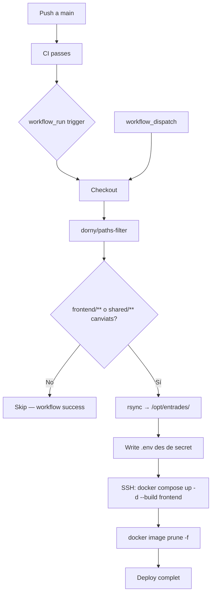

## Context

El projecte ja disposa d'un workflow de deploy del backend (`deploy-backend.yml`) que usa `workflow_run` per encadenar-se al CI, `dorny/paths-filter` per detectar canvis rellevants, `rsync` per sincronitzar codi al VPS i `appleboy/ssh-action` per executar `docker compose`. El frontend Nuxt seguirà exactament el mateix patró per mantenir consistència operacional.

La infraestructura de producció (`docker-compose.prod.yml`) ja inclou el servei `frontend` i el proxy Nginx. El que manca és: un `Dockerfile` de producció per al frontend i el workflow de CD.

## Goals / Non-Goals

**Goals:**
- Workflow GitHub Actions que desplega el frontend Nuxt al VPS de forma automàtica i independent del backend
- Dockerfile multi-stage per al frontend (build SSR + runtime mínim)
- Detecció de canvis per path (no desplegar si no hi ha canvis a `frontend/` o `shared/`)
- Injecció de variables d'entorn de producció en build time via `ARG`

**Non-Goals:**
- CDN, edge deployment o static export (el frontend usa SSR)
- Modificacions al `docker-compose.prod.yml` (ja configurat per `production-infrastructure`)
- Canvis al CI (`ci.yml`)

## Decisions

### Decisió 1: Rsync + SSH en lloc de GHCR

**Alternativa considerada:** Build de la imatge localment al runner, push a GHCR, i `docker pull` al VPS.

**Decisió adoptada:** Rsync + build al VPS, igual que el backend.

**Racional:** El workflow del backend ja funciona amb rsync i build al VPS. Usar el mateix patró elimina la complexitat d'autenticació a GHCR (token addicional, `docker login`), simplifica el debug i manté els dos workflows estructuralment idèntics. El VPS té suficient CPU/RAM per fer el build de Nuxt.

---

### Decisió 2: Dockerfile multi-stage

**Etapes:**
1. **builder** — Node + pnpm, instal·la dependències del workspace (`--filter frontend...`) i executa `nuxt build`
2. **runner** — Node slim, copia `.output/` de l'etapa builder i executa `node .output/server/index.mjs`

**Racional:** L'etapa builder inclou devDependencies, fitxers font i la cache de pnpm, que no cal a producció. La imatge final conté únicament el runtime de Node i el bundle compilat.

---

### Decisió 3: Variables d'entorn injectades en runtime via `.env` del VPS

`NUXT_PUBLIC_WS_URL` i `NUXT_PUBLIC_API_URL` s'injecten com a **runtime env vars** al contenidor `frontend` via `docker-compose.prod.yml` (que llegeix el `.env` del VPS). El `.env` s'escriu al VPS en cada deploy des del secret `BACKEND_ENV_FILE`. Els `ARG` del Dockerfile queden declarats per flexibilitat futura (p.ex. build local amb valors específics) però no s'utilitzen en el pipeline de CI/CD.

**Racional:** Nuxt 3 SSR llegeix `NUXT_PUBLIC_*` en runtime des del procés Nitro, no requereix que estiguin baked al bundle. La injecció en runtime és més flexible (permet canviar les URLs sense reconstruir la imatge) i és el patró ja establert al `docker-compose.prod.yml`.

---

### Decisió 4: Path filter — `frontend/**` i `shared/**`

El workflow SKIPA el deploy si el push no inclou canvis a `frontend/**` ni `shared/**`. Consistent amb el backend (que filtra `backend/**` i `shared/**`). El `workflow_dispatch` sempre desplega, ignorant els path filters.

## Diagrama de flux

## Risks / Trade-offs

- **Build lent al VPS** → El build de Nuxt pot trigar 2-3 minuts en un VPS de rang baix. Mitigació: Dockerfile multi-stage minimitza les re-instal·lacions; si és crític, es pot afegir cache de pnpm store al workflow.
- **Downtime breu durant `docker compose up -d`** → El contenidor `frontend` es reinicia. Mitigació: en producció real s'usaria rolling update; per a aquest projecte acadèmic és acceptable.
- **Secrets de build time exposats a la imatge** → `NUXT_PUBLIC_*` no son secrets sensibles (son URLs públiques). No hi ha risc.

## Open Questions

_(cap)_
