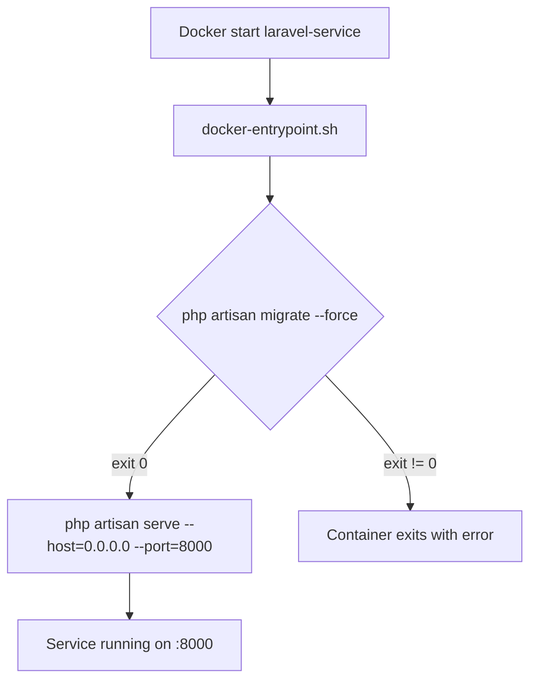

## Context

El `laravel-service` utilitza un `Dockerfile` que arrenca directament amb `php artisan serve`. En desplegaments on l'esquema de BD ha canviat respecte al codi de la imatge, el servidor falla perquè les migracions Eloquent no s'han aplicat. Cal un mecanisme que garanteixi que les migracions s'executen sempre abans de l'arrencada, sense intervenció manual.

## Goals / Non-Goals

**Goals:**
- Executar `php artisan migrate --force` automàticament a cada inici del contenidor.
- Aturar el contenidor (fail-fast) si la migració falla (BD inaccessible o error de migració).
- No canviar el comportament de l'entorn de desenvolupament local.

**Non-Goals:**
- Backup de BD pre-migració.
- Execució de seeders en producció.
- Rollback automàtic de migracions.

## Decisions

### Decisió 1: Shell entrypoint script vs. CMD inline

**Alternativa A — `docker-entrypoint.sh` (escollida):** Script shell separat que Docker executa com a `ENTRYPOINT`. Permet afegir lògica futura (health checks, warm-up) sense modificar el Dockerfile. Facilita la lectura i el testing manual.

**Alternativa B — Inline al `CMD`:** Encadenar els dos comandos amb `&&` directament al `CMD` del Dockerfile (`CMD ["sh", "-c", "php artisan migrate --force && php artisan serve ..."]`). Menys fitxers, però menys llegible i extensible.

**Decisió:** Alternativa A. Un script dedicat separa responsabilitats i facilita afegir passos futurs (ex: `php artisan config:cache`).

### Decisió 2: `ENTRYPOINT` vs. `CMD` per al script

S'utilitza `ENTRYPOINT ["docker-entrypoint.sh"]` en lloc de `CMD`. El fitxer es copia a `/usr/local/bin/docker-entrypoint.sh` (que ja és al `PATH`), i el shebang `#!/bin/sh` garanteix l'intèrpret. L'`ENTRYPOINT` garanteix que l'script sempre s'executa i no pot ser sobreescrit accidentalment per arguments de `docker run`.

## Risks / Trade-offs

- **Temps d'inici més llarg en deploy** → Si hi ha moltes migracions, l'arrencada triga més. Acceptable en context acadèmic; en producció real es mitigaria amb migracions en pipeline previ.
- **BD no accessible en inici** → El contenidor falla ràpidament i Docker/Compose el reinicia. Això és el comportament desitjat (fail-fast).

## Diagrama de flux

## Migration Plan

1. Afegir `backend/laravel-service/docker-entrypoint.sh` amb permisos d'execució (`chmod +x`).
2. Modificar `backend/laravel-service/Dockerfile`: copiar l'script a `/usr/local/bin/docker-entrypoint.sh` i substituir la instrucció `CMD` per `ENTRYPOINT ["docker-entrypoint.sh"]`.
3. Verificar localment amb `docker compose up laravel-service` que la migració s'executa i el servidor arrenca.
4. Fer merge a `main` — el workflow `deploy-backend.yml` reconstrueix la imatge al VPS.

## Open Questions

Cap.
