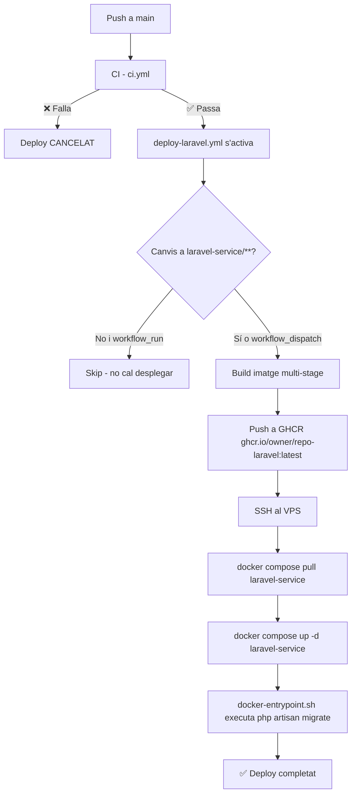

## Context

El Laravel Service és el servei d'API REST i autenticació (Sanctum + JWT) del projecte. Actualment el desplegament al VPS és completament manual: cal connectar-se per SSH, fer `git pull` i reiniciar els contenidors. Això viola el principi de CI/CD del projecte i és propens a errors humans. El `docker-entrypoint.sh` (US-08-04) ja gestiona les migracions automàtiques, de manera que el workflow no cal que les executi explícitament.

L'stack d'infraestructura existent al VPS ja té Docker Compose configurant el Laravel Service com a servei (`laravel-service`). El CI (`ci.yml`) ja valida la qualitat del codi abans de qualsevol desplegament.

## Goals / Non-Goals

**Goals:**
- Automatitzar el build de la imatge Docker de producció del Laravel Service (multi-stage)
- Publicar la imatge a GHCR (`ghcr.io/{owner}/{repo}-laravel:latest`)
- Desplegar al VPS via SSH sense secrets hardcodejats
- Garantir que el deploy només s'executa si el CI ha passat
- Detectar canvis a `laravel-service/**` per evitar desplegaments innecessaris

**Non-Goals:**
- Zero-downtime deploy (fora d'abast en entorn acadèmic amb VPS únic)
- Rollback automàtic a la versió anterior si el deploy falla
- Multi-environment (staging / production)

## Decisions

### D1 — Build de la imatge a GitHub Actions (no al VPS)

**Decisió**: La imatge Docker es construeix als runners de GitHub Actions i es puja a GHCR. El VPS només fa `docker compose pull` + `docker compose up -d`.

**Alternativa considerada**: Construir la imatge directament al VPS (com fa `deploy-backend.yml` amb rsync + build in-situ).

**Raó**: El VPS acadèmic té recursos limitats. Construir una imatge PHP amb Composer al VPS pot trigar molt i consumir memòria. Els runners de GitHub Actions (ubuntu-latest, 7 GB RAM) són més ràpids i no penalitzen el servei en producció. A més, la imatge publicada a GHCR actua com a artefacte versionat i auditable.

### D2 — Multi-stage Dockerfile (composer + PHP-FPM runtime)

**Decisió**: Dockerfile amb dues etapes:
- **Stage `builder`**: imatge `composer:latest`, instal·la dependències de Composer (sense dev).
- **Stage `runtime`**: imatge `php:8.2-fpm-alpine`, copia vendor/ des del builder, configura PHP-FPM.

**Alternativa considerada**: Laravel Octane (Swoole/FrankenPHP) per a millor rendiment.

**Raó**: PHP-FPM-Alpine és la opció estàndard, lleuger i ben suportat. Octane requereix extensions addicionals i complexitat de configuració que no aporten valor en context acadèmic.

### D3 — Injecció de variables via Docker Compose (no `.env` a la imatge)

**Decisió**: La imatge no conté cap `.env`. Les variables (`APP_KEY`, `JWT_SECRET`, `DATABASE_URL`, etc.) s'injecten via `environment:` al `docker-compose.prod.yml` del VPS, llegint-les de les variables d'entorn del sistema (que a la seva vegada provenen de GitHub Secrets via SSH).

**Alternativa considerada**: Copiar el `.env` al VPS via `scp` i muntar-lo com a volum.

**Raó**: Evita tenir fitxers de secrets persistits al sistema de fitxers del VPS. Més net i alineat amb les convencions del projecte (no secrets hardcodejats).

### D4 — Trigger via `workflow_run` (depèn del CI)

**Decisió**: El workflow usa `on.workflow_run` amb `workflows: ["CI"]` i `branches: [main]`, amb condició `if: github.event.workflow_run.conclusion == 'success'`. S'afegeix `workflow_dispatch` per a desplegaments manuals.

**Raó**: Garanteix que mai no es desplega codi que no ha superat el CI, sense acoblar els dos workflows en un de sol.

### D5 — Detecció de canvis a `laravel-service/**`

**Decisió**: S'usa `dorny/paths-filter` (o equivalent amb `git diff`) per detectar si el push inclou canvis a `laravel-service/**`. Si no n'hi ha i el trigger és `workflow_run`, els steps de build/push/deploy es salten.

**Raó**: Evita rebuild i redeploy del Laravel Service quan els canvis son únicament al frontend o al backend Node.

## Diagrama de flux

## Risks / Trade-offs

- **[Risc] Exposició de la clau SSH** → La clau privada es guarda com a GitHub Secret (`VPS_SSH_KEY`). Mai no s'escriu a disc en el runner; s'usa directament amb `ssh-agent`. El VPS configura `authorized_keys` amb aquesta clau amb permisos mínims.
- **[Risc] Fallada de migració al contenidor** → Si `php artisan migrate --force` falla, el contenidor surt amb codi d'error i Docker el reinicia (o no, segons `restart: unless-stopped`). Cal monitorar els logs del VPS. Mitigació: l'entrypoint fa `set -e`, el contenidor no arrencarà si la migració falla.
- **[Risc] Imatge GHCR pública** → El repositori és privat i GHCR hereta la visibilitat. Si alguna vegada es fa públic, la imatge serà accessible. Mitigació: cap secret s'inclou a la imatge (D3).
- **[Trade-off] Build a GitHub Actions vs. VPS** → El build és més ràpid als runners però el push a GHCR i el pull al VPS afegeixen latència de xarxa. En entorn acadèmic és acceptable; el deploy total hauria de ser < 5 minuts.

## Migration Plan

1. Afegir `laravel-service/Dockerfile.prod` al repositori
2. Afegir `.github/workflows/deploy-laravel.yml` al repositori
3. Configurar GitHub Secrets: `VPS_SSH_KEY`, `VPS_HOST`, `VPS_USER`, `LARAVEL_APP_KEY`, `JWT_SECRET`, `DB_PASSWORD` (o `LARAVEL_ENV_FILE` consolidat)
4. Verificar que el `docker-compose.prod.yml` del VPS té el servei `laravel-service` configurat per llegir variables d'entorn
5. Fer un primer `workflow_dispatch` manual per validar el pipeline complet
6. Verificar `GET /api/health` retorna `200` al VPS

**Rollback**: fer `docker compose up -d --no-build laravel-service` amb el tag anterior a GHCR (o `docker compose down laravel-service && docker compose up -d laravel-service` si el compose apunta a `:latest` de la versió anterior).

## Open Questions

- Cal consolidar totes les variables Laravel en un sol secret `LARAVEL_ENV_FILE` (com fa `deploy-backend.yml` amb `BACKEND_ENV_FILE`)? O és preferible secrets individuals per granularitat?
- La IP del VPS: es guardarà com a `VPS_HOST` (compartit amb el deploy del backend). Cal confirmar si és el mateix host o diferent.
